# Snabbstart: Skapa och hantera Azure Files-resurs med virtuella Windows-datorer

Artikeln visar de grundläggande stegen för att skapa och använda en Azure Files-resurs. I den här snabbstarten fokuserar vi på att snabbt konfigurera en Azure Files-resurs så att du kan se hur tjänsten fungerar. Om du behöver mer detaljerade instruktioner för att skapa och använda Azure-filresurser i din egen miljö, kan du läsa mer i [Använda en Azure-filresurs med Windows](storage-how-to-use-files-windows.md).

Om du inte har en Azure-prenumeration kan du skapa ett [kostnadsfritt konto](https://azure.microsoft.com/free/?WT.mc_id=A261C142F) innan du börjar.

## Logga in på Azure

Logga in på [Azure Portal](https://portal.azure.com).

## Förbered din miljö

I den här snabbstarten konfigurerar du följande objekt:

- Skapa ett Azure-lagringskonto och en Azure-filresurs
- En virtuell Windows Server 2016 Datacenter-dator

### skapar ett lagringskonto

Innan du kan arbeta med en Azure-filresurs måste du skapa ett Azure-lagringskonto. Ett v2-lagringskonto för generell användning ger åtkomst till alla Azure Storage-tjänster: blobar, filer, köer och tabeller. Snabbstarten skapar ett v2-lagringskonto för generell användning, men stegen för att skapa alla typer av lagringskonton liknar dessa. Ett lagringskonto kan innehålla ett obegränsat antal resurser. En resurs kan lagra ett obegränsat antal filer, upp till kapacitetsbegränsningen för lagringskontot.

[!INCLUDE [storage-create-account-portal-include](../../../includes/storage-create-account-portal-include.md)]

### Skapa en Azure-filresurs

Därefter skapar du en filresurs.

1. När distributionen av Azure-lagringskontot är klar väljer du **Gå till resurs**.
1. Välj **Filer** i lagringskontots fönster.

    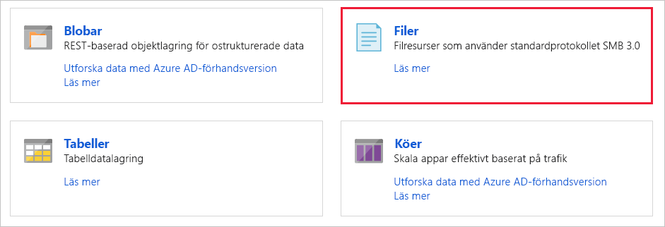

1. Välj **+ Filresurs**.

    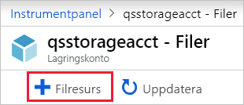

1. Ge den nya filresursen namnet *qsfileshare* > ange ”1” som **Kvot** > välj **Skapa**. Kvoten kan vara högst 5 TiB, men du behöver bara 1 GiB för den här snabbstarten.
1. Skapa en ny txt-fil med namnet *qsTestFile* på den lokala datorn.
1. Välj den nya filresursen och välj sedan **Överför** på filresursens plats.

    

1. Bläddra till platsen där du skapade din txt-fil > välj *qsTestFile.txt* > välj **Överför**.

Nu har du skapat ett Azure Storage-konto och en filresurs med en fil i Azure. Därefter ska du skapa den virtuella Azure-datorn i Windows Server 2016 Datacenter som representerar den lokala servern i den här snabbstarten.

### Distribuera en virtuell dator

1. Expandera sedan menyn till vänster om portalen och välj **Skapa en resurs** i det övre vänstra hörnet i Azure-portalen.
1. I sökrutan ovanför listan över resurser i **Azure Marketplace**, söker di efter och väljer **Windows Server 2016 Datacenter** och därefter **Skapa**.
1. På fliken **Grundinställningar** under **Projektinformation** väljer du den resursgrupp som du skapade för snabbstarten.

   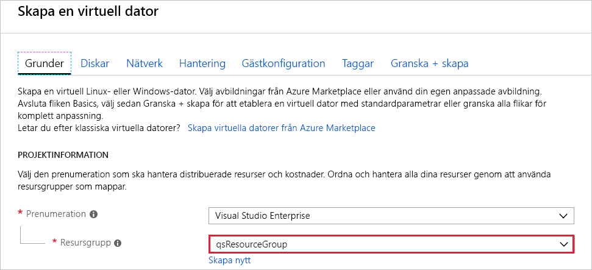

1. Under **Instansinformation** ger du den virtuella datorn namnet *qsVM*.
1. Lämna standardinställningar för **Region**, **Tillgänglighetsalternativ**, **Avbildning** och **Storlek**.
1. Under **Administratörskonto** lägger du till *VMadmin* som **Användarnamn** och anger ett **Lösenord** för den virtuella datorn.
1. Under **Regler för inkommande portar** väljer du **Tillåt valda portar** och sedan **RDP (3389)** och **HTTP** från listrutan.
1. Välj **Granska + skapa**.
1. Välj **Skapa**. Det tar några minuter att skapa en ny virtuell dator.

1. När distributionen av den virtuella datorn är klar väljer du **Gå till resurs**.

Nu har du skapat en ny virtuell dator och anslutit en datadisk. Nu måste du ansluta till den virtuella datorn.

### Ansluta till din virtuella dator

1. Välj **Anslut** på sidan för den virtuella datorns egenskaper.

   

1. På sidan **Anslut till den virtuella datorn** behåller du standardalternativen för att ansluta med **IP-adress** över **portnummer** *3389*. Välj sedan **Hämta RDP-filen**.
1. Öppna den nedladdade RDP-filen och välj **Anslut** när du tillfrågas.
1. I fönstret **Windows-säkerhet** väljer du **fler alternativ** och sedan **använd ett annat konto**. Ange användarnamnet som *localhost\användarnamn* där &lt;användarnamn&gt; är det användarnamn som du skapade för den virtuella datorn. Ange det lösenord som du skapade för den virtuella datorn och välj sedan **OK**.

   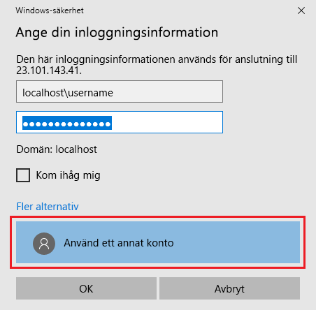

1. Du kan få en certifikatvarning under inloggningen. Välj **Ja** eller **Fortsätt** för att skapa anslutningen.

## Mappa Azure-filresursen till en Windows-enhet

1. I Azure-portalen går du till filresursen *qsfileshare* och väljer **Anslut**.
1. Kopiera innehållet i den andra rutan och klistra in det i **Anteckningar**.

   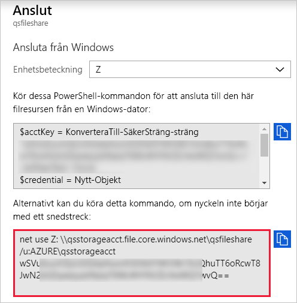

1. I den virtuella datorn öppnar du **Utforskaren** och väljer **Den här datorn** i fönstret. Detta ändrar menyerna i menyfliksområdet. Under menyn **Dator** väljer du **Mappa nätverksenhet**.
1. Välj enhetsbeteckningen och ange UNC-sökvägen. Om du har följt namnförslagen i den här snabbstarten kopierar du *\\qsstorageacct.file.core.windows.net\qsfileshare* från **Anteckningar**.

   Kontrollera att båda kryssrutorna är markerade.

   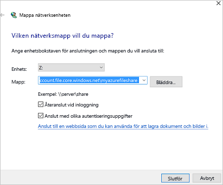

1. Välj **Slutför**.
1. I dialogrutan **Windows-säkerhet**:

   - Kopiera lagringskontonamnet som ska läggas till i AZURE\ från Anteckningar och klistra in det i dialogrutan **Windows-säkerhet** som användarnamn. Om du har följt namnförslagen i den här snabbstarten kopierar du *AZURE\qsstorageacct*.
   - Kopiera lagringskontonyckeln från Anteckningar och klistra in den i dialogrutan **Windows-säkerhet** som lösenord.

      

## Skapa en ögonblicksbild av en resurs

Nu när du har mappat enheten kan du skapa en ögonblicksbild.

1. I portalen går du till filresursen och väljer **Skapa ögonblicksbild**.

   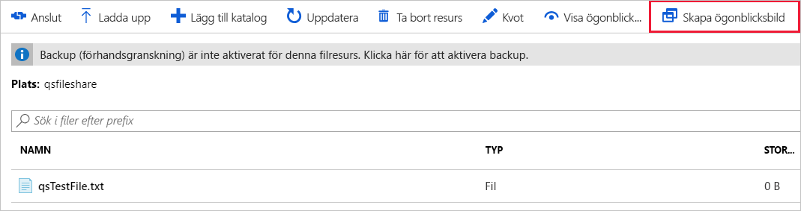

1. I den virtuella datorn öppnar du *qstestfile.txt* och skriver ”den här filen har ändrats” > Spara och stäng filen.
1. Skapa en annan ögonblicksbild.

## Bläddra i en resursögonblicksbild

1. Välj **Visa ögonblicksbilder** i din filresurs.
1. I fönstret **Ögonblicksbilder av filresurs** väljer du den första ögonblicksbilden i listan.

   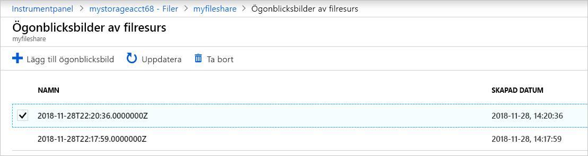

1. I fönstret för denna ögonblicksbild väljer du *qsTestFile.txt*.

## Återställa från en ögonblicksbild

1. Från bladet för filresursens ögonblicksbild högerklickar du på *qsTestFile* och väljer knappen **Återställ**.
1. Välj **Skriv över originalfilen**.

   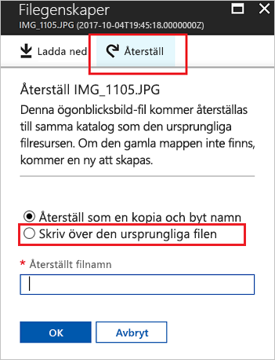

1. Öppna filen i den virtuella datorn. Den oförändrade versionen har återställts.

## Ta bort en resursögonblicksbild

1. Välj **Visa ögonblicksbilder** i din filresurs.
1. I fönstret **Ögonblicksbilder av filresurs** väljer du den sista ögonblicksbilden i listan och klickar på **Ta bort**.

   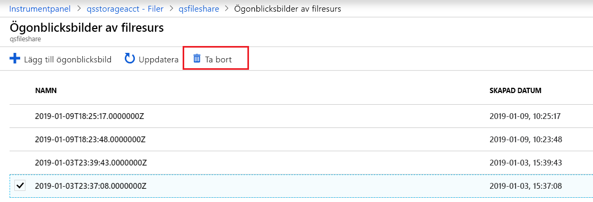

## Använda en resursögonblicksbild i Windows

Precis som med lokala VSS-ögonblicksbilder, kan du visa ögonblicksbilder från din monterade Azure-filresurs med hjälp av fliken Tidigare versioner.

1. Leta upp den monterade resursen i Utforskaren.

   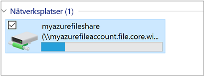

1. Välj *qsTestFile.txt* och > högerklicka och välj **Egenskaper** i menyn.

   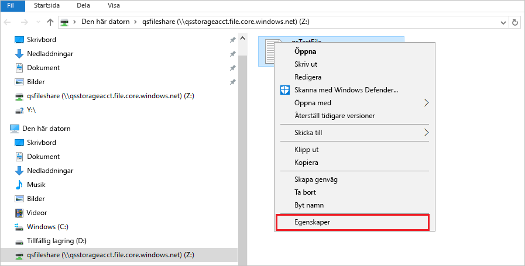

1. Välj **Tidigare versioner** för att visa en lista över resursögonblicksbilder för den här katalogen.

1. Välj **Öppna** för att öppna ögonblicksbilden.

   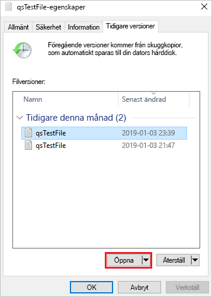

## Återställa från en tidigare version

1. Välj **Återställ**. Åtgärden kopierar innehållet i hela katalogen rekursivt vid tidpunkten då resursögonblicksbilden skapades till den ursprungliga platsen.

   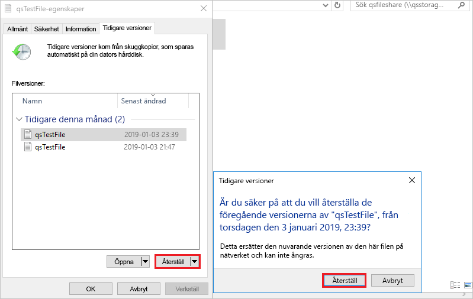

## Rensa resurser

[!INCLUDE [storage-files-clean-up-portal](../../../includes/storage-files-clean-up-portal.md)]

## Nästa steg

> [!div class="nextstepaction"]
> [Använda en Azure-filresurs med Windows](storage-how-to-use-files-windows.md)
