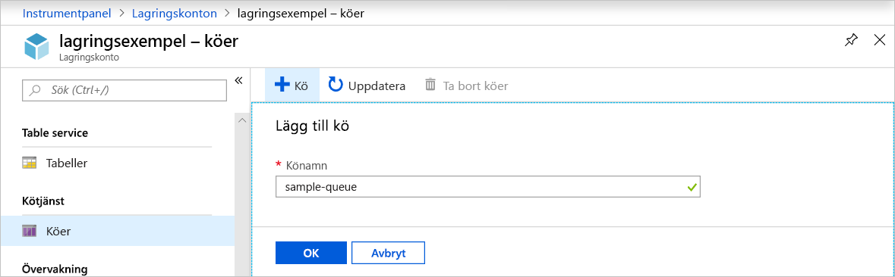
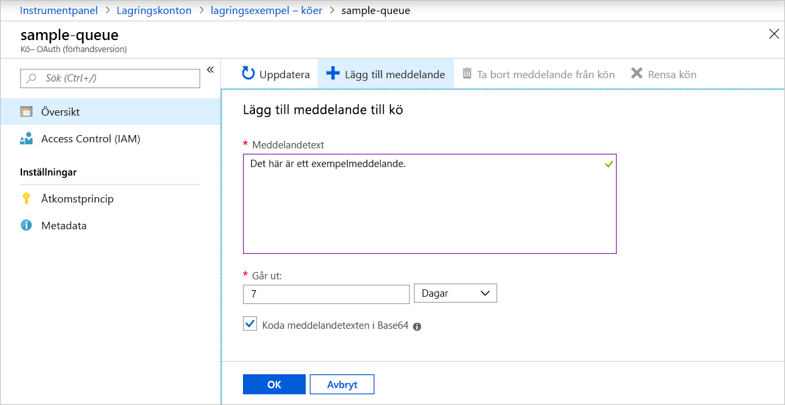
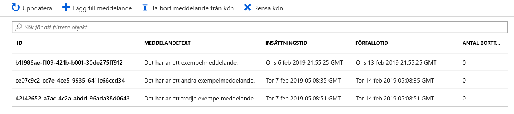
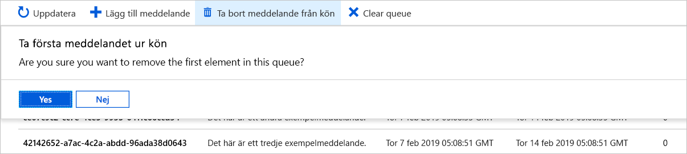

# Snabb start: skapa en kö och Lägg till ett meddelande med Azure Portal

I den här snabbstarten får du lära dig hur du använder [Azure-portalen](https://portal.azure.com/) till att skapa en kö i Azure Storage samt lägga till meddelanden i och ta dem ur kön.

## Förutsättningar

[!INCLUDE [storage-quickstart-prereq-include](../../../includes/storage-quickstart-prereq-include.md)]

## Skapa en kö

Skapa en kö i Azure-portalen med hjälp av följande steg:

1. Navigera till ditt nya lagringskonto i Azure Portal.
2. På den vänstra menyn för lagringskontot bläddrar du till avsnittet **Kötjänst** och väljer sedan **Köer**.
3. Välj knappen **+ Kö**.
4. Ange ett namn för den nya kön. Könamnet får bara innehålla gemener, måste börja med en bokstav eller siffra och får bara innehålla bokstäver, siffror och bindestreck (-).
6. Välj **OK** för att skapa kön.

    

## Lägg till ett meddelande

Lägg sedan till ett meddelande i den nya kön. Ett meddelande kan vara upp till 64 KB stort.

1. Välj den nya kön i listan över köer i lagringskontot.
1. Välj knappen **+ Lägg till meddelande** för att lägga till ett meddelande i kön. Ange ett meddelande i fältet **Meddelandetext**.
1. Ange när meddelandet ska upphöra. Giltiga värden som kan anges i fältet **upphör att gälla** är mellan 1 sekund och 7 dagar. Välj **meddelande upphör aldrig att gälla** för att ange ett meddelande som ska finnas kvar i kön tills det tas bort explicit.
1. Ange huruvida meddelandet ska kodas som Base64. Det rekommenderas att binära data kodas.
1. Välj knappen **OK** för att lägga till meddelandet.

    

## Visa meddelandeegenskaper

När du har lagt till ett meddelande visar Azure-portalen en lista över alla meddelanden i kön. Du kan visa meddelande-ID, innehållet i meddelandet, infogningstiden för meddelandet samt meddelandets upphörandetid. Du kan även se hur många gånger meddelandet har tagits ur kön.

## Ta bort ett meddelande från kön

Du kan ett meddelande ur första plats i kön från Azure-portalen. När du tar ett meddelande ur kön tas det bort.

Borttagning från kö tar alltid bort det äldsta meddelandet i kön.

## Nästa steg

I den här snabbstarten har du lärt dig skapa en kö, lägga till ett meddelande, visa meddelandeegenskaper och ta ett meddelande ur kön i Azure-portalen.

> [!div class="nextstepaction"]
> [Vad är Azure-köer?](storage-queues-introduction.md)
