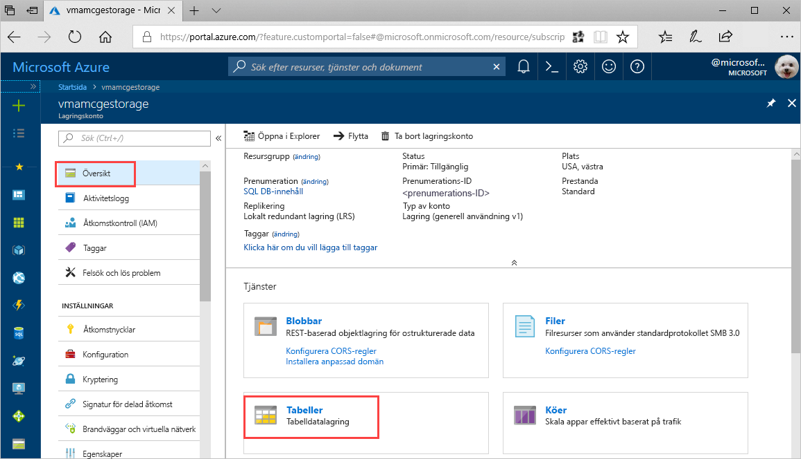
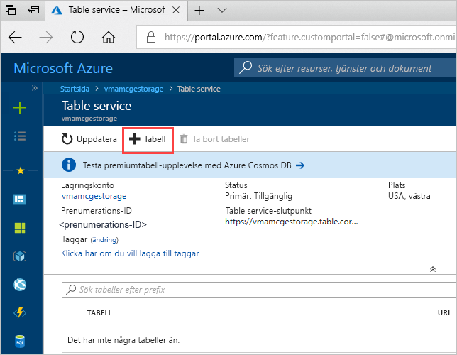
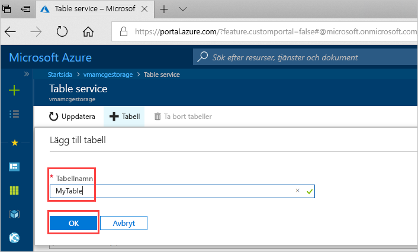

# Snabbstart: Skapa en Azure Storage-tabell i Azure-portalen 

Den här snabbstarten visar hur du skapar tabeller och entiteter i den webbaserade Azure-portalen. Den här snabbstarten visar även hur du skapar ett Azure Storage-konto.

[!INCLUDE [quickstarts-free-trial-note](../../../includes/quickstarts-free-trial-note.md)]

## Nödvändiga komponenter

För att slutföra den här snabbstarten måste du först skapa ett Azure-lagringskonto i [Azure-portalen](https://portal.azure.com/#create/Microsoft.StorageAccount-ARM). Hjälp med att skapa kontot finns i [Skapa ett lagringskonto](../common/storage-quickstart-create-account.md).

## Lägg till en tabell

Du kan nu använda Table Service i Azure-portalen för att skapa en tabell.

1. Klicka på Översikt > tabeller.

   

2. Klicka på **+ Tabell**.

   

3. Ange ett namn för din tabell i rutan **Tabellnamn** och klicka därefter på **OK**. 

   

## Nästa steg

- [Riktlinjer för tabelldesign](table-storage-design-guidelines.md)