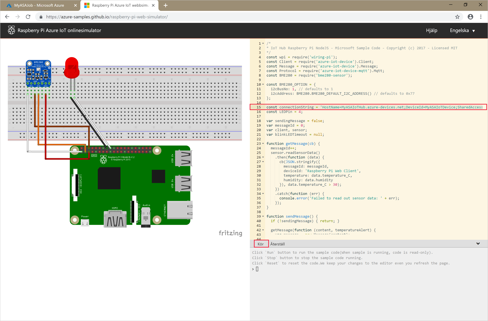

# <a name="quickstart-create-an-azure-stream-analytics-job-using-the-azure-cli"></a>Snabb start: skapa ett Azure Stream Analytics jobb med hjälp av Azure CLI

I den här snabb starten använder du Azure CLI för att definiera ett Stream Analytics jobb som filtrerar sensor meddelanden i real tid med en temperatur läsning som är större än 27. Ditt Stream Analyticss jobb kommer att läsa data från IoT Hub, transformera data och skriva tillbaka data till en behållare i Blob Storage. De indata som används i den här snabbstarten genereras av en Raspberry Pi-onlinesimulator.

## <a name="before-you-begin"></a>Innan du börjar

* Om du inte har någon Azure-prenumeration kan du skapa ett [kostnadsfritt konto](https://azure.microsoft.com/free/).

[!INCLUDE [cloud-shell-try-it.md](../../includes/cloud-shell-try-it.md)]

## <a name="prepare-your-environment"></a>Förbered din miljö

1. Logga in.

   Logga in med kommandot [az login](/cli/azure/reference-index#az-login) om du använder en lokal CLI-installation.

    ```azurecli
    az login
    ```

    Slutför autentiseringsprocessen genom att följa anvisningarna i terminalen.

2. Installera Azure CLI-tillägget.

   När du arbetar med tilläggsreferenser för Azure CLI måste du först installera tillägget.  Med Azure CLI-tillägg får du tillgång till experimentella kommandon som inte finns med i standardversionen av CLI:t ännu.  Läs mer om tillägg, bland annat hur du uppdaterar och avinstallerar dem, i [Använda tillägg med Azure CLI](/cli/azure/azure-cli-extensions-overview).

   Installera [tillägget för Stream Analytics](/cli/azure/ext/stream-analytics/stream-analytics) genom att köra följande kommando:

    ```azurecli
    az extension add --name stream-analytics
    ```

   Installera [tillägget för Azure IoT](/cli/azure/ext/azure-iot) genom att köra följande kommando:

    ```azurecli
    az extension add --name azure-iot
    ```

3. Skapa en resursgrupp.

   Alla Azure-resurser måste distribueras till en resurs grupp. Resursgrupper gör det enkelt att organisera och hantera relaterade Azure-resurser.

   I den här snabb starten skapar du en resurs grupp med namnet *streamanalyticsrg* på den *östra* platsen med följande [AZ Group Create](/cli/azure/group#az-group-create) -kommando:

   ```azurecli
   az group create --name streamanalyticsrg --location eastus
   ```

## <a name="prepare-the-input-data"></a>Förbereda indata

Innan du definierar Stream Analytics jobbet förbereder du de data som används för jobbets inmatning.

Följande kod block i Azure CLI är kommandon som förbereder de indata som krävs för jobbet. Läs avsnitten för att förstå koden.

1. Skapa en IoT-hubb med hjälp av kommandot [az iot hub create](../iot-hub/iot-hub-create-using-cli.md#create-an-iot-hub). I det här exemplet skapas en IoT-hubb som heter **MyASAIoTHub** . Eftersom namn på IoT-hubbar är unika behöver du skapa ett eget IoT-hubbnamn. Ange SKU:n till F1 för att använda den kostnadsfria nivån om den är tillgänglig med din prenumeration. Annars väljer du nästa lägsta nivå.

    ```azurecli
    az iot hub create --name "MyASAIoTHub" --resource-group streamanalyticsrg --sku S1
    ```

    När IoT-hubben har skapats hämtar du anslutningssträngen för IoT-hubben med hjälp av kommandot [az iot hub show-connection-string](/cli/azure/iot/hub?view=azure-cli-latest). Kopiera hela anslutningssträngen och spara den för användning när du lägger till IoT-hubben som indata i ditt Stream Analytics-jobb.

    ```azurecli
    az iot hub show-connection-string --hub-name "MyASAIoTHub"
    ```

2. Lägg till en enhet i IoT-hubben med hjälp av kommandot [az iothub device-identity create](../iot-hub/quickstart-send-telemetry-c.md#register-a-device). I det här exemplet skapas en enhet med namnet **MyASAIoTDevice** .

    ```azurecli
    az iot hub device-identity create --hub-name "MyASAIoTHub" --device-id "MyASAIoTDevice"
    ```

3. Hämta enhetsanslutningssträngen med hjälp av kommandot [az iot hub device-identity show-connection-string](/cli/azure/ext/azure-iot/iot/hub/device-identity#ext-azure-iot-az-iot-hub-device-identity-show-connection-string). Kopiera hela anslutningssträngen och spara den för användning när du skapar Raspberry Pi-simulatorn.

    ```azurecli
    az iot hub device-identity show-connection-string --hub-name "MyASAIoTHub" --device-id "MyASAIoTDevice" --output table
    ```

    **Utdataexempel:**

    ```output
    HostName=MyASAIoTHub.azure-devices.net;DeviceId=MyASAIoTDevice;SharedAccessKey=a2mnUsg52+NIgYudxYYUNXI67r0JmNubmfVafojG8=
    ```

## <a name="create-a-blob-storage-account"></a>Skapa ett Blob Storage-konto

Följande kod block i Azure CLI skapar ett Blob Storage-konto som används för jobbets utdata. Läs avsnitten för att förstå koden.

1. Skapa ett allmänt lagringskonto med kommandot [az storage account create](/cli/azure/storage/account). Det allmänna lagringskontot kan användas för alla fyra tjänsterna: blobar, filer, tabeller och köer.

   Kom ihåg att ersätta plats hållarnas värden inom vinkelparenteser med dina egna värden:

   ```azurecli
   az storage account create \
       --name <storage-account> \
       --resource-group streamanalyticsrg \
       --location eastus \
       --sku Standard_ZRS \
       --encryption-services blob
   ```

2. Hämta nyckeln för ditt lagrings konto genom att köra kommandot [AZ Storage Account Keys List](/cli/azure/storage/account/keys) . Spara den här nyckeln som ska användas i nästa steg.

   ```azurecli
   az storage account keys list -g streamanalyticsrg -n <storage-account>
   ```

3. Skapa en behållare för att lagra blobar med kommandot [az storage container create](/cli/azure/storage/container). Du kan använda lagrings konto nyckeln för att ge åtgärden att skapa behållaren. Mer information om hur du auktoriserar data åtgärder med Azure CLI finns i [bevilja åtkomst till BLOB-eller köa data med Azure CLI](../storage/common/authorize-data-operations-cli.md).

   ```azurecli
   az storage container create \
       --account-name <storage-account> \
       --name sample-container \
       --account-key <key>
       --auth-mode key
   ```

## <a name="create-a-stream-analytics-job"></a>Skapa ett Stream Analytics-jobb

Följande kod block i Azure CLI skapar ett Stream Analytics jobb. Läs avsnitten för att förstå koden

1. Skapa ett Stream Analytics jobb med kommandot [AZ Stream-Analytics Job Create](/cli/azure/ext/stream-analytics/stream-analytics/job?view=azure-cli-latest#ext-stream-analytics-az-stream-analytics-job-create) .

```azurecli
az stream-analytics job create \
    --resource-group streamanalyticsrg 
    --name streamanalyticsjob \
    --location eastus \
    --output-error-policy "Drop" \
    --events-outoforder-policy "Drop" \
    --events-outoforder-max-delay 5 \
    --events-late-arrival-max-delay 16 \     
    --data-locale "en-US"
```

## <a name="configure-input-to-the-job"></a>Konfigurera indata för jobbet

Lägg till indata till jobbet med hjälp av [AZ Stream-Analytics-indata-](/cli/azure/ext/stream-analytics/stream-analytics/input?view=azure-cli-latest#ext-stream-analytics-az-stream-analytics-input-create) cmdlet. Den här cmdleten tar jobbnamnet, jobbindatanamnet, resursgruppens namn och jobbindatadefinitionen som parametrar. Definitionen av jobb indata är en JSON-fil som innehåller de egenskaper som krävs för att konfigurera jobbets indata. I det här exemplet ska du skapa en IoT Hub som inmatad.

Skapa en fil med namnet `datasource.json` på den lokala datorn och lägg till följande JSON-data i den. Ersätt värdet för `sharedAccessPolicyKey` med `SharedAccessKey`-delen i den anslutningssträng för IoT Hub som du sparade i ett tidigare avsnitt.

```json
{
    "type": "Microsoft.Devices/IotHubs",
    "properties": {
        "iotHubNamespace": "iothub",
        "sharedAccessPolicyName": "iothubowner",
        "sharedAccessPolicyKey": "sharedAccessPolicyKey=",
        "consumerGroupName": "sdkconsumergroup",
        "endpoint": "messages/events"
    }
}
```

Skapa en fil med namnet `serialization.json` på den lokala datorn och lägg till följande JSON-data i den.

```json
{
     "type": "Json",
     "properties": {
         "encoding": "UTF8"
     }
}
```

Kör sedan cmdleten `az stream-analytics input create`. Se till att ersätta värdet för `datasource` variabeln med sökvägen där du har lagrat indata-JSON-filen för indata och värdet för `serialization` variabeln med sökvägen där du har sparat JSON-filen för serialisering.

```azurecli
az stream-analytics input create 
    --resource-group streamanalyticsrg 
    --job-name streamanalyticsjob \
    --name asaiotinput \
    --type Stream \
    --datasource datasource.json \
    --serialization serialization.json
```

## <a name="configure-output-to-the-job"></a>Konfigurera utdata för jobbet

Lägg till utdata till jobbet med hjälp av cmdleten [AZ Stream-Analytics output Create](/cli/azure/ext/stream-analytics/stream-analytics/output?view=azure-cli-latest#ext-stream-analytics-az-stream-analytics-output-create) . Den här cmdleten tar jobbnamnet, jobbutdatanamnet, resursgruppens namn och jobbutdatadefinitionen som parametrar. Jobbets utdata-definition är en JSON-fil som innehåller de egenskaper som krävs för att konfigurera jobbets utdata. Det här exemplet använder bloblagring som utdata.

Skapa en fil med namnet `datasink.json` på den lokala datorn och lägg till följande JSON-data i den. Se till att ersätta värdet för `accountKey` med lagrings kontots åtkomst nyckel som är det värde som lagras i $storageAccountKey värde.

```json
{
    "type": "Microsoft.Storage/Blob",
    "properties": {
        "storageAccounts": [
            {
                "accountName": "<storage-account>",
                "accountKey": "accountKey=="
            }
        ],
        "container": "state",
        "pathPattern": "{date}/{time}",
        "dateFormat": "yyyy/MM/dd",
        "timeFormat": "HH"
    }
}
```

Kör sedan cmdleten `az stream-analytics output`. Se till att ersätta värdet för `datasource` variabeln med sökvägen där du har sparat JSON-filen för utdata från utskrifts definitionen och värdet för `serialization` variabeln med sökvägen där du har sparat JSON-filen för serialisering.

```azurecli
az stream-analytics output create 
    --resource-group streamanalyticsrg \
    --job-name streamanalyticsjob \
    --name asabloboutput \
    --datasource datasink.json \
    --serialization serialization.json
```

## <a name="define-the-transformation-query"></a>Definiera transformationsfrågan

Lägg till en omvandling ditt jobb med hjälp av [create-cmdleten AZ Stream-Analytics Transformation](/cli/azure/ext/stream-analytics/stream-analytics/transformation?view=azure-cli-latest#ext-stream-analytics-az-stream-analytics-transformation-create) . Den här cmdleten tar jobbnamnet, jobbtransformationsnamnet, resursgruppens namn och jobbtransformationsdefinitionen som parametrar. 

Kör `az stream-analytics transformation create` cmdleten.

```azurecli
az stream-analytics transformation create 
    --resource-group streamanalyticsrg \
    --job-name streamanalyticsjob \
    --name Transformation \
    --streaming-units "6" \
    --transformation-query "SELECT * INTO asabloboutput FROM asaiotinput HAVING Temperature > 27"
```
## <a name="run-the-iot-simulator"></a>Köra IoT-simulatorn

1. Öppna [Raspberry Pi Azure IoT-onlinesimulatorn](https://azure-samples.github.io/raspberry-pi-web-simulator/).

2. Ersätt platshållaren på rad 15 med hela Azure IoT Hub-enhetens anslutningssträng, som du sparade i ett tidigare avsnitt.

3. Klicka på **Kör** . Utdata bör visas de sensordata och meddelanden som skickas till din IoT-hubb.

    

## <a name="start-the-stream-analytics-job-and-check-the-output"></a>Starta Stream Analytics-jobbet och kontrollera utdata

Starta jobbet med hjälp av start cmdleten [AZ Stream-Analytics Job](/cli/azure/ext/stream-analytics/stream-analytics/job?view=azure-cli-latest#ext-stream-analytics-az-stream-analytics-job-start) . Den här cmdleten tar jobbnamnet, resursgruppens namn, startläget för utdata och starttiden som parametrar. `OutputStartMode` godkänner värden för `JobStartTime`, `CustomTime` eller `LastOutputEventTime`.

När du har kört följande cmdlet returnerar den `True` som utdata om jobbet startar. En utdatamapp skapas i lagringscontainern med de data som har transformerats.

```azurecli
az stream-analytics job start 
    --resource-group streamanalyticsrg \
    --name streamanalyticsjob \
    --output-start-mode JobStartTime
```

## <a name="clean-up-resources"></a>Rensa resurser

Ta bort resursgruppen, strömningsjobbet och alla relaterade resurser när de inte längre behövs. Om du tar bort jobbet undviker du att bli fakturerad för de strömmande enheter som används av jobbet. Om du planerar att använda jobbet i framtiden kan du låta bli att ta bort det och stoppa det just nu. Om du inte planerar att fortsätta använda det här jobbet tar du bort alla resurser som skapades i snabbstarten genom att köra följande cmdlet:

```powershell
az group delete \
    --name streamanalyticsrg \
    --no-wait
```

## <a name="next-steps"></a>Nästa steg

I den här snabb starten har du distribuerat ett enkelt Stream Analytics-jobb med Azure CLI. Du kan även distribuera Stream Analytics-jobb med [Azure-portalen](stream-analytics-quick-create-portal.md) och [Visual Studio](stream-analytics-quick-create-vs.md).

Om du vill se hur du konfigurerar andra indatakällor och utför realtidsidentifiering fortsätter du till följande artikel:

> [!div class="nextstepaction"]
> [Identifiering av bedrägerier i realtid med hjälp av Azure Stream Analytics](stream-analytics-real-time-fraud-detection.md)