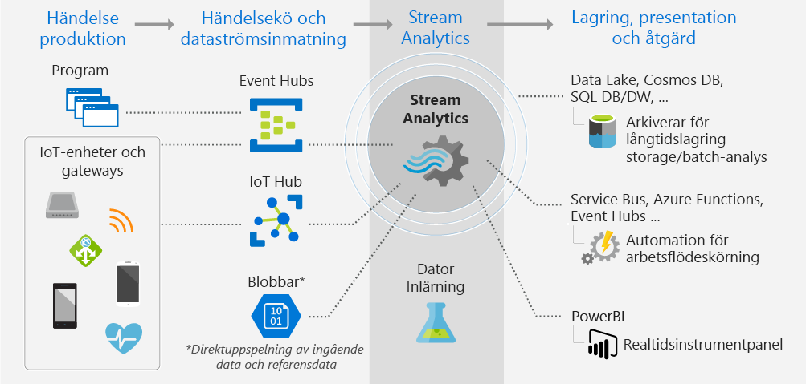

# Vad är Stream Analytics?

Azure Stream Analytics är en hanterad händelsebearbetningsmotor som ställer in analytiska beräkningar i realtid på strömmande data. Data kan komma från enheter, sensorer, webbplatser, sociala medier, program, infrastruktursystem och mer. 

Med Stream Analytics kan du undersöka stora mängder data som strömmas från enheter eller processer, extrahera information från dataströmmen och identifiera mönster, trender och relationer. Använd dessa mönster för att starta andra processer eller åtgärder, som aviseringar, automatiseringsarbetsflöden, skicka information till ett rapporteringsverktyg, eller lagra den för senare undersökning. 

Några exempel:

* Börshandelsanalys och aviseringar.
* Identifiering av bedrägerier, data, identifiera skydd. 
* Inbäddad analys av sensorer och aktuatorer.
* Webbklickanalys.

## Hur fungerar Stream Analytics?

Det här diagrammet illustrerar arbetsflödet i Stream Analytics, det vill säga hur data inhämtas, analyseras och sedan skickas för presentation eller åtgärd. 

Stream Analytics börjar med en källa för dataöverföring. Data kan hämtas till Azure från en enhet med hjälp av en Azure-händelsehubb eller IoT-hubb. Data kan också hämtas från ett dataarkiv som Azure Blob Storage. 

Om du vill kontrollera dataströmmen skapar du ett Stream Analytics-*jobb* som anger varifrån data kommer. Jobbet kan också ange en *omvandling*, hur du söker efter data, mönster eller relationer. För den här uppgiften stöder Stream Analytics ett SQL-liknande frågespråk som du kan använda för att filtrera, sortera, sammanställa och koppla strömmande data under en tidsperiod.

Slutligen anger jobbet en utdatafil dit omvandlade data skickas. Du kan styra vad du gör som svar på den information som du har analyserat. Som svar på analysen kan du till exempel:

* Skicka ett kommando för att ändra enhetsinställningarna. 
* Skicka data till en övervakad kö för ytterligare åtgärder utifrån det som identifierats. 
* Skicka data till en Power BI-instrumentpanel.
* Skicka data till lagring som Data Lake Store, Azure SQL Database eller Azure Blob Storage.

Du kan justera antalet händelser som bearbetas per sekund när jobbet körs. Du kan även skapa diagnostikloggar för felsökning.

## Viktiga funktioner och fördelar

Stream Analytics är avsett att vara enkelt att använda samt flexibelt och skalbart för alla jobbstorlekar.

### Ansluta indata och utdata

Stream Analytics ansluter direkt till [Azure Event Hubs](https://azure.microsoft.com/services/event-hubs/) och [Azure IoT Hub](https://azure.microsoft.com/services/iot-hub/) för inhämtning av dataströmmar och till [tjänsten Azure Blob Storage](https://docs.microsoft.com/azure/storage/storage-introduction#blob-storage-accounts) för att mata in historiska data. Kombinera data från händelsehubbar med Stream Analytics och andra datakällor och bearbetningsmotorer. Jobbindata kan även inkludera referensdata (statiska eller långsamt föränderliga data). Du kan koppla strömmat data till dessa referensdata och utföra åtgärder för sökning på samma sätt som du skulle gjort med databasfrågor.

Dirigera Stream Analytics-jobbutdata i många riktningar. Skriv till lagring som Azure Blob, Azure SQL Database, Azure Data Lake Store eller Azure Cosmos DB. Därifrån kan du köra gruppanalyser med Azure HDInsight. Alternativt kan du skicka utdata till en annan tjänst för användning av en annan process, till exempel händelsehubbar, Azure Service Bus-köer eller till Power BI för visualisering.

### Enkelt att använda

För att definiera omvandlingar, använder du det enkla deklarativa [Stream Analytics-frågespråket](https://msdn.microsoft.com/library/azure/dn834998.aspx) som hjälper dig att skapa avancerade analyser utan programmering. Frågespråket tar strömmande data som indata. Därefter kan du filtrera och sortera data, aggregera värden, utföra beräkningar, ansluta till data (inom en ström eller till referensdata) och använda geospatiala funktioner. Du kan redigera frågor i portalen med IntelliSense och syntaxkontroll och du kan testa frågor med exempeldata som du kan extrahera från liveöverföringen.

### Omfattande frågespråk

Du kan utöka funktionerna i frågespråket genom att definiera och anropa ytterligare funktioner. Du kan definiera funktionsanrop i Azure Machine Learning-tjänsten för att dra nytta av Azure Machine Learning-lösningar. Du kan också integrera användardefinierade JavaScript-funktioner (UDF) för att kunna utföra komplexa beräkningar som en del av en Stream Analytics-fråga.

### Skalbar

Stream Analytics kan hantera upp till 1 GB inkommande data per sekund. Tack vare integreringen med [Azure Event Hubs](https://azure.microsoft.com/services/event-hubs/) och [Azure IoT Hub](https://azure.microsoft.com/services/iot-hub/) kan jobb mata in flera miljoner händelser per sekund från anslutna enheter, klickströmsdata och loggfiler för att bara nämna några få. Med funktionen partition av händelsehubbar kan du kan också partitionera beräkningar i logiska steg, vart och ett med möjlighet att ytterligare partitioneras för att öka skalbarheten.

### Låg kostnad

Som en molntjänst är Stream Analytics optimerad för kostnad. Betala per användning baserat på en Streaming Unit och mängden data som bearbetas. Användningen beräknas baserat på mängden bearbetade händelser och hur mycket datorkraft som tilldelats i jobbklustret.

### Tillförlitlig

Som en hanterad tjänst förhindrar Stream Analytics dataförlust och ger kontinuitet för företag. Om fel uppstår innehåller tjänsten inbyggda återställningsfunktioner. Med möjligheten att upprätthålla tillstånd internt tillhandahåller tjänsten repeterbara resultat som ser till att du kan arkivera händelser och återanvända bearbetningar i framtiden, och alltid få samma resultat. Detta ger du möjlighet att gå tillbaka i tiden och undersöka beräkningar i samband med rotorsaksanalyser, konsekvensanalyser osv.

## Nästa steg

* Kom igång genom att [experimentera med indata- och frågor från IoT-enheter](stream-analytics-get-started-with-azure-stream-analytics-to-process-data-from-iot-devices.md).
* Skapa en [Stream Analytics-lösning från slutpunkt-till-slutpunkt](stream-analytics-real-time-fraud-detection.md) som undersöker telefonmetadata för att leta efter bedrägliga samtal.
* Få svar på dina Stream Analytics-frågor på [Azure Stream Analytics-forum](https://social.msdn.microsoft.com/Forums/en-US/home?forum=AzureStreamAnalytics).

