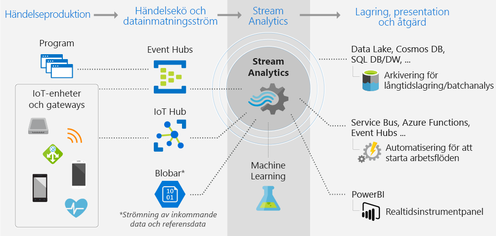
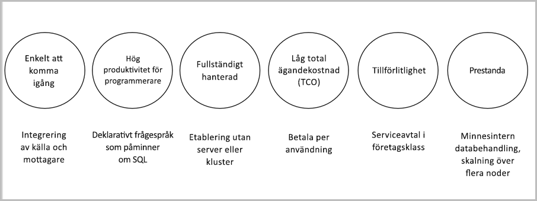

# Vad är Azure Stream Analytics?

Azure Stream Analytics är en motor för händelsebearbetning som gör det möjligt att kontrollera stora mängder data som strömmas från enheter. Inkommande data kan vara från enheter, sensorer, webbplatser, sociala medier, program och mer. Den stöder också extrahering av information från dataströmmar, identifiering av mönster och relationer. Sedan kan du använda de här mönstren för att utlösa andra åtgärder nedströms, till exempel skapa aviseringar, skicka information till ett rapporteringsverktyg eller lagra den för senare användning.

Nedan följer några exempel där Azure Stream Analytics kan användas: 

* Sakernas Internet, sensorfusion och analys i realtid på enhetstelemetri
* Webbloggar/klickströmsanalys
* Geospatial analys för hantering av vagnpark och förarlösa fordon
* Fjärrövervakning och förutsägande underhåll av högt värderade tillgångar
* Realtidsanalys av kassadata för lagerkontroll och avvikelseidentifiering

## Hur fungerar Stream Analytics?

Azure Stream Analytics börjar med en källa till strömmande data som matas in i Azure Event Hub, Azure IoT Hub eller från ett datalager, till exempel Azure Blob Storage. Om du vill kontrollera strömmarna skapar du ett Stream Analytics-jobb som anger indatakällan som strömmar data. Jobbet anger också en transformationsfråga som definierar hur du söker efter data, mönster eller relationer. Transformationsfrågan använder SQL-frågespråket för att enkelt filtrera, sortera, aggregera och ansluta strömmande data under en viss tidsperiod. När du kör jobbet kan du justera alternativen för händelseordning och varaktigheten för tidsperioder när du utför aggregeringsåtgärder.

När du har analyserat inkommande data anger du utdata för transformerade data, och du kan styra vad som ska göras som svar på den information du har analyserat. Du kan exempelvis utföra följande åtgärder:

* Skicka data till en övervakad kö för att utlösa aviseringar eller anpassade arbetsflöden nedströms.
* Skicka data till Power BI-instrumentpanel för visualisering i realtid.
* Lagra data till andra Azure Storage-tjänster, så att du kan träna en maskininlärningsmodell baserat på historiska data eller utföra batchanalyser.

Följande bild illustrerar Stream Analytics-pipelinen. Stream Analytics-jobbet kan använda alla eller en vald uppsättning av in- och utdata. Den här bilden visar hur data skickas till Stream Analytics, analyseras och skickas för andra åtgärder, till exempel lagring eller presentation:

## Viktiga funktioner och fördelar

Azure Stream Analytics är avsett att vara enkelt att använda samt flexibelt, tillförlitligt och skalbart för alla jobbstorlekar. Det är tillgängligt i flera Azure-regioner. Följande bild illustrerar de viktigaste funktionerna i Azure Stream Analytics:

## Lätt att komma igång

Det är lätt att komma igång med Azure Stream Analytics. Det krävs bara några klick för att ansluta till flera källor, kanalmottagare och för att skapa en pipeline från slutpunkt till slutpunkt. Stream Analytics kan ansluta till [Azure Event Hubs](https://docs.microsoft.com/azure/event-hubs/), [Azure IoT Hub](https://docs.microsoft.com/azure/iot-hub/) för inmatning av strömmande data. Det kan också ansluta till [Azure Blob Storage](https://docs.microsoft.com/azure/storage/storage-introduction)-tjänsten för att mata in historiska data. Det kan kombinera data från händelsehubbar med andra datakällor och bearbetningsmotorer. Jobbindata kan även omfatta referensdata som är statiska eller långsamt föränderliga data och du kan ansluta strömmande data till dessa referensdata för att utföra sökningsåtgärder.

Stream Analytics kan dirigera jobbutdata till många lagringssystem, till exempel [Azure Blob](https://docs.microsoft.com/azure/storage/storage-introduction), [Azure SQL Database](https://docs.microsoft.com/azure/sql-database/), [Azure Data Lake Stores](https://docs.microsoft.com/azure/data-lake-store/) eller [Azure Cosmos DB](https://docs.microsoft.com/azure/cosmos-db/introduction). Efter lagringen kan du köra batchanalyser med Azure HDInsight eller skicka utdata till en annan tjänst, till exempel händelsehubbar för förbrukning eller till [Power BI](https://docs.microsoft.com/power-bi/) för visualisering i realtid med hjälp av Power BI-API för strömning.

## Programmerares produktivitet

Azure Stream Analytics använder ett enkelt SQL-baserat frågespråk som har förstärkts med kraftfulla temporala begränsningar för att analysera data i rörelse. Om du vill definiera jobbtransformationer använder du ett enkelt, deklarativt [Stream Analytics-frågespråk](https://msdn.microsoft.com/library/azure/dn834998.aspx) som gör att du kan skapa komplexa temporala frågor och analyser med hjälp av enkla SQL-konstruktioner. Stream Analytics-frågespråket är konsekvent med SQL-språket, så om du är bekant med SQL-språket är det tillräckligt för att komma igång med att skapa jobb. Du kan också skapa jobb med hjälp av utvecklarverktyg, till exempel Azure PowerShell, [Stream Analytics-verktyg för Visual Studio](stream-analytics-tools-for-visual-studio-install.md) eller Azure Resource Manager-mallar. Med hjälp av utvecklarverktyg kan du utveckla transformationsfrågor offline och använda [CI/CD-pipelinen](stream-analytics-tools-for-visual-studio-cicd.md) för att skicka jobb till Azure. 

Stream Analytics-frågespråket erbjuder en mängd olika funktioner för analys och bearbetning av strömmande data. Det här frågespråket stöder enkel datamanipulering, aggregeringsfunktioner till komplexa geospatiala funktioner. Du kan redigera frågor i portalen och testa dem med hjälp av exempeldata som extraheras från liveströmmen.

Du kan utöka funktionerna i frågespråket genom att definiera och anropa ytterligare funktioner. Du kan definiera funktionsanrop i Azure Machine Learning-tjänsten för att dra nytta av Azure Machine Learning-lösningar och integrera användardefinierade JavaScript-funktioner (UDF) eller användardefinierade aggregeringar för att utföra komplexa beräkningar som en del av en Stream Analytics-fråga.

## Fullständigt hanterat 

Azure Stream Analytics är ett fullständigt hanterat serverlöst erbjudande (PaaS) på Azure. Det innebär att du inte behöver etablera någon maskinvara eller hantera kluster för att köra jobben. Azure Stream Analytics hanterar jobbet fullt ut, genom att ta hand om konfigurationen av komplexa beräkningskluster i molnet och den prestandajustering som krävs för att köra jobbet. Tack vare integreringen med Azure Event Hubs och Azure IoT Hub kan jobb mata in flera miljoner händelser per sekund från anslutna enheter, klickströmsdata och loggfiler för att bara nämna några få. Med partitioneringsfunktionen för händelsehubbar kan du partitionera beräkningar i logiska steg, vart och ett med möjlighet att ytterligare partitioneras för att öka skalbarheten.

## Köra i molnet på intelligenta gränsenheter

Azure Stream Analytics kan köras i molnet, för storskaliga analyser, eller köras på en intelligent gränsenhet för analyser med extremt låg latens.
Azure Stream Analytics använder samma frågespråk både i molnet och på intelligenta gränsenheter, så att utvecklare kan skapa verklig hybridarkitektur för bearbetning av dataströmmen.

## Låg total ägandekostnad

Som en molntjänst är Stream Analytics optimerad för kostnad. Det innebär inga direktkostnader, du betalar bara för de [strömningsenheter du förbrukar](stream-analytics-streaming-unit-consumption.md) och mängden data som bearbetas. Det krävs inget åtagande eller klusteretablering. Du kan skala upp eller ned strömningsjobben utifrån dina affärsbehov. 

## Tillförlitlighet 

Stream Analytics garanterar händelsebearbetning exakt en gång och leverans av händelser minst en gång, så inga händelser går förlorade. Det har inbyggda återställningsfunktioner om det inte går att leverera en händelse. Dessutom ger Stream Analytics inbyggda kontrollpunkter för att upprätthålla jobbets tillstånd och ger upprepningsbara resultat.

Som en hanterad tjänst garanterar Stream Analytics händelsebearbetning med 99,9 % tillgänglighet. Mer information finns på sidan [SLA för Stream Analytics](https://azure.microsoft.com/support/legal/sla/stream-analytics/v1_0/). 

## Prestanda

Stream Analytics kan bearbeta miljontals händelser per sekund och leverera resultat med kort svarstid.
Det ger dig möjlighet att skala upp och skala ut för att hantera stora program för bearbetning av händelser i realtid och komplexa händelser. Stream Analytics stöder prestanda genom partitionering, vilket gör att komplexa frågor kan parallelliseras och köras på flera direktuppspelningsnoder.
Azure Stream Analytics är byggt på [Trill](https://github.com/Microsoft/Trill), en högpresterande minnesintern analysmotor för direktuppspelning som har utvecklats i samarbete med Microsoft Research. 

## Nästa steg

Nu har du en överblick av Azure Stream Analytics. Härnäst kan du gå på djupet och skapa ditt första Stream Analytics-jobb:

* [Skapa ett Stream Analytics-jobb med hjälp av Azure Portal](stream-analytics-quick-create-portal.md).
* [Skapa ett Stream Analytics-jobb med hjälp av Azure PowerShell](stream-analytics-quick-create-powershell.md).
* [Skapa ett Stream Analytics-jobb med hjälp av Visual Studio](stream-analytics-quick-create-vs.md).

