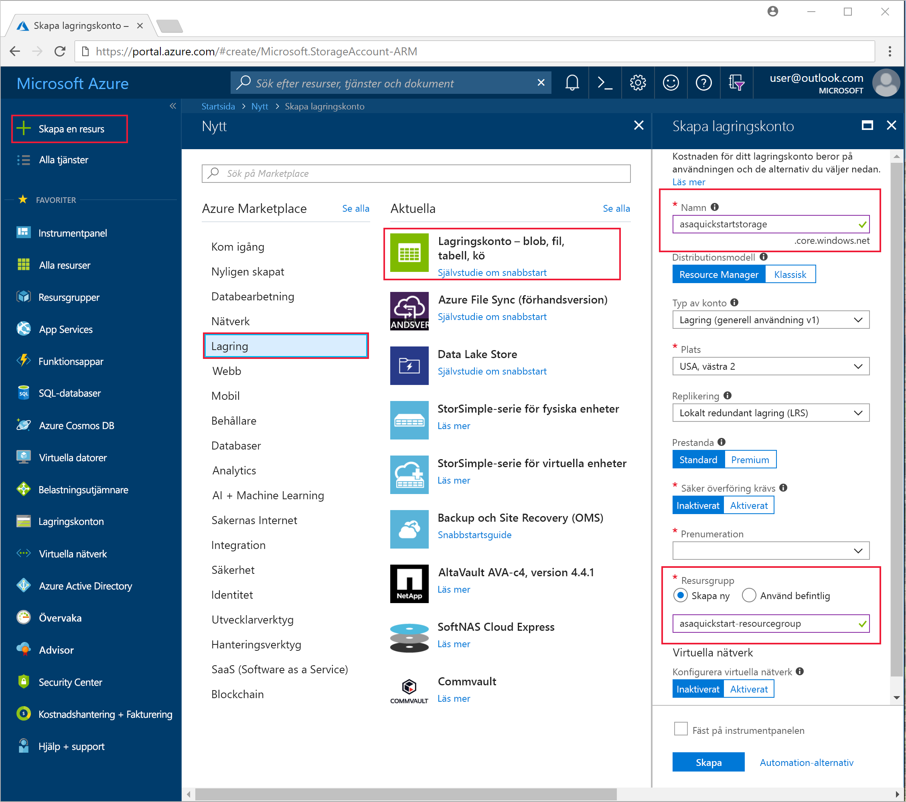
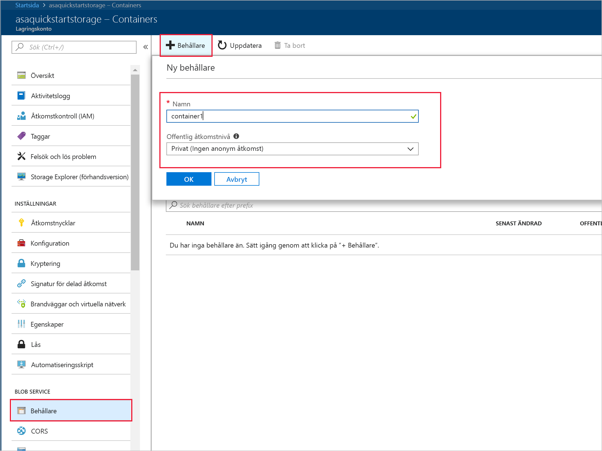
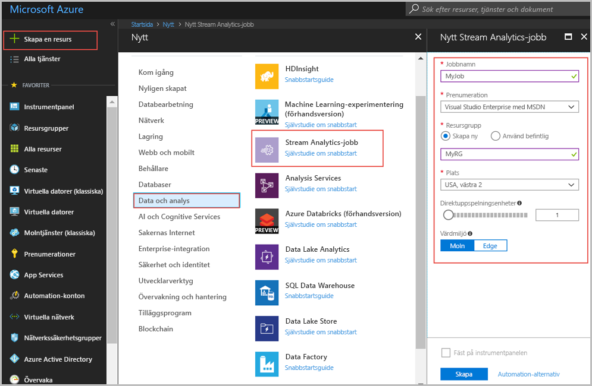
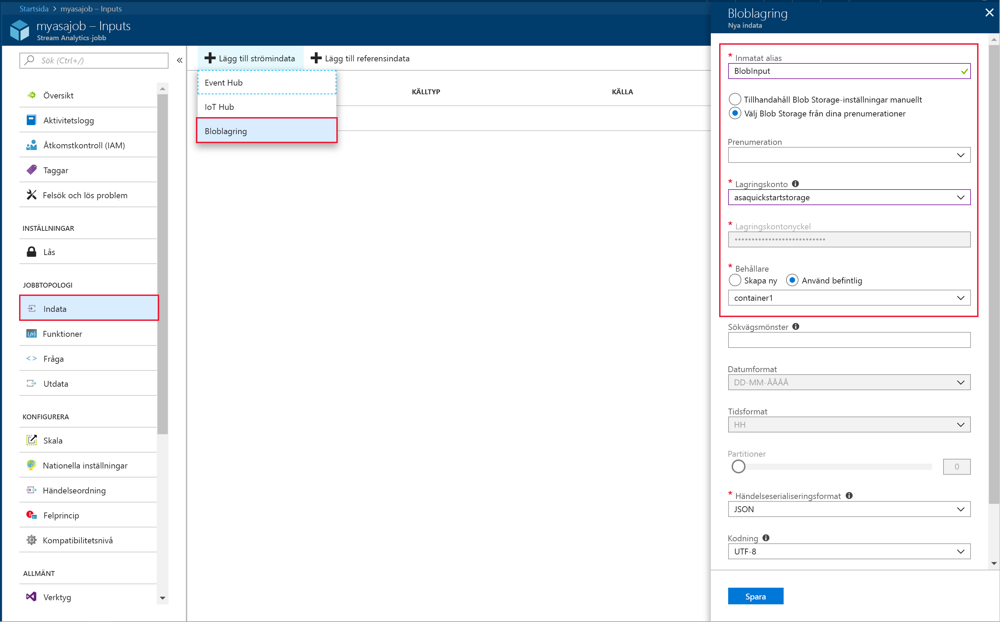
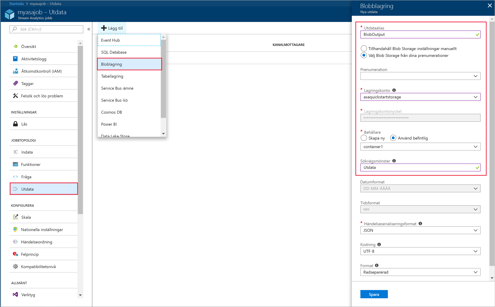
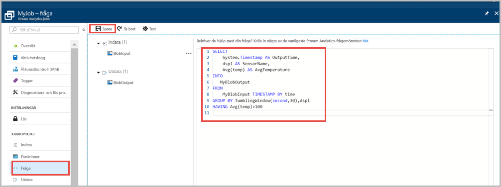
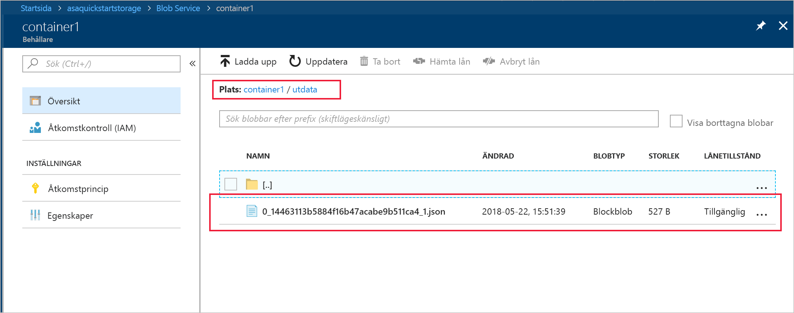

# <a name="quickstart-create-a-stream-analytics-job-by-using-the-azure-portal"></a>Snabbstart: Skapa ett Stream Analytics-jobb med hjälp av Azure-portalen

Den här snabbstarten visar hur du kommer igång med att skapa ett Stream Analytics-jobb. I den här snabbstarten definierar du ett Stream Analytics-jobb som läser exempelsensordata och filtrerar rader där medeltemperaturen är större än 100 för var 30:e sekund. I den här artikeln läser du data från bloblagringen, omvandlar data och skriver dessa data tillbaka till en annan behållare i samma bloblagring. Indata-filen som används i denna Snabbstart innehåller statiska data som endast är för illustration. I ett verkligt scenario använder du strömningsindata för en Stream Analytics-jobb.

## <a name="before-you-begin"></a>Innan du börjar

* Om du inte har någon Azure-prenumeration kan du skapa ett [kostnadsfritt konto](https://azure.microsoft.com/free/).

* Logga in på [Azure-portalen](https://portal.azure.com/).

## <a name="prepare-the-input-data"></a>Förbereda indata

Innan du definierar Stream Analytics-jobbet bör du förbereda de data som har konfigurerats som indata för jobbet. Förbered de indata som krävs för jobbet genom att köra följande steg:

1. Ladda ned [exempelsensordata](https://raw.githubusercontent.com/Azure/azure-stream-analytics/master/Samples/GettingStarted/HelloWorldASA-InputStream.json) från GitHub. Exempeldata innehåller sensorinformation i följande JSON-format:  

   ```json
   {
     "time": "2018-01-26T21:18:52.0000000",
     "dspl": "sensorC",
     "temp": 87,
     "hmdt": 44
   }
   ```
2. Logga in på Azure Portal.  

3. Välj **Skapa en resurs** > **Lagring** > **Lagringskonto** i det övre vänstra hörnet i Azure-portalen. Fyll i sidan för Storage-kontojobb och ange ”myasastorageaccount” för **Namn**, ”West US 2” för **Plats**, ”MyRG” för **Resursgrupp** (värdlagringskonto i samma resursgrupp som Streaming-jobbet för bättre prestanda). Återstående inställningar kan ha kvar standardvärdena.  

   

4. Från sidan **Alla resurser** letar du rätt på lagringskontot som du skapade i föregående steg. Öppna sidan **Översikt** och öppna sedan panelen **Blobar**.  

5. Från sidan **Blob-tjänst** väljer du **Behållare**, anger ett **Namn** för behållaren, t.ex. *container1*, och ändrar **Offentlig åtkomstnivå** till Blob (anonym läsbehörighet endast för blobar) > välj **OK**.  

   

6. Gå till behållaren du skapade i föregående steg. Välj **Ladda upp** och ladda upp sensordata som du fick i det första steget.  

   

## <a name="create-a-stream-analytics-job"></a>Skapa ett Stream Analytics-jobb

1. Logga in på Azure Portal.

2. Klicka på **Skapa en resurs** längst upp till vänster i Azure-portalen.  

3. Välj **Data + analys** > **Stream Analytics-jobb** i resultatlistan.  

4. Fyll i sidan för Stream Analytics-jobbet med följande information:

   |**Inställning**  |**Föreslaget värde**  |**Beskrivning**  |
   |---------|---------|---------|
   |Jobbnamn   |  myJob   |   Ange ett namn som identifierar Stream Analytics-jobbet. Stream Analytics-jobbets namn får enbart innehålla alfanumeriska tecken, bindestreck och understreck och måste vara mellan 3 och 63 tecken långt. |
   |Prenumeration  | \<Din prenumeration\> |  Välj den Azure-prenumeration som du vill använda för jobbet. |
   |Resursgrupp   |   myResourceGroup  |   Välj **Skapa ny** och ange ett nytt resursgruppsnamn för ditt konto. |
   |Plats  |  \<Välj den region som är närmast dina användare\> | Välj den geografiska plats där du kan ha ditt Stream Analytics-jobb. Använd den plats som är närmast dina användare för att få bättre prestanda och minska kostnaderna för dataöverföring. |
   |Strömningsenheter  | 1  |   Strömningsenheter representerar de bearbetningsresurser som krävs för att köra ett jobb. Standardvärdet är 1. Mer information om skalning av strömningsenheter finns i artikeln om att [förstå och justera strömningsenheter](stream-analytics-streaming-unit-consumption.md).   |
   |Värdmiljö  |  Molnet  |   Stream Analytics-jobb kan distribueras till molnet eller edge. Med molnet kan du distribuera till Azure Cloud, och med Edge kan du distribuera till en IoT edge-enhet. |

   

5. Markera kryssrutan **Fäst på instrumentpanelen** så att jobbet placeras på instrumentpanelen, och klicka sedan på **Skapa**.  

6. ”Distribution startas...” bör nu visas längst upp till höger i webbläsarfönstret. 

## <a name="configure-input-to-the-job"></a>Konfigurera indata för jobbet

I det här avsnittet konfigurerar du blob-lagring som indata till Stream Analytics-jobbet. Skapa ett blob-lagringskonto innan du konfigurerar indata.  

### <a name="add-the-input"></a>Lägga till indata 

1. Gå till Stream Analytics-jobbet.  

2. Välj **Indata** > **Lägga till Stream-indata** > **Blob-lagring**.  

3. Fyll i följande värden på sidan **Blob Storage**:

   |**Inställning**  |**Föreslaget värde**  |**Beskrivning**  |
   |---------|---------|---------|
   |Inmatat alias  |  BlobInput   |  Ange ett namn som identifierar jobbets indata.   |
   |Prenumeration   |  \<Din prenumeration\> |  Välj den Azure-prenumeration där det lagringskonto som du skapade finns. Lagringskontot kan vara i samma eller en annan prenumeration. I det här exemplet förutsätts att du har skapat lagringskontot i samma prenumeration. |
   |Lagringskonto  |  myasastorageaccount |  Välj eller ange lagringskontots namn. Lagringskontonamn identifieras automatiskt om de skapas i samma prenumeration. |
   |Behållare  | container1 | Välj namnet på behållaren som innehåller exempeldata. Lagringskontonamn identifieras automatiskt om de skapas i samma prenumeration. |

4. Låt standardvärdena stå kvar för övriga alternativ och välj **Spara** för att spara inställningarna.  

   
 
## <a name="configure-output-to-the-job"></a>Konfigurera utdata för jobbet

1. Gå till Stream Analytics-jobbet som du skapade tidigare.  

2. Välj **Utdata > Lägg till > Blob-lagring**.  

3. Fyll i följande värden på sidan **Blob Storage**:

   |**Inställning**  |**Föreslaget värde**  |**Beskrivning**  |
   |---------|---------|---------|
   |Utdataalias |   BlobOutput   |   Ange ett namn som identifierar jobbets utdata. |
   |Prenumeration  |  \<Din prenumeration\>  |  Välj den Azure-prenumeration där det lagringskonto som du skapade finns. Lagringskontot kan vara i samma eller en annan prenumeration. I det här exemplet förutsätts att du har skapat lagringskontot i samma prenumeration. |
   |Lagringskonto |  myasastorageaccount |   Välj eller ange lagringskontots namn. Lagringskontonamn identifieras automatiskt om de skapas i samma prenumeration.       |
   |Behållare |   container2  |  Skapa en ny behållare i samma lagringskonto som du använde för indata.   |

4. Låt standardvärdena stå kvar för övriga alternativ och välj **Spara** för att spara inställningarna.  

   
 
## <a name="define-the-transformation-query"></a>Definiera transformationsfrågan

1. Gå till Stream Analytics-jobbet som du skapade tidigare.  

2. Välj **Fråga** och uppdatera frågan på följande sätt:  

   ```sql
   SELECT 
   System.Timestamp AS OutputTime,
   dspl AS SensorName,
   Avg(temp) AS AvgTemperature
   INTO
     BlobOutput
   FROM
     BlobInput TIMESTAMP BY time
   GROUP BY TumblingWindow(second,30),dspl
   HAVING Avg(temp)>100
   ```

3. I det här exemplet läser frågan data från blobben och kopierar den till en ny fil i blobben. Välj **spara**.  

   

## <a name="start-the-stream-analytics-job-and-check-the-output"></a>Starta Stream Analytics-jobbet och kontrollera utdata

1. Återgå till jobböversiktssidan och välj **Starta**.

2. Under **Starta jobb** väljer du **Anpassad** för fältet **Starttid**. Välj `2018-01-24` som startdatum, men ändra inte tiden. Det här startdatumet är valt eftersom det kommer före tidsstämpeln för händelsen från exempeldata. När du är klar väljer du **Starta**.

   

3. Efter några minuter går du till portalen och letar rätt på lagringskontot och den behållare som du har konfigurerat som utdata för jobbet. Nu kan du se utdatafilen i behållaren. Det tar några minuter för jobbet att starta första gången. När det har startats fortsätter det att köras medan data tas emot.  

   

## <a name="clean-up-resources"></a>Rensa resurser

Ta bort resursgruppen, strömningsjobbet och alla relaterade resurser när de inte längre behövs. Om du tar bort jobbet undviker du att bli fakturerad för de strömmande enheter som används av jobbet. Om du planerar att använda jobbet i framtiden kan du stoppa det och sedan starta det igen när du behöver det. Om du inte tänker fortsätta använda det här jobbet tar du bort alla resurser som skapades i snabbstarten med följande steg:

1. Klicka på **Resursgrupper** på den vänstra menyn i Azure-portalen och välj sedan namnet på den resurs du skapade.  

2. På sidan med resursgrupper klickar du på **Ta bort**, skriver in namnet på resursen som ska tas bort i textrutan och väljer sedan **Ta bort**.

## <a name="next-steps"></a>Nästa steg

I den här snabbstarten har du distribuerat ett enkelt Stream Analytics-jobb. Om du vill se hur du konfigurerar andra indatakällor och utför realtidsidentifiering fortsätter du till följande artikel:

> [!div class="nextstepaction"]
> [Identifiering av bedrägerier i realtid med hjälp av Azure Stream Analytics](stream-analytics-real-time-fraud-detection.md)

