# <a name="quickstart-create-a-stream-analytics-job-by-using-the-azure-portal"></a>Snabbstart: Skapa ett Stream Analytics-jobb med hjälp av Azure-portalen

Den här snabbstarten visar hur du kommer igång med att skapa ett Stream Analytics-jobb. I den här snabbstarten definierar du ett Stream Analytics-jobb som läser realtidsbaserade strömningsdata och filtrerar meddelanden med en temperatur högre än 27. Ditt Stream Analyticss jobb kommer att läsa data från IoT Hub, transformera data och skriva tillbaka data till en behållare i Blob Storage. De indata som används i den här snabbstarten genereras av en Raspberry Pi-onlinesimulator. 

## <a name="before-you-begin"></a>Innan du börjar

* Om du inte har någon Azure-prenumeration kan du skapa ett [kostnadsfritt konto](https://azure.microsoft.com/free/).

* Logga in på [Azure-portalen](https://portal.azure.com/).

## <a name="prepare-the-input-data"></a>Förbereda indata

Innan du definierar Stream Analytics jobbet bör du förbereda indata. Real tids sensor data matas in till IoT Hub, som senare har kon figurer ATS som indata för jobbet. Förbered de indata som krävs för jobbet genom att utföra följande steg:

1. Logga in på [Azure-portalen](https://portal.azure.com/).

2. Välj **skapa en resurs**  >  **Sakernas Internet**  >  **IoT Hub**.

3. I rutan **IoT-hubb** anger du följande information:
   
   |**Inställning**  |**Föreslaget värde**  |**Beskrivning**  |
   |---------|---------|---------|
   |Prenumeration  | \<Your subscription\> |  Välj den Azure-prenumeration som du vill använda. |
   |Resursgrupp   |   asaquickstart-resourcegroup  |   Välj **Skapa ny** och ange ett nytt resursgruppsnamn för ditt konto. |
   |Region  |  \<Select the region that is closest to your users\> | Välj en geografisk plats där du kan hantera din IoT-hubb. Använd den plats som är närmast dina användare. |
   |IoT-hubbnamn  | MyASAIoTHub  |   Välj ett namn för din IoT-hubb.   |

   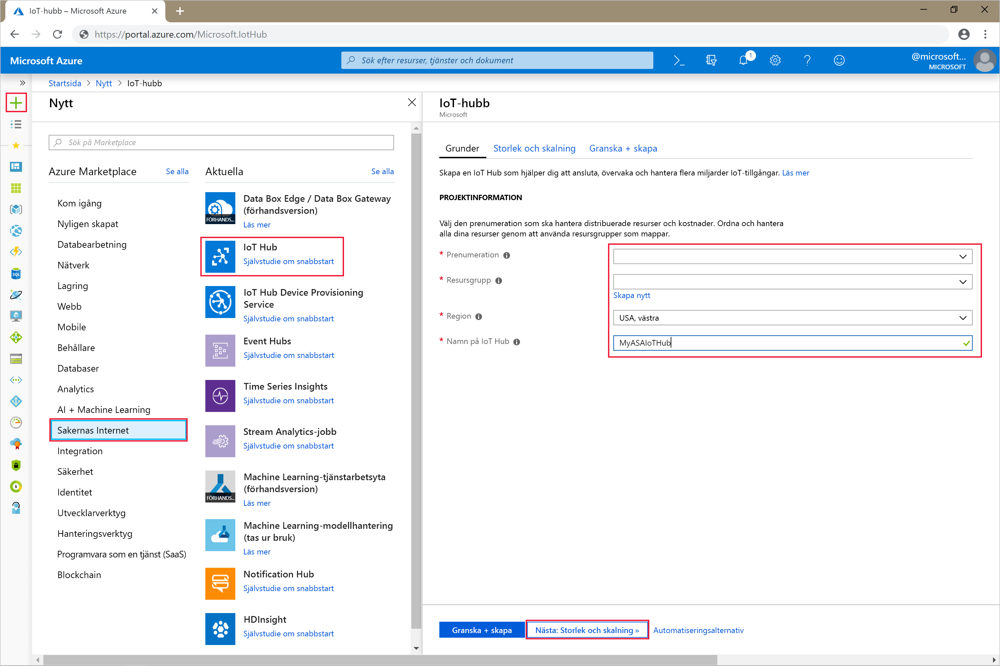

4. Välj **Nästa: Ange storlek och skala**.

5. Välj **pris- och skalningsnivå**. För den här snabbstarten väljer du nivån **F1 – kostnadsfri** om den fortfarande är tillgänglig för din prenumeration. Mer information finns i [Prissättning för IoT-hubb](https://azure.microsoft.com/pricing/details/iot-hub/).

   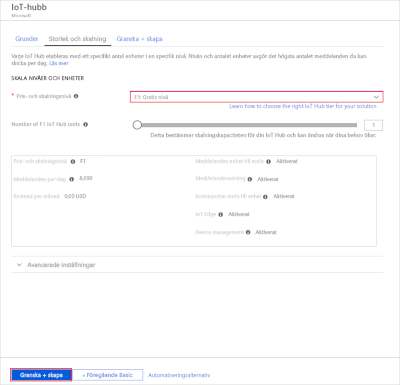

6. Välj **Granska + skapa**. Gå igenom informationen om IoT-hubben och klicka på **Skapa**. Det kan ta några minuter innan IoT-hubben skapas. Du kan övervaka förloppet i **meddelandefönstret**.

7. I navigeringsmenyn för din IoT-hubb klickar du på **Lägg till** under **IoT-enheter**. Lägg till ett **Enhets-ID** och klicka på **Spara**.

   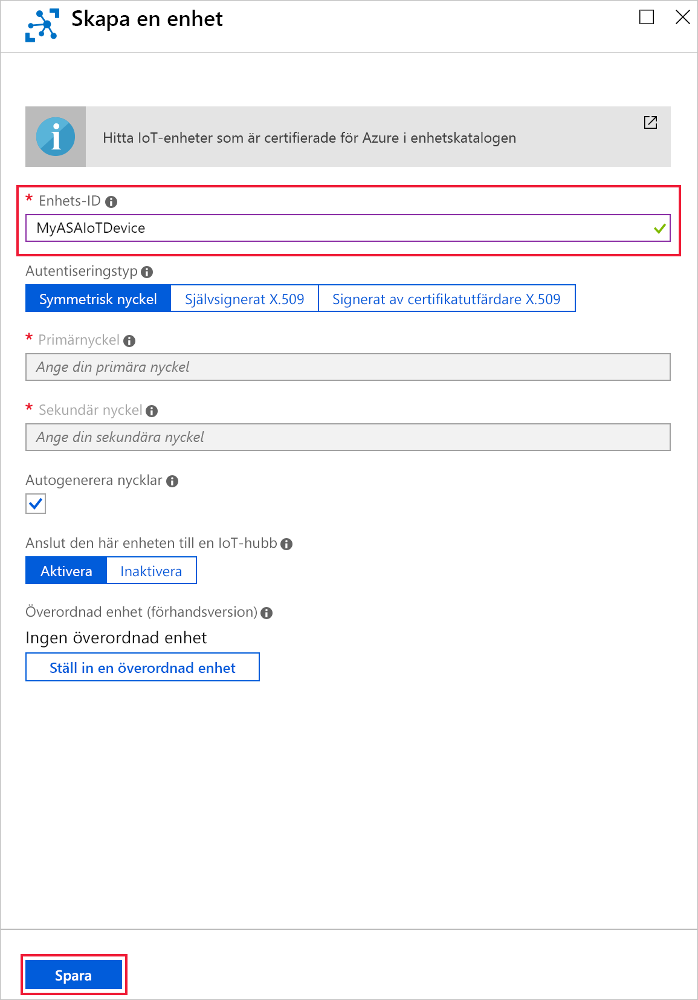

8. När enheten har skapats öppnar du enheten från listan över **IoT-enheter**. Kopiera **Anslutningssträng – primärnyckel** och spara den i en anteckningsfil för senare användning.

   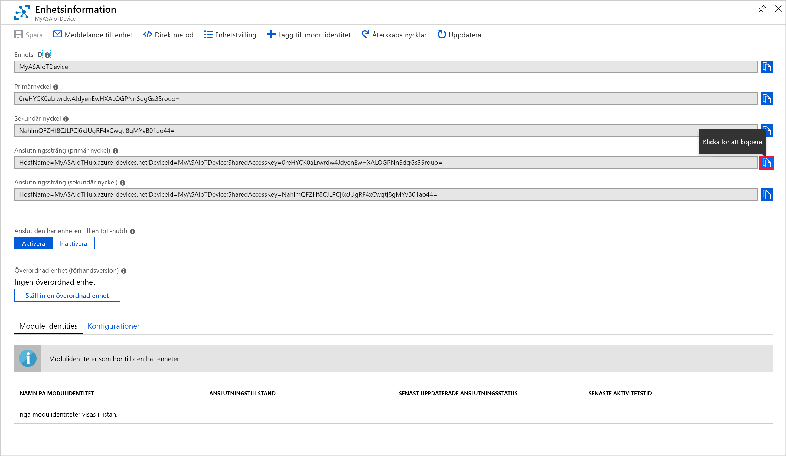

## <a name="create-blob-storage"></a>Skala bloblagring

1. I det övre vänstra hörnet av Azure Portal väljer du **skapa ett resurs**  >  **lagrings**  >  **lagrings konto**.

2. I fönsterrutan **Skapa lagringskonto** anger du namn, plats och resursgrupp för lagringskonto. Välj samma plats och resursgrupp som den IoT-hubb som du skapade. Klicka sedan på **Granska + skapa** för att skapa kontot.

   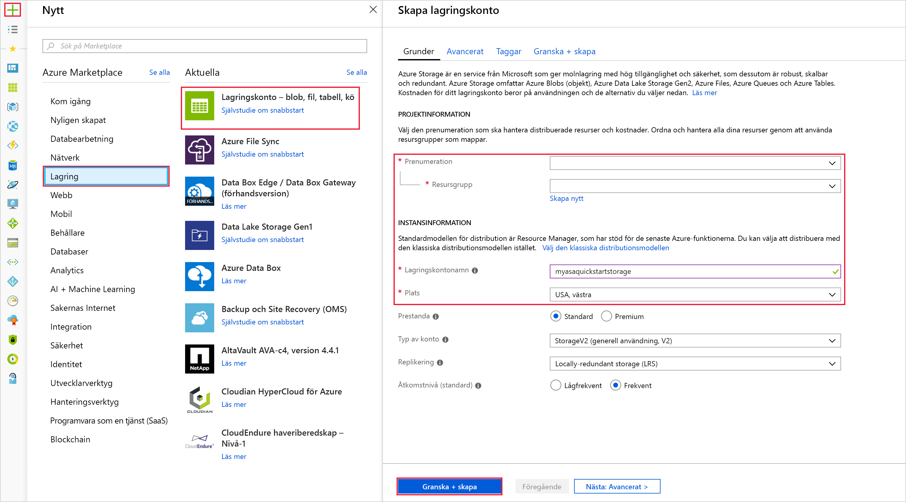

3. När ditt lagringskonto har skapats väljer du panelen **Blobar** på panelen **Översikt**.

   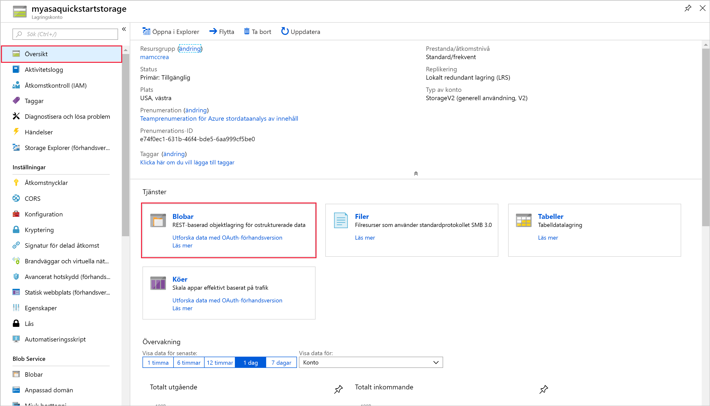

4. Från sidan **Blob Service** väljer du **Container** och anger ett namn för containern, till exempel *container1*. Låt **Offentlig åtkomstnivå** vara **Privat (ingen anonym åtkomst)** och välj **OK**.

   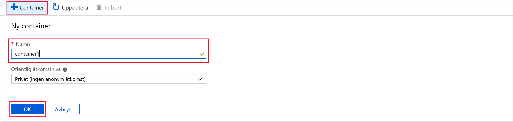

## <a name="create-a-stream-analytics-job"></a>Skapa ett Stream Analytics-jobb

1. Logga in på Azure-portalen.

2. Klicka på **Skapa en resurs** längst upp till vänster i Azure-portalen.  

3. Välj **analys**  >  **Stream Analytics jobb** i resultat listan.  

4. Fyll i sidan för Stream Analytics-jobbet med följande information:

   |**Inställning**  |**Föreslaget värde**  |**Beskrivning**  |
   |---------|---------|---------|
   |Jobbnamn   |  MyASAJob   |   Ange ett namn som identifierar Stream Analytics-jobbet. Stream Analytics-jobbets namn får enbart innehålla alfanumeriska tecken, bindestreck och understreck och måste vara mellan 3 och 63 tecken långt. |
   |Prenumeration  | \<Your subscription\> |  Välj den Azure-prenumeration som du vill använda för jobbet. |
   |Resursgrupp   |   asaquickstart-resourcegroup  |   Använd samma resursgrupp som din IoT-hubb. |
   |Plats  |  \<Select the region that is closest to your users\> | Välj den geografiska plats där du kan ha ditt Stream Analytics-jobb. Använd den plats som är närmast dina användare för att få bättre prestanda och minska kostnaderna för dataöverföring. |
   |Strömningsenheter  | 1  |   Strömningsenheter representerar de bearbetningsresurser som krävs för att köra ett jobb. Standardvärdet är 1. Mer information om skalning av strömningsenheter finns i artikeln om att [förstå och justera strömningsenheter](stream-analytics-streaming-unit-consumption.md).   |
   |Värdmiljö  |  Moln  |   Stream Analytics-jobb kan distribueras till molnet eller edge. Med molnet kan du distribuera till Azure-molnet, och med Edge kan du distribuera till en IoT Edge enhet. |

   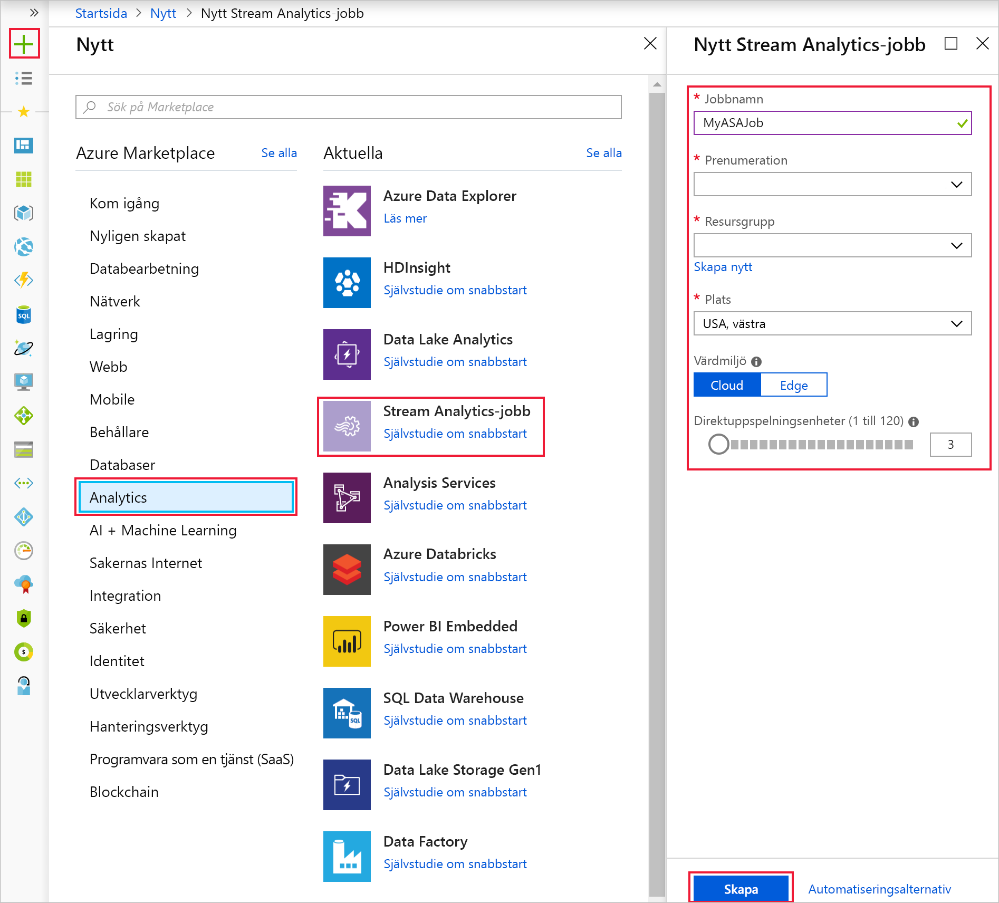

5. Markera kryssrutan **Fäst på instrumentpanelen** så att jobbet placeras på instrumentpanelen, och klicka sedan på **Skapa**.  

6. Meddelandet *Distribution pågår...* bör nu visas längst upp till höger i webbläsarfönstret. 

## <a name="configure-job-input"></a>Konfigurera jobbindata

I det här avsnittet konfigurerar du en IoT-hubbenhetsinmatning till Stream Analytics-jobbet. Använd den IoT-hubb som du skapade i föregående avsnitt i snabbstarten.

1. Gå till Stream Analytics-jobbet.  

2. Välj **indata**  >  **Lägg till data ström**  >  **IoT Hub**.  

3. Fyll sodan **IoT-hubb** med följande värden:

   |**Inställning**  |**Föreslaget värde**  |**Beskrivning**  |
   |---------|---------|---------|
   |Inmatat alias  |  IoTHubInput   |  Ange ett namn som identifierar jobbets indata.   |
   |Prenumeration   |  \<Your subscription\> |  Välj den Azure-prenumeration där det lagringskonto som du skapade finns. Lagringskontot kan vara i samma eller en annan prenumeration. I det här exemplet förutsätts att du har skapat lagringskontot i samma prenumeration. |
   |IoT Hub  |  MyASAIoTHub |  Ange namnet på den IoT-hubb som du skapade i föregående avsnitt. |

4. Låt standardvärdena stå kvar för övriga alternativ och välj **Spara** för att spara inställningarna.  

   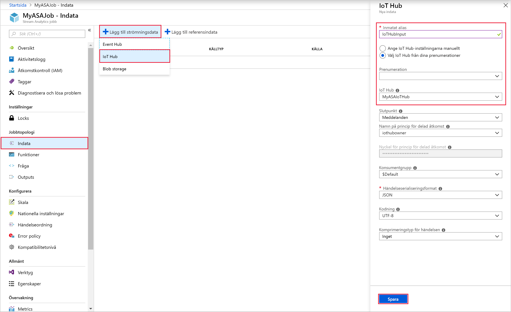
 
## <a name="configure-job-output"></a>Konfigurera jobbutdata

1. Gå till Stream Analytics-jobbet som du skapade tidigare.  

2. Välj **utdata**  >  **Lägg till**  >  **blob-lagring**.  

3. Fyll i följande värden på sidan **Blob Storage**:

   |**Inställning**  |**Föreslaget värde**  |**Beskrivning**  |
   |---------|---------|---------|
   |Utdataalias |   BlobOutput   |   Ange ett namn som identifierar jobbets utdata. |
   |Prenumeration  |  \<Your subscription\>  |  Välj den Azure-prenumeration där det lagringskonto som du skapade finns. Lagringskontot kan vara i samma eller en annan prenumeration. I det här exemplet förutsätts att du har skapat lagringskontot i samma prenumeration. |
   |Lagringskonto |  asaquickstartstorage |   Välj eller ange lagringskontots namn. Lagringskontonamn identifieras automatiskt om de skapas i samma prenumeration.       |
   |Container |   container1  |  Välj en befintlig container som du skapade i ditt lagringskonto.   |

4. Låt standardvärdena stå kvar för övriga alternativ och välj **Spara** för att spara inställningarna.  

   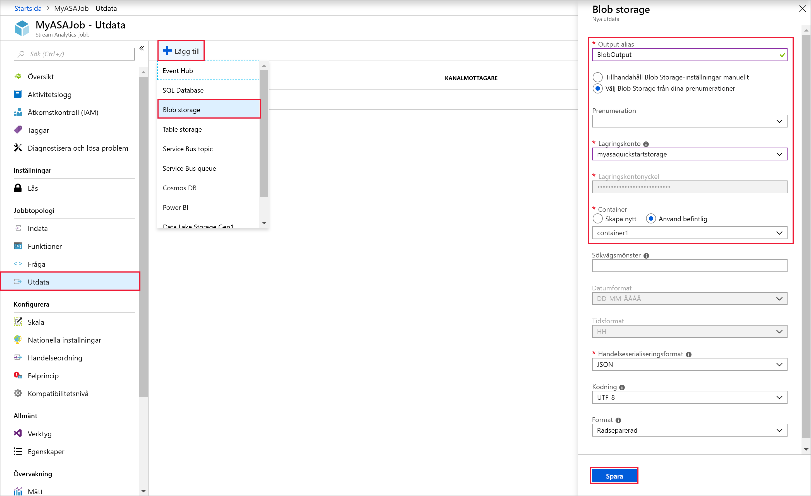
 
## <a name="define-the-transformation-query"></a>Definiera transformationsfrågan

1. Gå till Stream Analytics-jobbet som du skapade tidigare.  

2. Välj **Fråga** och uppdatera frågan på följande sätt:  

   ```sql
   SELECT *
   INTO BlobOutput
   FROM IoTHubInput
   HAVING Temperature > 27
   ```

3. I det här exemplet läser frågan data från IoT-hubben och kopierar dem till en ny fil i bloben. Välj **Spara**.  

   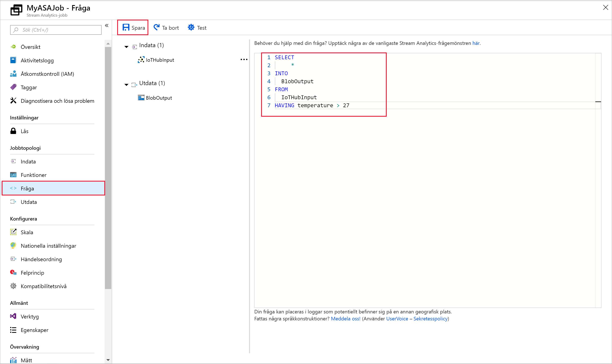

## <a name="run-the-iot-simulator"></a>Köra IoT-simulatorn

1. Öppna [Raspberry Pi Azure IoT-onlinesimulatorn](https://azure-samples.github.io/raspberry-pi-web-simulator/).

2. Ersätt platshållaren på rad 15 med Azure IoT Hub-enhetens anslutningssträng, som du sparade i föregående avsnitt.

3. Klicka på **Kör**. Utdata bör visas de sensordata och meddelanden som skickas till din IoT-hubb.

   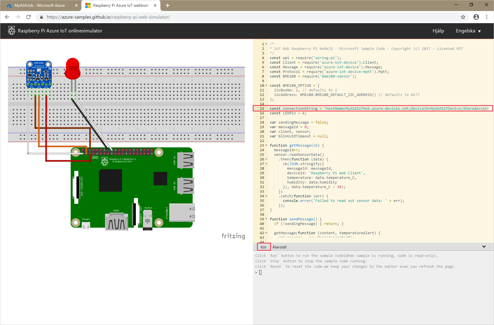

## <a name="start-the-stream-analytics-job-and-check-the-output"></a>Starta Stream Analytics-jobbet och kontrollera utdata

1. Återgå till jobböversiktssidan och välj **Starta**.

2. Under **Starta jobb** väljer du **Nu** för fältet **Starttid för jobbutdata**. Starta sedan jobbet genom att välja **Starta**.

3. Efter några minuter går du till portalen och letar rätt på lagringskontot och den container som du har konfigurerat som utdata för jobbet. Nu kan du se utdatafilen i containern. Det tar några minuter för jobbet att starta första gången. När det har startats fortsätter det att köras medan data tas emot.  

   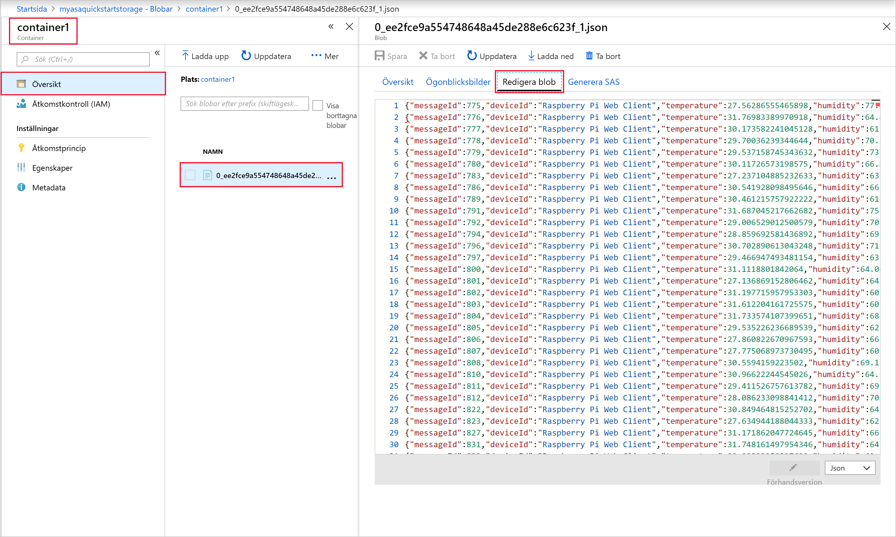

## <a name="clean-up-resources"></a>Rensa resurser

Ta bort resurs gruppen, Stream Analytics jobbet och alla relaterade resurser när de inte längre behövs. Om du tar bort jobbet undviker du att bli fakturerad för de strömmande enheter som används av jobbet. Om du planerar att använda jobbet i framtiden kan du stoppa det och sedan starta det igen när du behöver det. Om du inte tänker fortsätta använda det här jobbet tar du bort alla resurser som skapades i snabbstarten med följande steg:

1. Klicka på **Resursgrupper** på den vänstra menyn i Azure-portalen och välj sedan namnet på den resurs du skapade.  

2. På sidan med resursgrupper klickar du på **Ta bort**, skriver in namnet på resursen som ska tas bort i textrutan och väljer sedan **Ta bort**.

## <a name="next-steps"></a>Nästa steg

I den här snabbstarten har du distribuerat ett enkelt Stream Analytics-jobb med hjälp Azure-portalen. Du kan också distribuera Stream Analytics jobb med hjälp av [PowerShell](stream-analytics-quick-create-powershell.md), [Visual Studio](stream-analytics-quick-create-vs.md)och [Visual Studio Code](quick-create-visual-studio-code.md).

Om du vill se hur du konfigurerar andra indatakällor och utför realtidsidentifiering fortsätter du till följande artikel:

> [!div class="nextstepaction"]
> [Identifiering av bedrägerier i realtid med hjälp av Azure Stream Analytics](stream-analytics-real-time-fraud-detection.md)
