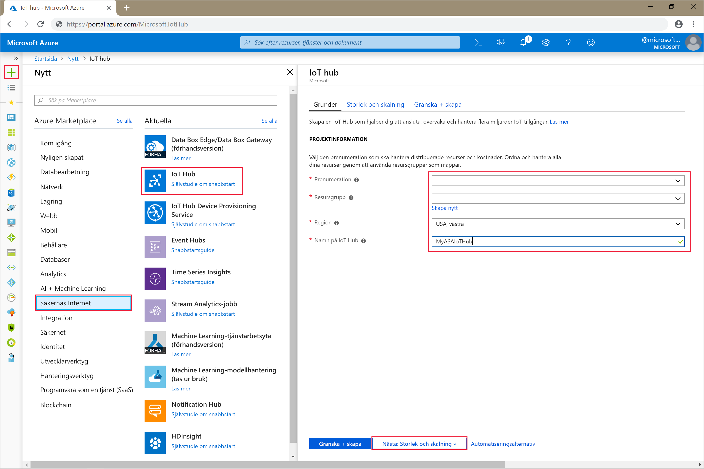
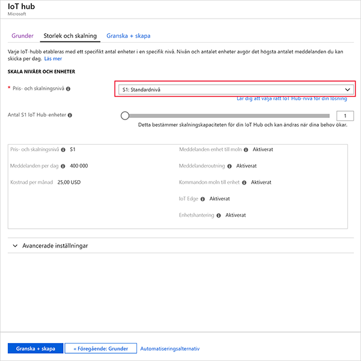
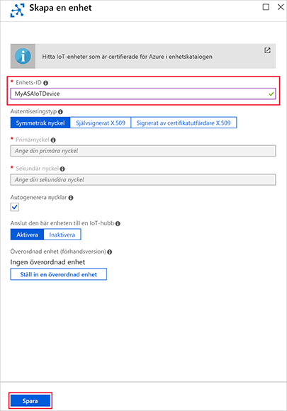
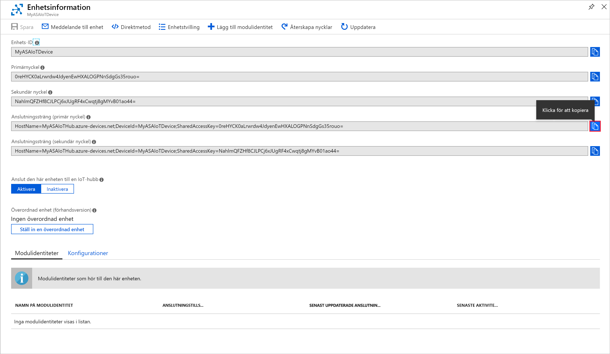

# <a name="quickstart-create-a-stream-analytics-job-by-using-the-azure-stream-analytics-tools-for-visual-studio"></a>Snabbstart: Skapa ett Stream Analytics-jobb med hjälp av Azure Stream Analytics-verktygen för Visual Studio

Den här snabbstarten visar hur du skapar och kör ett Stream Analytics-jobb med hjälp av Azure Stream Analytics-verktyg för Visual Studio. Exempeljobbet läser strömmande data från en IoT Hub-enhet. Du definierar ett jobb som beräknar medeltemperaturen när den överstiger 27° och skriver utdatahändelser till en ny fil i Blob Storage.

## <a name="before-you-begin"></a>Innan du börjar

* Om du inte har någon Azure-prenumeration kan du skapa ett [kostnadsfritt konto](https://azure.microsoft.com/free/).

* Logga in på [Azure Portal](https://portal.azure.com/).

* Installera Visual Studio 2017, Visual Studio 2015 eller Visual Studio 2013 uppdatering 4. Versionerna Enterprise (Ultimate/Premium), Professional och Community stöds. Versionen Express stöds inte.

* Följ [installationsanvisningarna](https://docs.microsoft.com/azure/stream-analytics/stream-analytics-tools-for-visual-studio-install) för att installera Stream Analytics-verktygen för Visual Studio.

## <a name="prepare-the-input-data"></a>Förbereda indata

Innan du definierar Stream Analytics-jobbet bör du förbereda de data som senare konfigureras som jobbindata. Förbered de indata som krävs för jobbet genom att utföra följande steg:

1. Logga in på [Azure Portal](https://portal.azure.com/).

2. Välj **Skapa en resurs** > **Sakernas internet** > **IoT Hub**.

3. I rutan **IoT-hubb** anger du följande information:
   
   |**Inställning**  |**Föreslaget värde**  |**Beskrivning**  |
   |---------|---------|---------|
   |Prenumeration  | \<Din prenumeration\> |  Ange den prenumeration som du vill använda. |
   |Resursgrupp   |   asaquickstart-resourcegroup  |   Välj **Skapa ny** och ange ett nytt resursgruppsnamn för ditt konto. |
   |Region  |  \<Välj den region som är närmast dina användare\> | Välj en geografisk plats där du kan hantera din IoT-hubb. Använd den plats som är närmast dina användare. |
   |IoT-hubbnamn  | MyASAIoTHub  |   Välj ett namn för din IoT-hubb.   |

   

4. Välj **Nästa: Ange storlek och skala**.

5. Välj **pris- och skalningsnivå**. För den här snabbstarten väljer du nivån **F1 – kostnadsfri** om den fortfarande är tillgänglig för din prenumeration. Om den kostnadsfria nivån inte är tillgänglig väljer du den lägsta tillgängliga nivån. Mer information finns i [Prissättning för IoT-hubb](https://azure.microsoft.com/pricing/details/iot-hub/).

   

6. Välj **Granska + skapa**. Gå igenom informationen om IoT-hubben och klicka på **Skapa**. Det kan ta några minuter innan IoT-hubben skapas. Du kan övervaka förloppet i **meddelandefönstret**.

7. I navigeringsmenyn för din IoT-hubb klickar du på **Lägg till** under **IoT-enheter**. Lägg till ett **Enhets-ID** och klicka på **Spara**.

   

8. När enheten har skapats öppnar du enheten från listan över **IoT-enheter**. Kopiera **Anslutningssträng – primärnyckel** och spara den i en anteckningsfil för senare användning.

   

## <a name="create-blob-storage"></a>Skala bloblagring

1. Välj **Skapa en resurs** > **Lagring** > **Lagringskonto** i det övre vänstra hörnet i Azure-portalen.

2. I fönsterrutan **Skapa lagringskonto** anger du namn, plats och resursgrupp för lagringskonto. Välj samma plats och resursgrupp som den IoT-hubb som du skapade. Klicka sedan på **Granska + skapa** för att skapa kontot.

   

3. När ditt lagringskonto har skapats väljer du panelen **Blobar** på panelen **Översikt**.

   

4. Från sidan **Blob Service** väljer du **Container** och anger ett namn för containern, till exempel *container1*. Låt **Offentlig åtkomstnivå** vara **Privat (ingen anonym åtkomst)** och välj **OK**.

   

## <a name="create-a-stream-analytics-project"></a>Skapa ett Stream Analytics-projekt

1. Starta Visual Studio.

2. Välj **Arkiv > Nytt projekt**.  

3. I listan över mallar till vänster väljer du **Stream Analytics** och sedan **Azure Stream Analytics-programmet**.  

4. Ange projektets **namn**, **plats** och **lösningsnamn**. Välj sedan **OK**.

   

Lägg märke till de element som ingår i ett Azure Stream Analytics-projekt.

   


## <a name="choose-the-required-subscription"></a>Välj den prenumeration som krävs

1. Gå till menyn **Visa** och välj **Server Explorer** i Visual Studio.

2. Högerklicka på **Azure**, välj **Anslut till Microsoft Azure-prenumeration** och logga in med ditt Azure-konto.

## <a name="define-input"></a>Definiera indata

1. I **Solution Explorer** expanderar du noden för **indata** och dubbelklickar på **Input.json**.

2. Fyll i informationen för **indatakonfiguration av Stream Analytics** med följande värden:

   |**Inställning**  |**Föreslaget värde**  |**Beskrivning**   |
   |---------|---------|---------|
   |Indataalias  |  Indata   |  Ange ett namn som identifierar jobbets indata.   |
   |Källtyp   |  Dataström |  Välj lämplig indatakälla: Dataström eller referensdata.   |
   |Källa  |  IoT Hub |  Välj lämplig indatakälla.   |
   |Resurs  | Välj datakälla från det aktuella kontot | Välj att ange data manuellt eller välj ett befintligt konto.   |
   |Prenumeration  |  \<Din prenumeration\>   | Välj den Azure-prenumeration som innehåller den IoT-hubb du skapade.   |
   |IoT Hub  |  MyASAIoTHub   |  Välj eller ange namnet på IoT-hubben. IoT-hubbnamn identifieras automatiskt om de skapas i samma prenumeration.   |
   
3. Låt standardvärdena stå kvar för övriga alternativ och välj **Spara** för att spara inställningarna.  

   

## <a name="define-output"></a>Definiera utdata

1. I **Solution Explorer** expanderar du noden för **utdata** och dubbelklickar på **Output.json**.

2. Fyll i informationen för **utdatakonfiguration av Stream Analytics** med följande värden:

   |**Inställning**  |**Föreslaget värde**  |**Beskrivning**   |
   |---------|---------|---------|
   |Utdataalias  |  Resultat   |  Ange ett namn som identifierar jobbets utdata.   |
   |Kanalmottagare   |  Blob Storage |  Välj lämplig kanalmottagare.    |
   |Resurs  |  Ange inställningar för datakälla manuellt |  Välj att ange data manuellt eller välj ett befintligt konto.   |
   |Prenumeration  |  \<Din prenumeration\>   | Välj den Azure-prenumeration där det lagringskonto som du skapade finns. Lagringskontot kan vara i samma eller en annan prenumeration. I det här exemplet förutsätts att du har skapat lagringskontot i samma prenumeration.   |
   |Lagringskonto  |  asaquickstartstorage   |  Välj eller ange lagringskontots namn. Lagringskontonamn identifieras automatiskt om de skapas i samma prenumeration.   |
   |Container  |  container1   |  Välj en befintlig container som du skapade i ditt lagringskonto.   |
   |Sökvägsmönster  |  utdata   |  Ange namnet för en sökväg som ska skapas i containern.   |
   
3. Låt standardvärdena stå kvar för övriga alternativ och välj **Spara** för att spara inställningarna.  

   

## <a name="define-the-transformation-query"></a>Definiera transformationsfrågan

1. Öppna **Script.asaql** från **Solution Explorer** i Visual Studio.

2. Lägg till följande fråga:

   ```sql
   SELECT *
   INTO BlobOutput
   FROM IoTHubInput
   HAVING Temperature > 27
   ```

## <a name="submit-a-stream-analytics-query-to-azure"></a>Skicka en Stream Analytics-fråga till Azure

1. I **frågeredigeraren** väljer du **Submit to Azure** (Skicka till Azure) i skriptredigeraren.

2. Välj **Create a New Azure Stream Analytics job** (Skapa ett nytt Azure Stream Analytics-jobb) och ange ett **jobbnamn**. Välj den **prenumeration**, **resursgrupp** och **plats** som du använde i början av snabbstarten.

   

## <a name="run-the-iot-simulator"></a>Köra IoT-simulatorn

1. Öppna [Raspberry Pi Azure IoT-onlinesimulatorn](https://azure-samples.github.io/raspberry-pi-web-simulator/) i en ny webbläsarflik eller ett fönster.

2. Ersätt platshållaren på rad 15 med Azure IoT Hub-enhetens anslutningssträng, som du sparade i föregående avsnitt.

3. Klicka på **Run** (Kör). Utdata bör visas de sensordata och meddelanden som skickas till din IoT-hubb.

   

## <a name="start-the-stream-analytics-job-and-check-output"></a>Starta Stream Analytics-jobbet och kontrollera utdata

1. Jobbvyn öppnas automatiskt när jobbet har skapats. Välj den gröna pilknappen för att starta jobbet.

   

2. Ändra **Job output start mode** (Startläge för jobbutdata) till **JobStartTime** och välj **Starta**.

   

3. Observera att jobbstatusen har ändrats till **Körs** och att det finns händelser med indata/utdata. Det kan ta några minuter.

   

4. För att visa resultatet, gå till menyn **Visa** och välj **Cloud Explorer**. Navigera till lagringskontot i resursgruppen. Under **Blob-behållare** dubbelklickar du på **container1** och sedan på filsökvägen för **utdata**.

   

## <a name="clean-up-resources"></a>Rensa resurser

Ta bort resursgruppen, strömningsjobbet och alla relaterade resurser när de inte längre behövs. Om du tar bort jobbet undviker du att bli fakturerad för de strömmande enheter som används av jobbet. Om du planerar att använda jobbet i framtiden kan du stoppa det och sedan starta det igen när du behöver det. Om du inte tänker fortsätta använda det här jobbet tar du bort alla resurser som skapades i snabbstarten med följande steg:

1. Klicka på **Resursgrupper** på den vänstra menyn i Azure-portalen och välj sedan namnet på den resurs du skapade.  

2. På sidan med resursgrupper klickar du på **Ta bort**, skriver in namnet på resursen som ska tas bort i textrutan och väljer sedan **Ta bort**.

## <a name="next-steps"></a>Nästa steg

I den här snabbstarten har du distribuerat ett enkelt Stream Analytics-jobb med Visual Studio. Du kan även distribuera Stream Analytics-jobb med [Azure-portalen](stream-analytics-quick-create-portal.md) och [PowerShell](stream-analytics-quick-create-powershell.md). 

Fortsätt till följande artikel om du vill veta mer om Azure Stream Analytics-verktyg för Visual Studio:

> [!div class="nextstepaction"]
> [Använda Visual Studio för att visa Azure Stream Analytics-jobb](stream-analytics-vs-tools.md)
