# <a name="quickstart-create-a-stream-analytics-job-by-using-the-azure-stream-analytics-tools-for-visual-studio"></a>Snabbstart: Skapa ett Stream Analytics-jobb med hjälp av Azure Stream Analytics-verktygen för Visual Studio

Den här snabbstarten visar hur du skapar och kör ett Stream Analytics-jobb med hjälp av Azure Stream Analytics-verktyg för Visual Studio. Exempeljobbet läser strömmande data från Azure Blob Storage. Indata-filen som används i denna Snabbstart innehåller statiska data som endast är för illustration. I ett verkligt scenario använder du strömningsindata för en Stream Analytics-jobb. I den här snabbstarten definierar du ett jobb som beräknar medeltemperaturen när den överstiger 100° och skriver utdatahändelser till en ny fil.

## <a name="before-you-begin"></a>Innan du börjar

* Om du inte har någon Azure-prenumeration kan du skapa ett [kostnadsfritt konto](https://azure.microsoft.com/free/).

* Logga in på [Azure-portalen](https://portal.azure.com/).

* Installera Visual Studio 2017, Visual Studio 2015 eller Visual Studio 2013 uppdatering 4. Versionerna Enterprise (Ultimate/Premium), Professional och Community stöds. Versionen Express stöds inte.

* Följ [installationsanvisningarna](https://docs.microsoft.com/azure/stream-analytics/stream-analytics-tools-for-visual-studio-install) för att installera Stream Analytics-verktygen för Visual Studio.

## <a name="prepare-the-input-data"></a>Förbereda indata

Innan du definierar Stream Analytics-jobbet bör du förbereda de data som har konfigurerats som indata för jobbet. Förbered de indata som krävs för jobbet genom att köra följande steg:

1. Ladda ned [exempelsensordata](https://raw.githubusercontent.com/Azure/azure-stream-analytics/master/Samples/GettingStarted/HelloWorldASA-InputStream.json) från GitHub. Exempeldata innehåller sensorinformation i följande JSON-format:  

   ```json
   {
     "time": "2018-01-26T21:18:52.0000000",
     "dspl": "sensorC",
     "temp": 87,
     "hmdt": 44
   }
   ```
2. Logga in på [Azure-portalen](https://portal.azure.com/).

3. Välj **Skapa en resurs** > **Lagring** > **Lagringskonto** i det övre vänstra hörnet i Azure-portalen. Fyll i sidan för Storage-kontojobb med ”asaquickstartstorage” som **Namn**, ”västra USA” som **Plats**, ”asaquickstart-resourcegroup” som **Resursgrupp** (använd samma resursgrupp som värd för lagringskontot som streamingjobbet för bättre prestanda). Återstående inställningar kan ha kvar standardvärdena.  

   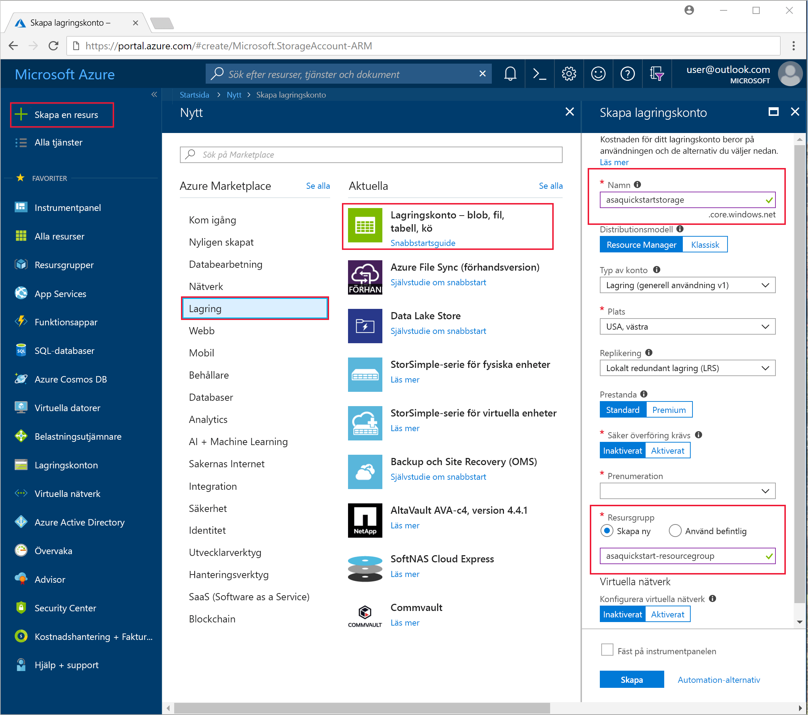

4. Från sidan **Alla resurser** letar du rätt på lagringskontot som du skapade i föregående steg. Öppna sidan **Översikt** och öppna sedan panelen **Blobar**.  

5. Från sidan **Blob Service** väljer du **behållare** och anger ett **namn** för behållaren, som *container1* > välj sedan  **OK**.  

   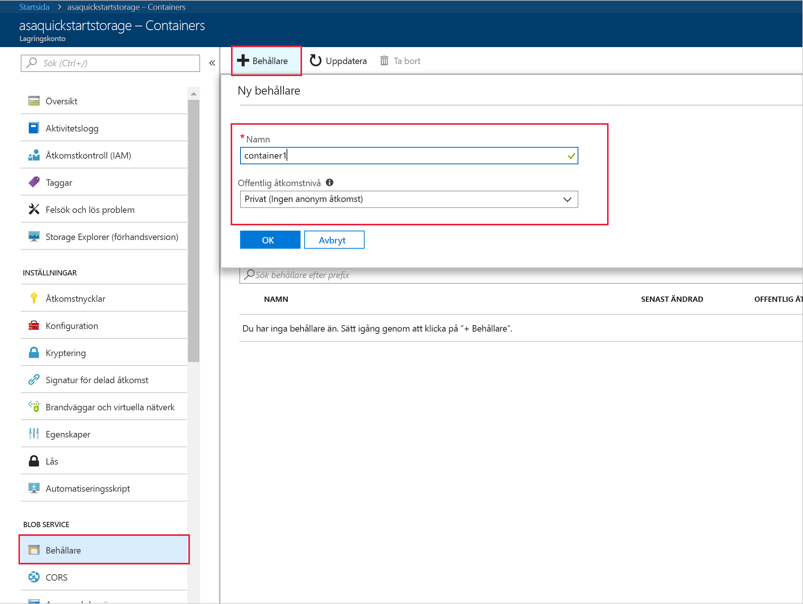

6. Gå till containern du skapade i föregående steg. Välj **Ladda upp** och ladda upp sensordata som du fick i det första steget.  

   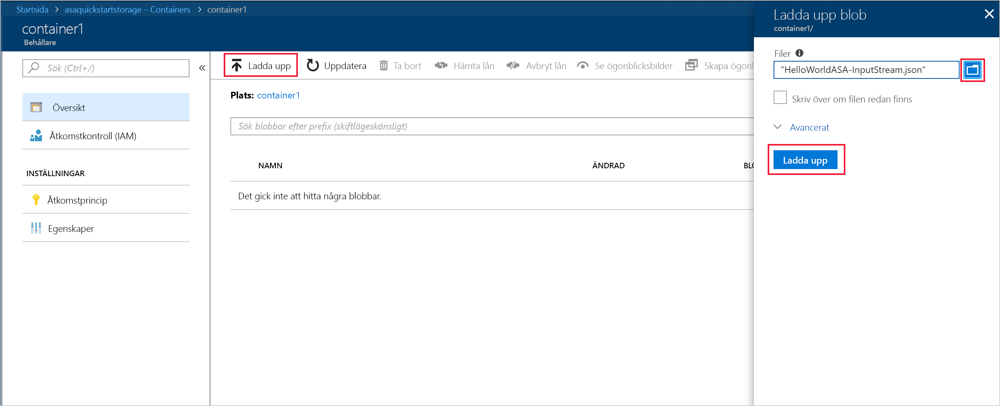

## <a name="create-a-stream-analytics-project"></a>Skapa ett Stream Analytics-projekt

1. Starta Visual Studio.

2. Välj **Arkiv > Nytt projekt**.  

3. I listan över mallar till vänster väljer du **Stream Analytics** och sedan **Azure Stream Analytics-programmet**.  

4. Ange projektets **namn**, **plats** och **lösningsnamn**. Välj sedan **OK**.

   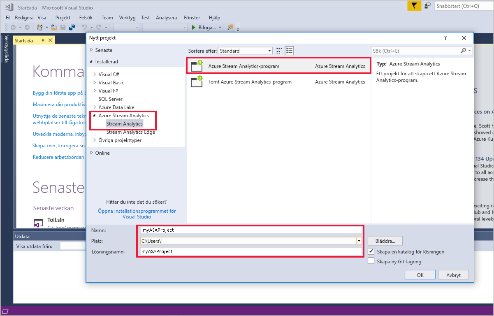

Lägg märke till de element som ingår i ett Azure Stream Analytics-projekt.

   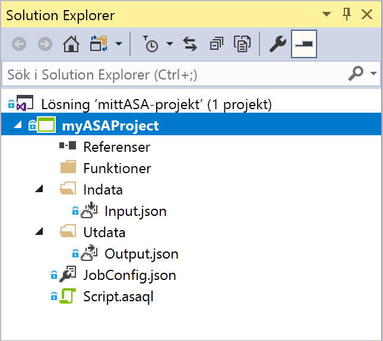


## <a name="choose-the-required-subscription"></a>Välj den prenumeration som krävs

1. Gå till menyn **Visa** och välj **Server Explorer** i Visual Studio.

2. Högerklicka på **Azure**, välj **Anslut till Microsoft Azure-prenumeration** och logga in med ditt Azure-konto.

## <a name="define-input"></a>Definiera indata

1. I **Solution Explorer** expanderar du noden för **indata** och dubbelklickar på **Input.json**.

2. Fyll i informationen för **indatakonfiguration av Stream Analytics** med följande värden:

   |**Inställning**  |**Föreslaget värde**  |**Beskrivning**   |
   |---------|---------|---------|
   |Indataalias  |  Indata   |  Ange ett namn som identifierar jobbets indata.   |
   |Källtyp   |  Dataström |  Välj lämplig indatakälla: dataström eller referensdata.   |
   |Källa  |  Blob Storage |  Välj lämplig indatakälla.   |
   |Resurs  | Välj datakälla från det aktuella kontot | Välj att ange data manuellt eller välj ett befintligt konto.   |
   |Prenumeration  |  \<Din prenumeration\>   | Välj den Azure-prenumeration där det lagringskonto som du skapade finns. Lagringskontot kan vara i samma eller en annan prenumeration. I det här exemplet förutsätts att du har skapat lagringskontot i samma prenumeration.   |
   |Lagringskonto  |  asaquickstartstorage   |  Välj eller ange lagringskontots namn. Lagringskontonamn identifieras automatiskt om de skapas i samma prenumeration.   |
   |Container  |  container1   |  Välj en befintlig container som du skapade i ditt lagringskonto.   |
   
3. Låt standardvärdena stå kvar för övriga alternativ och välj **Spara** för att spara inställningarna.  

   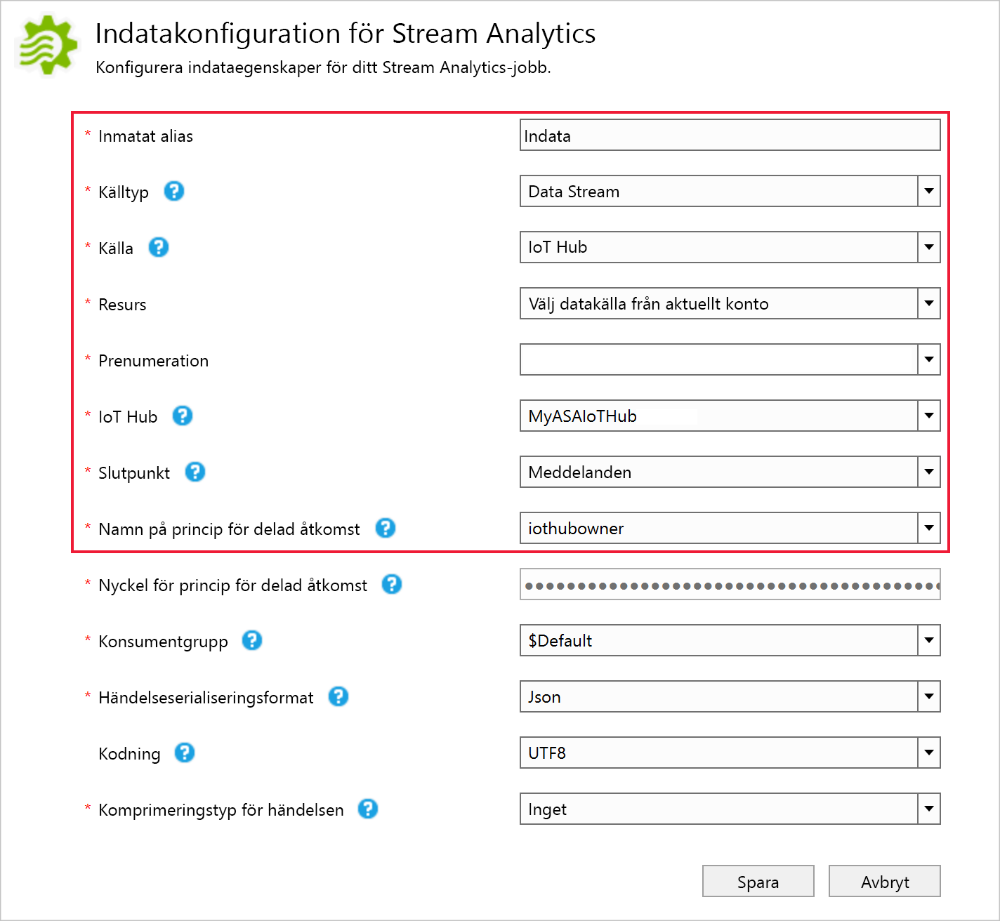

## <a name="define-output"></a>Definiera utdata

1. I **Solution Explorer** expanderar du noden för **utdata** och dubbelklickar på **Output.json**.

2. Fyll i informationen för **utdatakonfiguration av Stream Analytics** med följande värden:

   |**Inställning**  |**Föreslaget värde**  |**Beskrivning**   |
   |---------|---------|---------|
   |Utdataalias  |  Resultat   |  Ange ett namn som identifierar jobbets utdata.   |
   |Kanalmottagare   |  Blob Storage |  Välj lämplig kanalmottagare.    |
   |Resurs  |  Ange inställningar för datakälla manuellt |  Välj att ange data manuellt eller välj ett befintligt konto.   |
   |Prenumeration  |  \<Din prenumeration\>   | Välj den Azure-prenumeration där det lagringskonto som du skapade finns. Lagringskontot kan vara i samma eller en annan prenumeration. I det här exemplet förutsätts att du har skapat lagringskontot i samma prenumeration.   |
   |Lagringskonto  |  asaquickstartstorage   |  Välj eller ange lagringskontots namn. Lagringskontonamn identifieras automatiskt om de skapas i samma prenumeration.   |
   |Container  |  container1   |  Välj en befintlig container som du skapade i ditt lagringskonto.   |
   |Sökvägsmönster  |  utdata   |  Ange namnet för en sökväg som ska skapas i containern.   |
   
3. Låt standardvärdena stå kvar för övriga alternativ och välj **Spara** för att spara inställningarna.  

   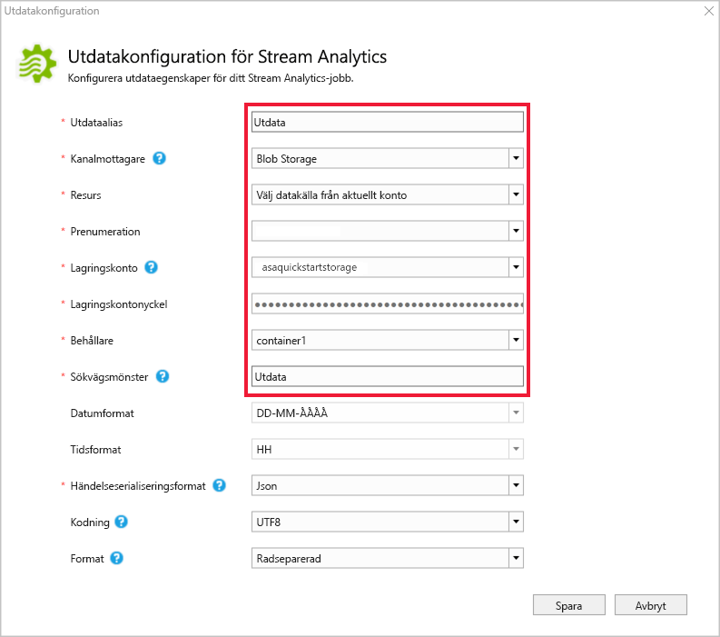

## <a name="define-the-transformation-query"></a>Definiera transformationsfrågan

1. Öppna **Script.asaql** från **Solution Explorer** i Visual Studio.

2. Lägg till följande fråga:

   ```sql
   SELECT 
   System.Timestamp AS OutputTime,
   dspl AS SensorName,
   Avg(temp) AS AvgTemperature
   INTO
     Output
   FROM
     Input TIMESTAMP BY time
   GROUP BY TumblingWindow(second,30),dspl
   HAVING Avg(temp)>100
   ```

## <a name="submit-a-stream-analytics-query-to-azure"></a>Skicka en Stream Analytics-fråga till Azure

1. I **frågeredigeraren** väljer du **Submit to Azure** (Skicka till Azure) i skriptredigeraren.

2. Välj **Create a New Azure Stream Analytics job** (Skapa ett nytt Azure Stream Analytics-jobb) och ange ett **jobbnamn**. Välj den **prenumeration**, **resursgrupp** och **plats** som du använde i början av snabbstarten.

   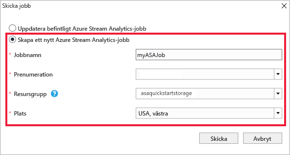

## <a name="start-the-stream-analytics-job-and-check-output"></a>Starta Stream Analytics-jobbet och kontrollera utdata

1. Jobbvyn öppnas automatiskt när jobbet har skapats. Välj den gröna pilknappen för att starta jobbet.

   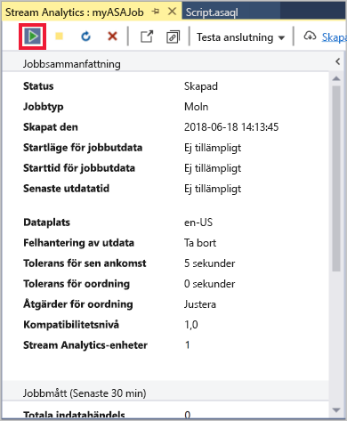

2. Ändra datumet för **Anpassad tid** till `2018-01-01` och välj **Starta**.

   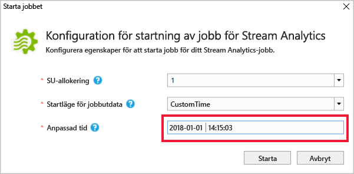

3. Observera att jobbstatusen har ändrats till **Körs** och att det finns händelser med indata/utdata. Det kan ta några minuter.

   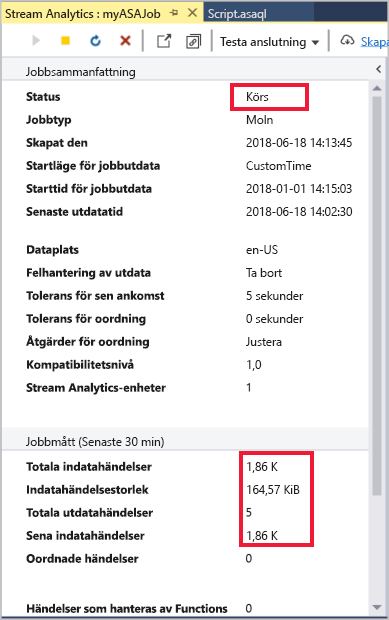

4. För att visa resultatet, gå till menyn **Visa** och välj **Cloud Explorer**. Navigera till lagringskontot i resursgruppen. Under **Blob-behållare** dubbelklickar du på **container1** och sedan på filsökvägen för **utdata**.

   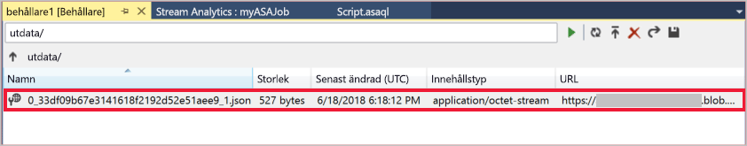

## <a name="clean-up-resources"></a>Rensa resurser

Ta bort resursgruppen, strömningsjobbet och alla relaterade resurser när de inte längre behövs. Om du tar bort jobbet undviker du att bli fakturerad för de strömmande enheter som används av jobbet. Om du planerar att använda jobbet i framtiden kan du stoppa det och sedan starta det igen när du behöver det. Om du inte tänker fortsätta använda det här jobbet tar du bort alla resurser som skapades i snabbstarten med följande steg:

1. Klicka på **Resursgrupper** på den vänstra menyn i Azure-portalen och välj sedan namnet på den resurs du skapade.  

2. På sidan med resursgrupper klickar du på **Ta bort**, skriver in namnet på resursen som ska tas bort i textrutan och väljer sedan **Ta bort**.

## <a name="next-steps"></a>Nästa steg

I den här snabbstarten har du distribuerat ett enkelt Stream Analytics-jobb med Visual Studio. Du kan även distribuera Stream Analytics-jobb med [Azure-portalen](stream-analytics-quick-create-portal.md) och [PowerShell](stream-analytics-quick-create-powershell.md). 

Om du vill se hur du konfigurerar andra indatakällor och utför realtidsidentifiering fortsätter du till följande artikel:

> [!div class="nextstepaction"]
> [Identifiering av bedrägerier i realtid med hjälp av Azure Stream Analytics](stream-analytics-real-time-fraud-detection.md)
