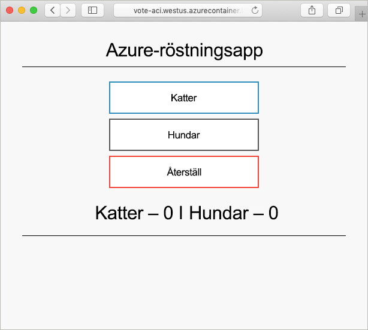

# <a name="create-a-terraform-configuration-for-azure"></a>Skapa en Terraform-konfigurations för Azure

I det här exemplet får du erfarenhet av att skapa en Terraform-konfiguration och distribuera konfigurationen till Azure. När du är klar kommer du att ha distribuerat en Azure Cosmos DB-instans, en Azure Container-instans och ett program som fungerar över dessa två resurser. Det här dokumentet förutsätter att allt arbete har slutförts i Azure Cloud Shell, som har Terraform-verktyg förinstallerade. Om du vill gå igenom exemplet på din dator kan Terraform installeras med hjälp av instruktionerna [här](../virtual-machines/linux/terraform-install-configure.md).

## <a name="create-first-configuration"></a>Skapa den första konfigurationen

I det här avsnittet skapar du konfigurationen för en Azure Cosmos DB-instans.

Välj **prova nu** för att öppna Azure Cloud Shell. När det är öppet anger du `code .` för att öppna kodredigeraren för Cloud Shell.

```azurecli-interactive
code .
```

Kopiera och klistra in följande Terraform-konfiguration.

Den här konfigurationen modellerar en Azure-resursgrupp, ett slumpvist heltal och en Azure Cosmos DB-instans. Det slumpvisa heltalet används i Cosmos DB-instansens namn. Dessutom konfigureras flera Cosmos DB-inställningar. En fullständig lista över Cosmos DB Terraform-konfigurationer finns i [referensen för Cosmos DB Terraform](https://www.terraform.io/docs/providers/azurerm/r/cosmosdb_account.html).

Spara filen som `main.tf` när du är klar. Den här åtgärden kan utföras med hjälp av ellipserna i den övre högra delen av kodredigeraren.

```azurecli-interactive
resource "azurerm_resource_group" "vote-resource-group" {
  name     = "vote-resource-group"
  location = "westus"
}

resource "random_integer" "ri" {
  min = 10000
  max = 99999
}

resource "azurerm_cosmosdb_account" "vote-cosmos-db" {
  name                = "tfex-cosmos-db-${random_integer.ri.result}"
  location            = "${azurerm_resource_group.vote-resource-group.location}"
  resource_group_name = "${azurerm_resource_group.vote-resource-group.name}"
  offer_type          = "Standard"
  kind                = "GlobalDocumentDB"

  consistency_policy {
    consistency_level       = "BoundedStaleness"
    max_interval_in_seconds = 10
    max_staleness_prefix    = 200
  }

  geo_location {
    location          = "westus"
    failover_priority = 0
  }
}
```

Kommandot [terraform init](https://www.terraform.io/docs/commands/init.html) initierar arbetskatalogen. Kör `terraform init` i Cloud Shell-terminalen för att förbereda för distributionen av den nya konfigurationen.

```azurecli-interactive
terraform init
```

Kommandot [terraform plan](https://www.terraform.io/docs/commands/plan.html) kan användas för att verifiera att konfigurationen är korrekt formaterad och för att visualisera vilka resurser som kommer att skapas, uppdateras eller förstöras. Resultatet kan lagras i en fil och användas vid ett senare tillfälle för att tillämpa konfigurationen.

Kör `terraform plan` för att testa den nya Terraform-konfigurationen.

```azurecli-interactive
terraform plan --out plan.out
```

Tillämpa konfigurationen med hjälp av [terraform apply](https://www.terraform.io/docs/commands/apply.html) och ange namnet på planfilen. Det här kommandot distribuerar resurserna i din Azure-prenumeration.

```azurecli-interactive
terraform apply plan.out
```

När det är klart ser du att resursgruppen har skapats och en Azure Cosmos DB-instans har placerats i resursgruppen.

## <a name="update-configuration"></a>Uppdatera konfiguration

Uppdatera konfigurationen för att inkludera en Azure Container-instans. Containern kör ett program som läser och skriver data till Cosmos DB.

Kopiera följande konfiguration till slutet av `main.tf`-filen. Spara filen när det är klart.

Två miljövariabler anges: `COSMOS_DB_ENDPOINT` och `COSMOS_DB_MASTERKEY`. Dessa variabler innehåller platsen och nyckeln för åtkomst till databasen. Värdena för de här variablerna hämtas från den databasinstans som skapades i föregående steg. Den här processen kallas interpolering. Läs mer om Terraform-interpolering i [interpoleringssyntax](https://www.terraform.io/docs/configuration/interpolation.html).


Konfigurationen innehåller även ett utdatablock som returnerar det fullständiga domännamnet (FQDN) för containerinstansen.

```azurecli-interactive
resource "azurerm_container_group" "vote-aci" {
  name                = "vote-aci"
  location            = "${azurerm_resource_group.vote-resource-group.location}"
  resource_group_name = "${azurerm_resource_group.vote-resource-group.name}"
  ip_address_type     = "public"
  dns_name_label      = "vote-aci"
  os_type             = "linux"

  container {
    name   = "vote-aci"
    image  = "microsoft/azure-vote-front:cosmosdb"
    cpu    = "0.5"
    memory = "1.5"
    ports  = {
      port     = 80
      protocol = "TCP"
    }

    secure_environment_variables {
      "COSMOS_DB_ENDPOINT"  = "${azurerm_cosmosdb_account.vote-cosmos-db.endpoint}"
      "COSMOS_DB_MASTERKEY" = "${azurerm_cosmosdb_account.vote-cosmos-db.primary_master_key}"
      "TITLE"               = "Azure Voting App"
      "VOTE1VALUE"          = "Cats"
      "VOTE2VALUE"          = "Dogs"
    }
  }
}

output "dns" {
  value = "${azurerm_container_group.vote-aci.fqdn}"
}
```

Kör `terraform plan` för att skapa den uppdaterade planen och visualisera de ändringar som ska göras. Du bör se att Azure Container-instansresurs har lagts till konfigurationen.

```azurecli-interactive
terraform plan --out plan.out
```

Kör slutligen `terraform apply` för att tillämpa konfigurationen.

```azurecli-interactive
terraform apply plan.out
```

När det är klart anteckna containerinstansens FQDN.

## <a name="test-application"></a>Testa programmet

Gå till containerinstansens FQDN. Om allt konfigurerades korrekt bör du se följande program.



## <a name="clean-up-resources"></a>Rensa resurser

När du är klar kan Azure-resurserna och resursgruppen tas bort med hjälp av kommandot [terraform destroy](https://www.terraform.io/docs/commands/destroy.html).

```azurecli-interactive
terraform destroy -auto-approve
```

## <a name="next-steps"></a>Nästa steg

I det här exemplet skapade, distribuerade och förstörde du en Terraform-konfiguration. Mer information om hur du använder Terraform i Azure finns i dokumentationen för Azure Terraform-provider.

> [!div class="nextstepaction"]
> [Azure Terraform-provider](https://www.terraform.io/docs/providers/azurerm/)
