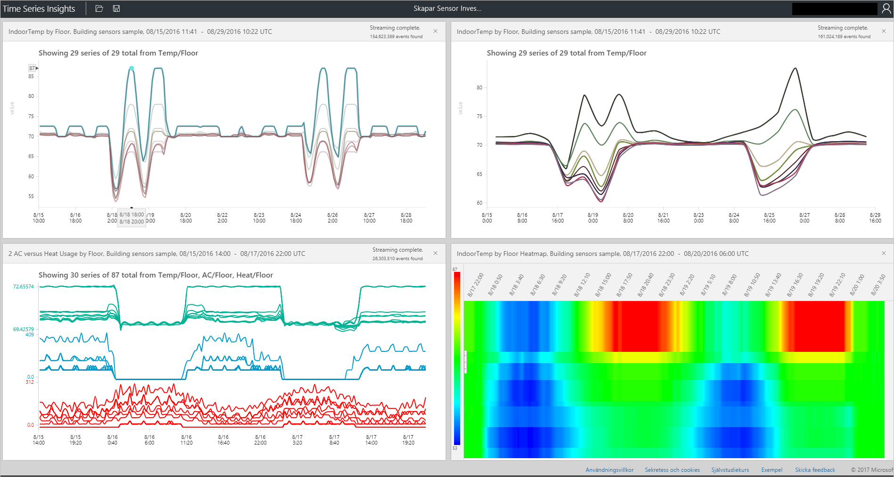

# Azure tid serien insikter explorer
Den här artikeln innehåller olika funktioner och alternativ som är tillgängliga i tid serien insikter explorer webbapp. Du kan använda tid serien insikter explorer i webbläsaren för att skapa visualiseringar av dina data.
 
Azure Time Series Insights är en fullständigt hanterad tjänst för analys, lagring och visualisering som gör det enkelt att utforska och analysera miljarder IoT-händelser samtidigt. Den ger dig en global vy över dina data, som gör att du snabbt Validera IoT-lösningen och undviker dyrbar avbrottstid för verksamhetskritiska enheter. Du kan identifiera dolda trender, upptäcka avvikelser och utföra grundläggande orsaken analyser i nära realtid. Tid serien insikter explorer är för närvarande i förhandsversion.

## Krav

Innan du kan använda tid serien insikter explorer, måste du:
- Skapa en tid serien insikter-miljö
- Ge åtkomst till ditt konto i miljön
- Lägg till en källa för att mata in data och förvara den

## Utforska och frågar efter data
Du kan utforska och fråga tid seriens data inom minuter ansluta din händelsekälla till tid serien insikter miljön.

1. Starta genom att öppna den [tid serien insikter explorer](https://insights.timeseries.azure.com/) i webbläsaren och välj en miljö på vänster sida av fönstret. Alla miljöer som du har åtkomst till visas i alfabetisk ordning.

2. När du väljer en miljö kan du antingen använda de **från** och **till** konfigurationer högst upp, eller klicka och dra över din önskade tidsintervallet.  Klicka på förstoringsglaset längst upp till höger, eller högerklicka på över valda timespan och välj **Sök**.  

3. Du kan också uppdatera tillgänglighet automatiskt varje minut genom att välja den **automatiskt på** knappen.

4. Observera att Azure-molnet ikonen tar dig till din miljö i Azure-portalen.

   

5. Därefter kan du se ett diagram som visar en uppräkning av alla händelser under den valda timespan.  Här har du ett antal kontroller:

    **Termer Editor panelen**: termen utrymme är där du fråga din miljö.  Det hittas på vänster sida av skärmen aktiverar 
      - **Måttet**: detta listrutan visas alla numeriska kolumner (dubbleras)
      - **Delning av**: den här nedrullningsbara visar kategoriska kolumner (strängar)
      - Du kan aktivera steg interpolerade, visa lägsta och högsta och justera y-axeln från Kontrollpanelen nästa för att mäta.  Du kan dessutom justera om data som visas är ett antal, genomsnittlig eller summan av data.
      - Du kan lägga till upp till fem villkor för att visa på samma x-axeln.  Använd den **kopiera ned** för att lägga till ytterligare en term eller klicka på den **Lägg till** för att lägga till en ny term.
     
        

      - **Predikatet**: predikatet kan du snabbt filtrera händelserna med uppsättning operander som anges nedan. Om du utför en sökning genom att välja/att klicka på predikat kommer automatiskt uppdatera baserat på sökningen.      Stöds operanden typer är:

         |Åtgärd  |Typer som stöds  |Anteckningar  |
         |---------|---------|---------|
         |<, >, <=, >=     |  Double, DateTime, TimeSpan       |         |
         |=, !=, <>     | String, Bool, Double, DateTime, TimeSpan, NULL        |         |
         |I     | String, Bool, Double, DateTime, TimeSpan, NULL        |  Alla operander måste vara av samma typ eller vara NULL-konstanten.        |
         |HAR     | Sträng        |  Endast konstant stränglitteraler tillåts på höger sida. Tom sträng och NULL är inte tillåtna.       |

      - **Exempel på frågor**
      
         

6. Den **Intervallstorlek** skjutreglaget verktyget gör att du kan zooma in och ut intervall under samma timespan.  Detta ger mer exakt kontroll av flytt mellan stora kortare perioder som visar smooth trender till segment så liten som millisekunder, så att du kan se detaljerade, högupplösta delar av dina data. Slider standard startpunkt som har angetts som den mest optimala visningen av data från markeringen. belastningsutjämning lösning, fråga hastighet och granularitet.

7. Den **tid pensel** verktyget är det enkelt att navigera från en tidsrymd till en annan, placera intuitiva UX platsen och för sömlös flytt mellan tidsintervall.

8. Den **spara** med kommandot kan du spara din aktuella frågan och aktivera det för att dela med andra användare i miljön. Med hjälp av **öppna**, kan du se alla dina sparade frågor och för andra användare i miljöer som du har åtkomst till delade frågor. 

   

9. Den **perspektiv** verktyget visar samtidiga upp till fyra unika frågor. Knappen Visa perspektiv hittar du i det övre högra hörnet i diagrammet.  

   

10. Den **diagram** kan du visuellt Utforska dina data. Diagrammet verktyg är:

   - Välj/klickar du på, vilket gör ett val av en specifik timespan eller en dataserie.  
   - Span val inom en tid kan du zooma eller utforska händelser.  
   - Inom en dataserie kan du dela serien av en annan kolumn, lägga till serien som en ny term, visa endast valda serie, undanta den markerade serien, pinga serien eller utforska händelser från den markerade serien.
   - I filterområdet till vänster om diagrammet kan se alla data som visas serier och ordna om med namn eller värde kan visa alla dataserien eller specifikt fästa eller ta bort serier.  Du kan också markera en dataserie och dela serien av en annan kolumn, lägga till serien som en ny term, visa endast valda serie, undanta den markerade serien, fästa serien eller utforska händelser från den markerade serien.
   - När du visar flera villkor samtidigt kan du stacken, avgruppera, se ytterligare information om en serie och Använd samma y-axeln i alla villkor med hjälp av knapparna i det övre högra hörnet i diagrammet.
 
    

11. Den **heatmap** kan användas för att snabbt hitta unikt eller avvikande dataserien i en given fråga. Endast en sökterm kan vara visualiseras som en heatmap.    

   

12. **Händelser**: när du väljer utforska händelser när du väljer eller högerklicka ovan panelen Händelser görs tillgänglig.  Här kan du se alla dina rådata händelser och exportera händelserna som JSON- eller CSV-filer. Observera att tid serien insikter lagrar alla rådata.

   

13. Klicka på den **STATS** fliken efter utforska händelser för att visa mönster och statistik för kolumnen.  

   - **Mönster**: den här funktionen proaktivt hämtar de mest statistiskt signifikant mönster i en region för valda data. Detta besparar dig från att titta på tusentals händelser att förstå vilka mönster garanterar mest tid och energi. Dessutom kan tid serien insikter du hoppa direkt till dessa statistiskt signifikant mönster fortsätta utföra en analys. Den här funktionen är också användbara för post före utredning historiska data. 

   - **Kolumnen Stats**: kolumnen stats ange diagram och tabeller som över det valda tidsintervallet för att dela upp data från varje kolumn i den markerade dataserien.  
 
       

Nu har du sett olika funktioner och alternativ som är tillgängliga i tid serien insikter explorer webbapp. 

## Nästa steg
> [!div class="nextstepaction"]
>[Diagnostisera och lösa problem i miljön tid serien insikter](time-series-insights-diagnose-and-solve-problems.md)
