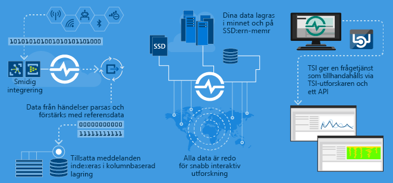

# Vad är Azure Time Series Insights gen1?

> [!CAUTION]
> Det här är en gen1-artikel.

Azure Time Series Insights har skapats för att lagra, visualisera och fråga stora mängder tids serie data, till exempel som genereras av IoT-enheter. Om du vill lagra, hantera, fråga eller visualisera tids serie data i molnet är Azure Time Series Insights förmodligen bra för dig.

Azure Time Series Insights har fyra viktiga jobb:

- Den är helt integrerad med moln-gatewayer som Azure IoT Hub och Azure Event Hubs. Det ansluter enkelt till dessa händelsekällor och parsar JSON från meddelanden och strukturer som innehåller data i rena rader och kolumner. Det kopplar metadata till telemetri och indexerar dina data i en kolumnbaserad lagring.
- Azure Time Series Insights hanterar lagringen av dina data. För att säkerställa att data alltid är lättillgängliga lagras dina data i minnet och SSD i upp till 400 dagar. Du kan interaktivt fråga miljard tals händelser på några sekunder – på begäran.
- Azure Time Series Insights ger direkt visualisering via Azure Time Series Insights Explorer.
- Azure Time Series Insights tillhandahåller en Query-tjänst, både i Azure Time Series Insights Explorer och genom att använda API: er som är enkla att integrera för att bädda in tids serie data i anpassade program.

Om du skapar ett program för intern förbrukning eller för externa kunder kan du använda Azure Time Series Insights som Server del. Du kan använda den för att indexera, lagra och sammanställa tids serie data. Om du vill bygga en anpassad visualisering och användar upplevelse överst använder du [klient-SDK: n](https://github.com/microsoft/tsiclient/blob/master/docs/API.md). Azure Time Series Insights är också utrustad med flera [API: er för frågor](./concepts-json-flattening-escaping-rules.md) för att aktivera dessa anpassade scenarier.

Tidsseriedata representerar ändringar i en tillgång eller en process över tid. Time Series-data indexeras av tidsstämplar och tiden är den mest meningsfulla axeln som dessa data är organiserade i. Time Series-data anländer vanligt vis i nummerordning, så det behandlas som en infogning i stället för en uppdatering av databasen.

Det kan vara en utmaning att lagra, indexera, fråga, analysera och visualisera tids serie data i stora volymer.
Azure Time Series Insights fångar in och lagrar varje ny händelse som en rad, och förändringar mäts effektivt över tid. Det innebär att du kan se bakåt för att få insikter från det förflutna för att förutse framtida förändringar.

## Video

### Lär dig mer om Azure Time Series Insights, den molnbaserade IoT Analytics-plattformen. 

## Primära scenarier

- Lagra Time Series-data på ett skalbart sätt.

   På grund av detta har Azure Time Series Insights en databas som är utformad med Time Series-data i åtanke. Eftersom det är skalbart och fullständigt hanterat hanterar Azure Time Series Insights arbetet med att lagra och hantera händelser.

- Utforska data i nära real tid.

   Azure Time Series Insights innehåller en utforskare som visualiserar alla data som strömmas i en miljö. Strax efter att du har anslutit till en händelse källa kan du Visa, utforska och fråga händelse data i Azure Time Series Insights. Med hjälp av informationen kan du kontrol lera om en enhet avger data som förväntat och övervaka en IoT-till gång för hälsa, produktivitet och övergripande effektivitet.

- Utför rotor Saks analys och identifiera avvikelser.

   Azure Time Series Insights innehåller verktyg som mönster och vyer för att genomföra och spara rotor Saks analyser i multisteg. Azure Time Series Insights fungerar också med aviserings tjänster som Azure Stream Analytics så att du kan visa aviseringar och identifiera avvikelser i nära real tid i Azure Time Series Insights Explorer.

- Få en global vy över tids serie data som strömmas från olika platser för flera till gångar eller en plats jämförelse.

   Du kan ansluta flera händelse källor till en Azure Time Series Insights-miljö. På så sätt kan du visa data som strömmas från flera olika platser tillsammans i nära real tid. Användarna kan dra nytta av den här synligheten för att dela data med affärs ledare. De kan samar beta bättre med domän experter som kan använda sina kunskaper för att lösa problem, använda bästa praxis och dela information.

- Bygg ett kund program ovanpå Azure Time Series Insights.

   Azure Time Series Insights visar REST-API: er som du kan använda för att bygga program som använder Time Series-data.

## Funktioner

- **Kom igång snabbt**: Azure Time Series Insights kräver inte förberedelse av första data, så att du snabbt kan ansluta till miljon tals händelser i din IoT Hub eller Event Hub. När du har anslutit kan du visualisera och interagera med sensor data för att snabbt verifiera dina IoT-lösningar. Du kan interagera med dina data utan att skriva kod, och du behöver inte lära dig något nytt språk. Azure Time Series Insights innehåller en detaljerad, fri text fråga för avancerade användare och utforskning av punkt och klicka.

- **Nära real tids insikter**: Azure Time Series Insights kan mata in miljon tals sensor händelser per dag med en svars tid på en minut. Azure Time Series Insights hjälper dig att få insikter om dina sensor data. Använd den för att upptäcka trender och avvikelser, utföra rotor Saks analyser och undvika kostsamma drift stopp. Kors korrelation mellan real tids data och historiska data hjälper dig att hitta dolda trender i data.

- **Bygg anpassade lösningar**: bädda in Azure Time Series Insights data i dina befintliga program. Du kan också skapa nya anpassade lösningar med Azure Time Series Insights REST-API: er. Skapa anpassade vyer som kan du dela och med dig av, så att andra också kan ta del av dina insikter.

- **Skalbarhet**: Azure Time Series Insights har utformats för att stödja IoT i stor skala. Det kan mata in mellan 1 och 100 miljoner händelser per dag, med ett standardomfång för kvarhållning på 31 dagar. Du kan visualisera och analysera real tids data strömmar i nära real tid, tillsammans med historiska data.

## Kom igång

Följ dessa steg för att komma igång.

1. Etablera en Azure Time Series Insights-miljö i Azure Portal.
1. Anslut till en händelse källa som IoT Hub eller Event Hub.
1. Överför referens data. Detta är inte en extra tjänst.
1. Granska och Visa dina data på några minuter med Azure Time Series Insights Explorer.

## Utforskaren

Visa, analysera och identifiera trender i dina data med hjälp av Azure Time Series Insights Explorer.

Lär dig hur du använder [Azure Time Series Insights Explorer](time-series-insights-explorer.md) och ritar insikter från dina data.

## Nästa steg

- Utforska Azure Time Series Insights gen1 [demo Environment](./time-series-quickstart.md).

- Läs mer om hur du [planerar din Azure Time Series Insightss](time-series-insights-environment-planning.md) miljö.