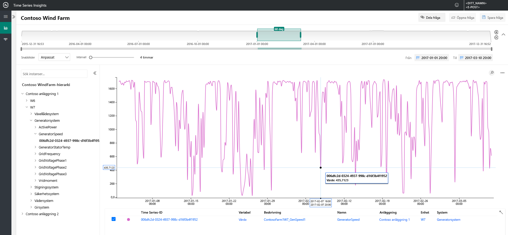
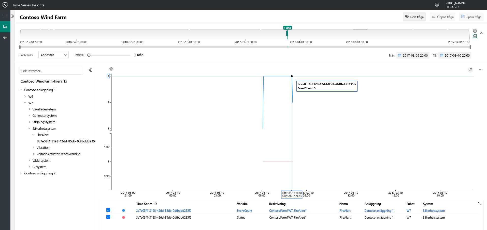
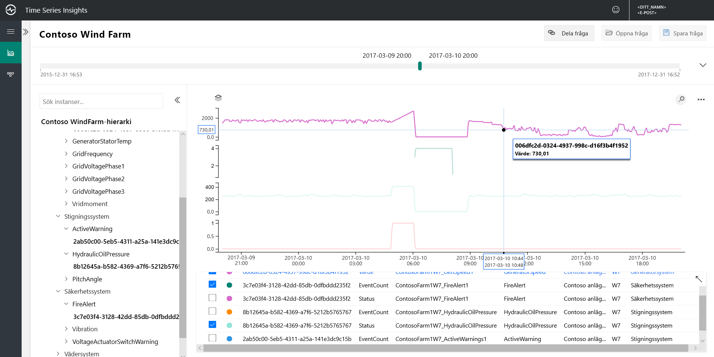
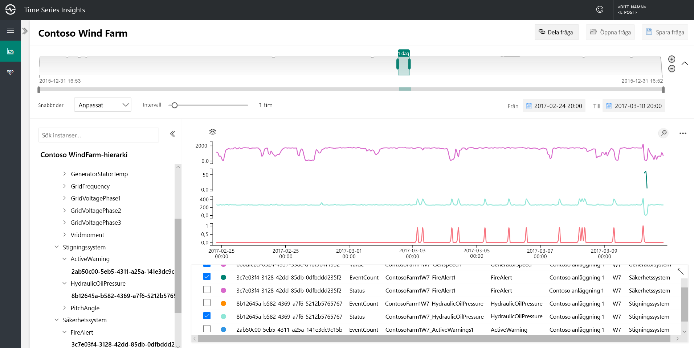
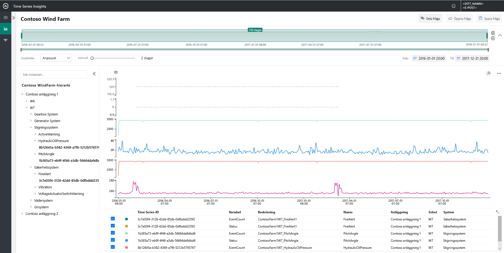
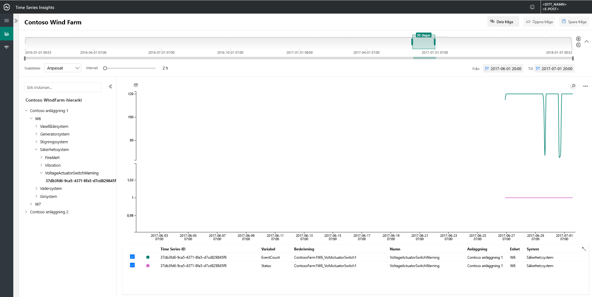
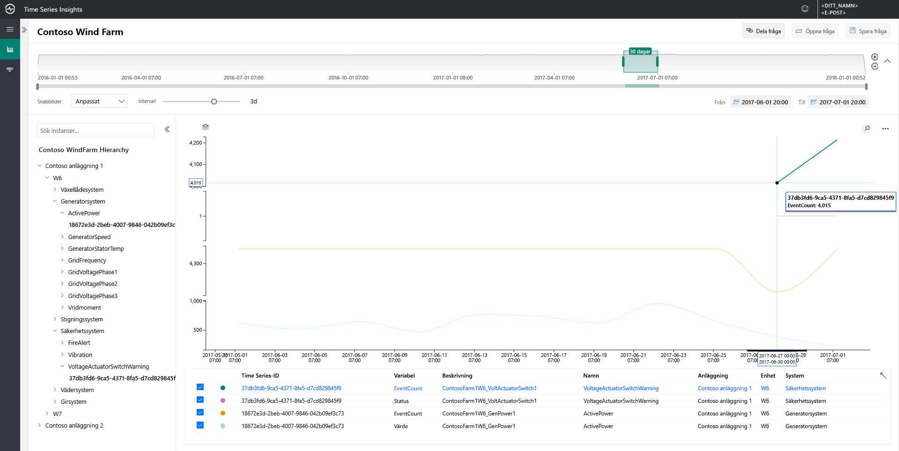
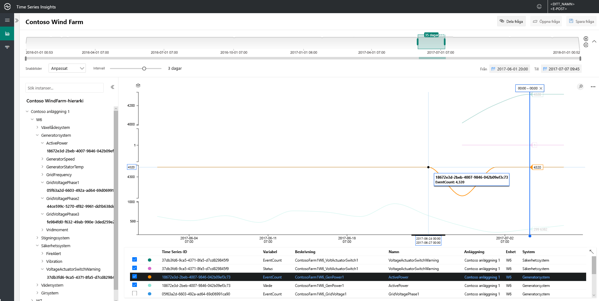
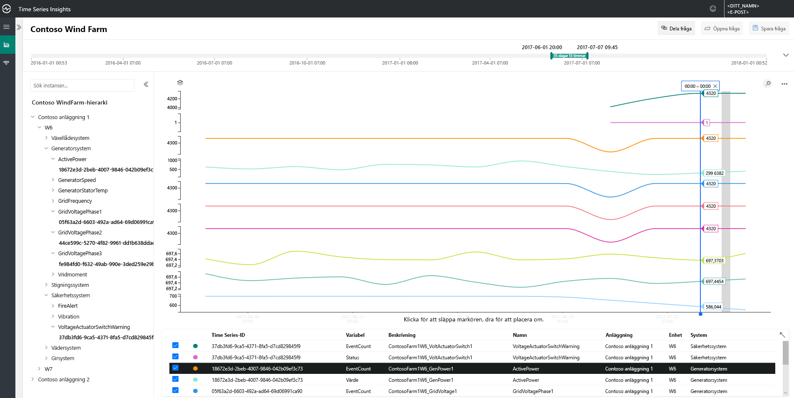

# Snabbstart: Utforska demomiljön för förhandsversionen av Azure Time Series Insights

Den här snabbstarten kommer du igång med Azure Time Series Insights Preview. Via den kostnadsfria demon ska du titta viktiga funktioner som har lagts till i Time Series Insights Preview.

Demo förhandsversionsmiljön innehåller ett scenario företaget Contoso, som körs två vind turbinen servergrupper, var och en med 10 syfte. Varje turbin har 20 sensorer som rapporterar data varje minut till Azure IoT Hub. Sensorerna samla in information om väderförhållanden, bladet försäljningsargument och yaw position. Dessutom övervakar generator prestanda, växellåda beteende och säkerhet.

 Du får lära dig att använda Time Series Insights för att hitta värdefulla insikter i Contoso-data. Du kan också göra en kort Rotorsaksanalys för att bättre förutse kritiska problem och utföra underhåll.

## Se Time Series Insights-utforskaren i en demomiljö

Förhandsversionen av Time Series Insights explorer visar historiska data och analys av rotorsaker. Så här kommer du igång:

1. Skapa en [kostnadsfritt Azure-konto](https://azure.microsoft.com/free/?ref=microsoft.com&utm_source=microsoft.com&utm_medium=docs&utm_campaign=visualstudio) om något inte har skapats.

1. Navigera till den [Contoso vind servergruppen demo](https://insights.timeseries.azure.com/preview/samples) miljö.  

1. Om du uppmanas logga in i Time Series Insights-Utforskaren med dina autentiseringsuppgifter för Azure-konto.

## Arbeta med historiska data

1. Titta på vindturbin **W7** i **Contoso anläggning 1**.  

    * Uppdatera vyn intervallet till **1/1/17 20:00 till 17/10/3 20:00 (UTC)**.
    * Välj den **Contoso anläggning 1** > **W7** > **Generator System** > **GeneratorSpeed** sensorn. Granska sedan de resulterande värdena.

      

1. Contoso upptäckte nyligen en brand i vindturbin **W7**. Yttranden variera om närbelägen orsaken till fire har. Vid närmare granskning ser vi att fire avisering sensorn har aktiverats vid fire.

    * Uppdatera vyn intervallet till **3/9/17 20:00 till 17/10/3 20:00 (UTC)**.
    * Välj den **säkerhetssystem** > **FireAlert** sensorn.

      

1. Granska andra händelser ungefär samma tidpunkt som fire att förstå vad som hänt. Både olja hög belastning och aktiva varningar som högst nådde precis före fire.

    * Välj den **försäljningsargument System** > **HydraulicOilPressure** sensorn.
    * Välj den **försäljningsargument System** > **ActiveWarning** sensorn.

      

1. Olja hög belastning och aktiva varningen sensorer som högst nådde strax innan startar. Expandera den visade tidsserien om du vill se andra tecken närvarande leder fram till fire. Båda sensorer växlade konsekvent under tiden som indikerar ett permanent eller lite nervöst mönster.

    * Uppdatera vyn intervallet till **2/24/17 20:00 till 17/10/3 20:00 (UTC)**.

      

1. Undersöka två år av historiska data visar en annan fire-händelse med samma sensor förändringar.

    * Uppdatera vyn intervallet till **1/1/16 till 12/31/17** (alla data).

      

Med hjälp av Azure Time Series Insights och våra sensor telemetri, har vi upptäckt en långsiktig och problematiska trend som är dolda i våra historiska data. Med dessa nya insikter kan vi:

> [!div class="checklist"]
> * Beskriver vad som verkligen inträffade.
> * Rätta till problemet.
> * Placera överlägsen avisering om system på plats.

## Rotorsaksanalys

1. Vissa scenarier kräver avancerad analys för att få fram diskret ledtrådar i data. Välj windmill **W6** på datum **6/25**

    * Uppdatera vyn intervallet till **6/1/17 20:00-7/1/17 20:00 (UTC)**.
    * Välj sedan den **Contoso anläggning 1** > **W6** > **säkerhetssystem** > **VoltageActuatorSwitchWarning**  sensorn.

      

1. Varningen anger ett problem med spänningen från generatorn. Totala effekt av generatorn arbetar inom normal parametrar får våra aktuellt intervall. Genom att öka våra intervall, en annan mönstret växer: det finns en bestämd Samlingsbibliotek.

    * Ta bort den **VoltageActuatorSwitchWarning** sensorn.
    * Välj den **Generator System** > **ActivePower** sensorn.
    * Uppdatera intervallet **3d**.

      

1. Genom att expandera tidsintervallet kan vi fastställa om problemet är stoppad eller om det fortsätter.

    * Utöka tidsintervallet till 60 dagar.

      

1. Andra sensorn datapunkter kan läggas till att ge överlägsen sammanhang. Flera sensorer som vi kan visa, desto mer fullständig vår förståelse för problemet. Vi släpper en markör för att se de faktiska värdena. 

    * Välj den **Generator System** > **GridVoltagePhase1**, **GridVoltagePhase2**, och **GridVoltagePhase3** sensorer .
    * Släpp en markör på den sista datapunkten i det synliga området.

      

    De tre spänningssensorer fungerar samma prestanda och inom normal parametrar. Det ser ut som den **GridVoltagePhase3** sensorn är orsaken.

1. Fas 3-Samlingsbibliotek visas ännu mer som problemet med mycket kontextuella data som har lagts till. Vi är nu redo att referera problemet till vårt underhållsteam med en bra lead på orsaken till varningen.  

    * Uppdatera skärmen för att täcka över alla **Generator System** sensorer på samma diagram skala.

       

## Nästa steg

Du är redo att skapa en egen förhandsversion av Time Series Insights-miljön:

> [!div class="nextstepaction"]
> [Planera en förhandsversion av Time Series Insights-miljön](time-series-insights-update-plan.md)

Lär dig att navigera demon och dess funktioner:

> [!div class="nextstepaction"]
> [I förhandsversionen av Time Series Insights-Utforskaren](time-series-insights-update-explorer.md)
