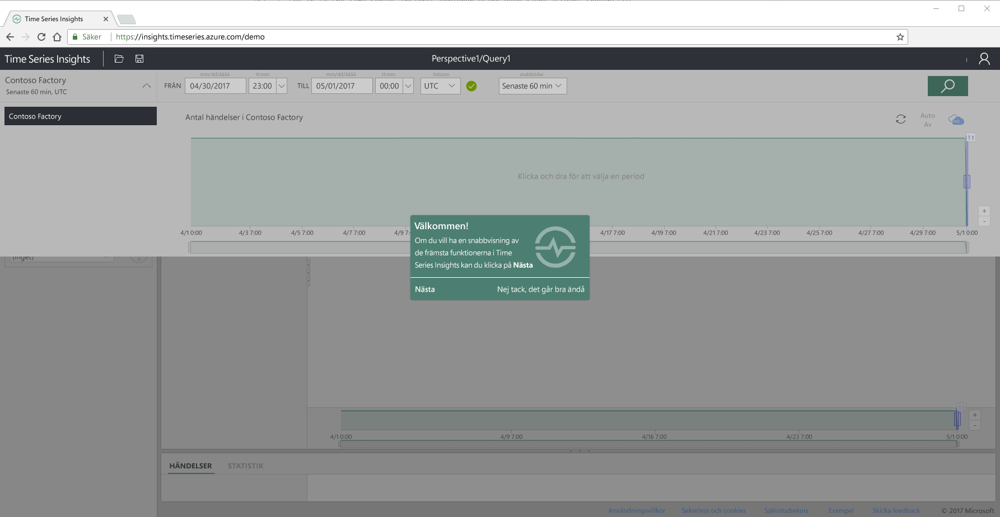
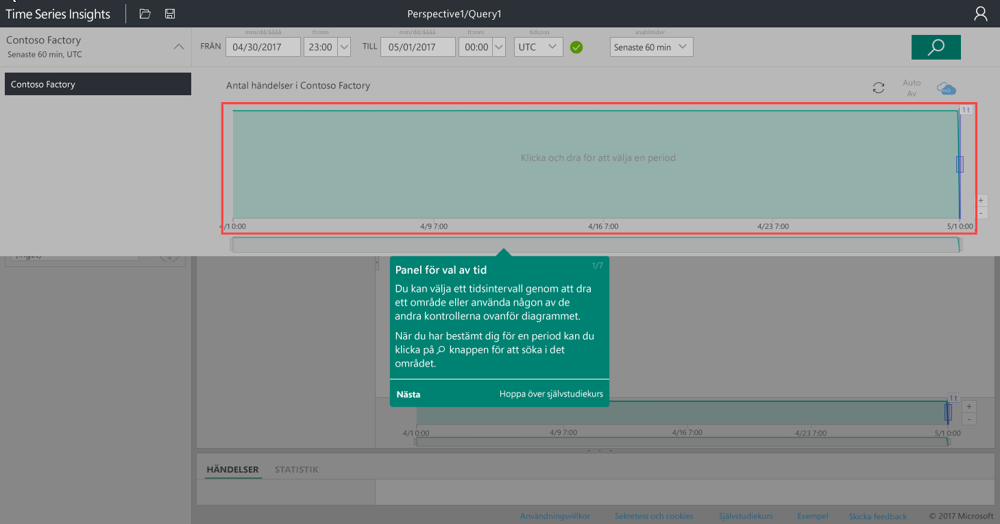
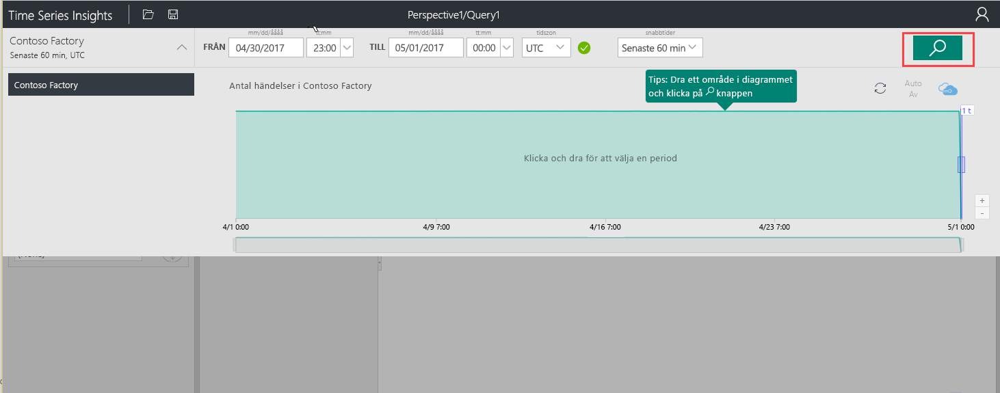
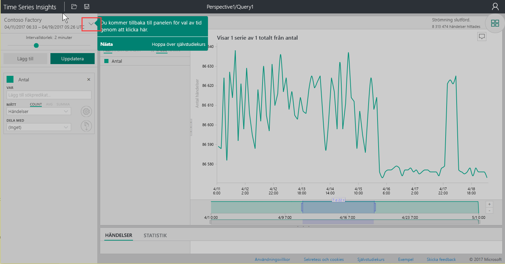
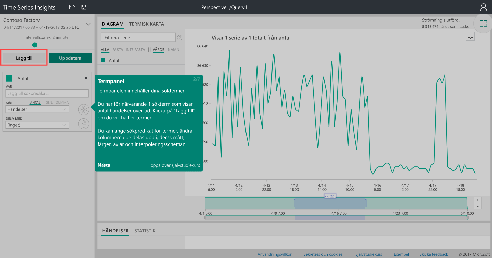
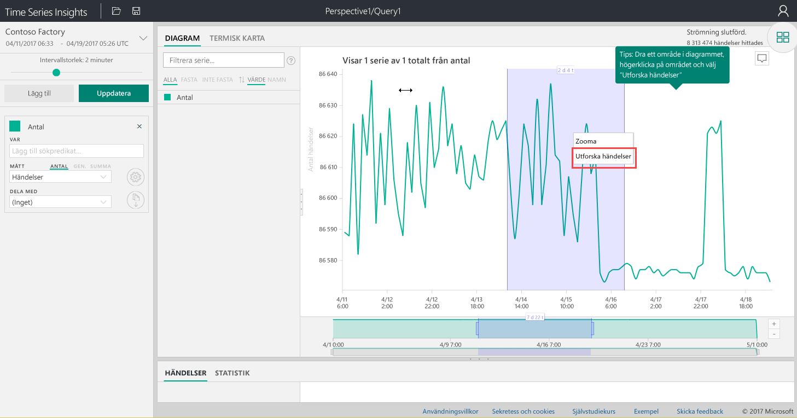
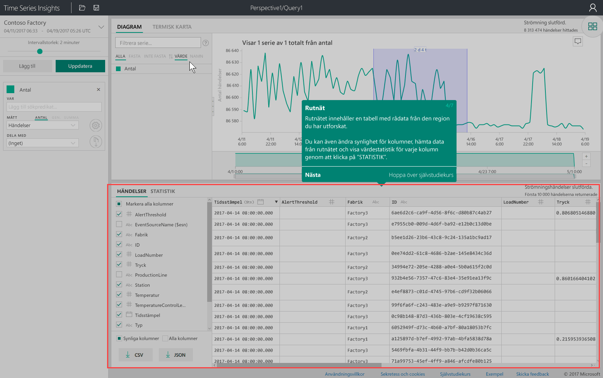
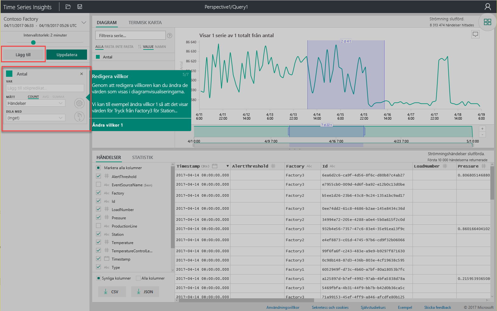
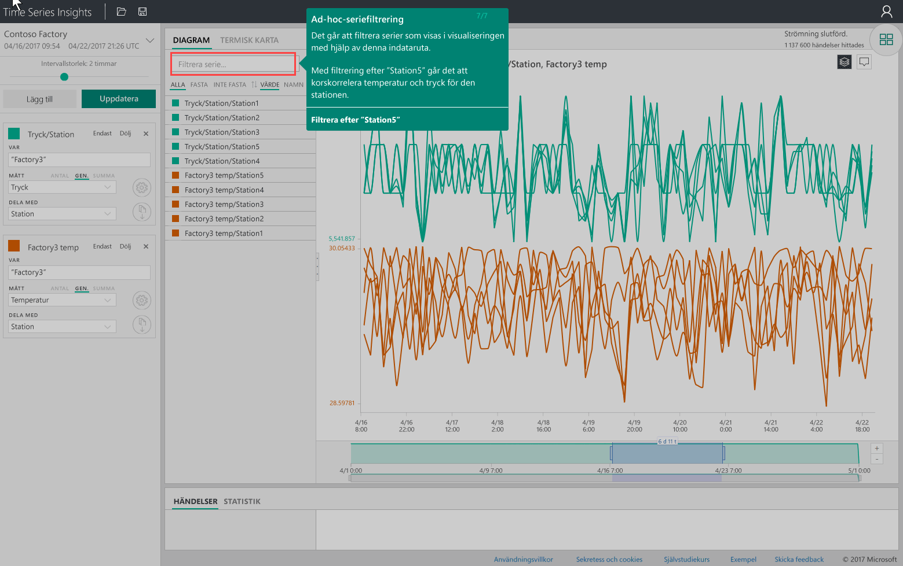

# Snabbstart: Utforska Azure Time Series Insights

En Snabbstart explorer tillhandahålls för att komma igång med Azure Time Series Insights i en gratis demonstrationsmiljö. Via det lär du dig att använda webbläsaren för att visualisera stora volymer med IoT data och rundtur viktiga funktioner för närvarande i allmänt tillgänglig.

Azure Time Series Insights är en helt hanterad tjänst analys, lagring och visualisering som förenklar hur du utforska och analysera miljarder IoT-händelser samtidigt. Det ger dig en global vy över dina data, så att du snabbt verifiera din IoT-lösning och undvika kostsamma avbrott på verksamhetskritiska enheter. Via Azure Time Series Insights kan du identifiera dolda trender, upptäcka avvikelser och utföra rotorsaksanalyser i nära realtid.

För extra flexibilitet Azure Time Series Insights kan läggas till ett redan existerande program via dess kraftfulla [REST API: er](./time-series-insights-update-tsq.md) och [klient-SDK](./tutorial-create-tsi-sample-spa.md). API: erna kan du lagra fråga time series-data och använda time series-data i ett klientprogram som du önskar. Du kan också välja att använda klient-SDK för att lägga till UI-komponenter i ditt befintliga program.

Time Series Insights explorer är en guidad visning av funktioner för närvarande allmänt tillgängliga.

## Förbereda miljön demo

1. Skapa en [kostnadsfritt Azure-konto](https://azure.microsoft.com/free/?ref=microsoft.com&utm_source=microsoft.com&utm_medium=docs&utm_campaign=visualstudio) om något inte har skapats.

1. I din webbläsare, navigerar du till den [allmänt tillgängliga demo](https://insights.timeseries.azure.com/demo).

1. Om du uppmanas logga in i Time Series Insights-Utforskaren med dina autentiseringsuppgifter för Azure-konto.

1. Snabbvisningssidan för Time Series Insights visas. Klicka på **Nästa** för att starta snabbvisningen.

   

## Utforska demomiljö

1. **Panelen för val av tid** visas. Använd den här panelen för att välja en tidsram som ska visualiseras.

   

1. Klicka och dra i regionen och klicka sedan på knappen **Sök**.

   

   Time Series Insights visar en diagramvisualisering för den tidsram du angav. Du kan utföra olika åtgärder med linjediagrammet, t.ex. filtrera, fästa, sortera och stapla.

   Om du vill komma tillbaka till **panelen för val av tid** klickar du på nedåtpilen på det sätt som visas:

   

1. Klicka på **Lägg till** i **panelen Villkor** för att lägga till en ny sökterm.

   

1. I diagrammet kan du välja en region, högerklicka på regionen och välja **Utforska händelser**.

   

   Ett rutnät med dina rådata visas från den region du utforskar:

   

## Välja och filtrera data

1. Redigera villkoren om du vill ändra de värden som visas i diagrammet, och lägg till ytterligare villkor om du vill korskorrelera olika typer av värden:

   

1. Ange ett filtervillkor i den **filtrera serie...**  kryssrutan för provisoriska spränganordningar seriefiltrering. För snabbstarten anger du **Station5** om du vill korskorrelera temperatur och tryck för den stationen.

   

När du har slutfört snabbstarten kan du experimentera med exempeldata för att skapa olika visualiseringar.

## Nästa steg

Du är redo att skapa en egen Time Series Insights-miljö:
> [!div class="nextstepaction"]
> [Planera Time Series Insights-miljön](time-series-insights-environment-planning.md)
