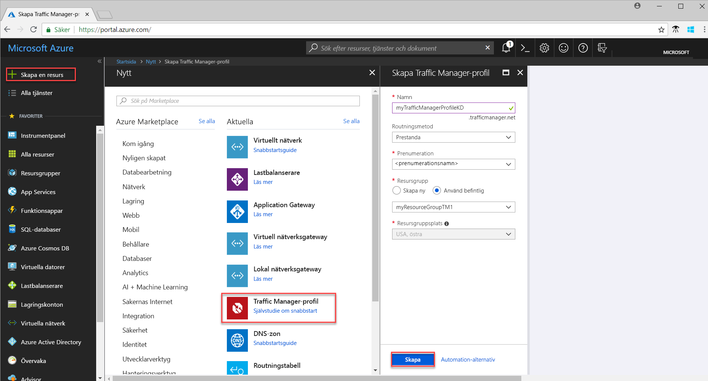
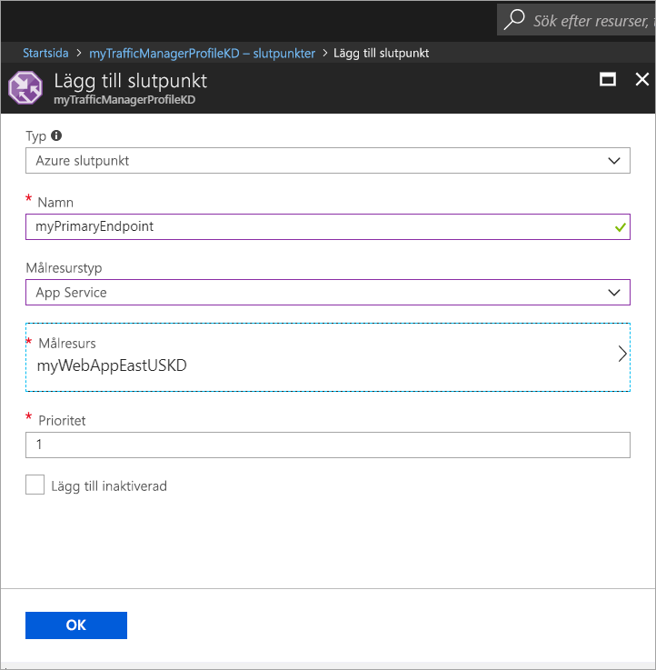
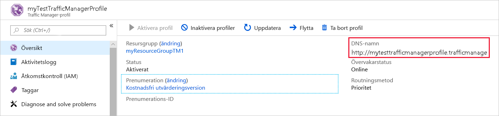
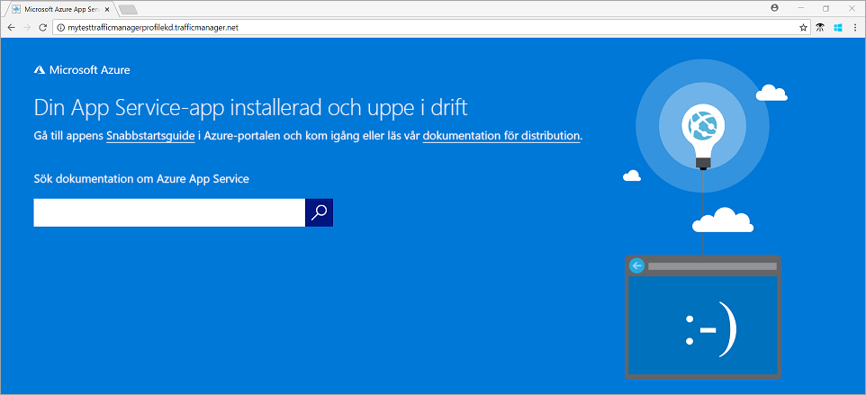

# Snabbstart: Skapa en Traffic Manager-profil för en webbapp med hög tillgänglighet

I den här snabbstarten beskrivs hur du skapar en Traffic Manager-profil som ger hög tillgänglighet för din webbapp. 

Det scenario som beskrivs i den här snabbstarten innehåller två instanser av en webbapp som körs i olika Azure-regioner. En Traffic Manager-profil som baseras på [slutpunktsprioritet](traffic-manager-routing-methods.md#priority) skapas som hjälper dig att dirigera användartrafik till den primära platsen där programmet körs. Traffic Manager övervakar webbappen kontinuerligt och ger automatisk redundans till säkerhetskopieringsplatsen när den primära platsen inte är tillgänglig.

Om du inte har en Azure-prenumeration kan du skapa ett [kostnadsfritt konto](https://azure.microsoft.com/free/?WT.mc_id=A261C142F) innan du börjar.

## Logga in på Azure 
Logga in på Azure Portal på https://portal.azure.com.

## Nödvändiga komponenter
Den här snabbstarten kräver att du har distribuerat två instanser av en webbapp som körs i olika Azure-regioner (*USA, östra* och *Europa, västra*). Två instanser av webbapp fungerar som primär och sekundär slutpunkt för Traffic Manager.

1. Längst upp till vänster på skärmen väljer du **Skapa en resurs** > **Webb** > **Webbapp** > **Skapa**.
2. I **Webbapp** anger eller väljer du följande information och anger standardinställningarna där de inte har angetts:

     | Inställning         | Värde     |
     | ---              | ---  |
     | Namn           | Ange ett unikt namn för din webbapp  |
     | Resursgrupp          | Välj **Ny** och skriv sedan *myResourceGroupTM1* |
     | App Service-plan/plats         | Välj **Ny**.  I App Service-planen anger du *myAppServicePlanEastUS* och väljer sedan **OK**. 
     |      Plats  |   Östra USA        |
    |||

3. Välj **Skapa**.
4. En standardwebbplats skapas när webbappen har distribuerats.
5. Upprepa steg 1–3 för att skapa en andra webbplats i en annan Azure-region med följande inställningar:

     | Inställning         | Värde     |
     | ---              | ---  |
     | Namn           | Ange ett unikt namn för din webbapp  |
     | Resursgrupp          | Välj **Ny** och skriv sedan *myResourceGroupTM2* |
     | App Service-plan/plats         | Välj **Ny**.  I App Service-planen anger du *myAppServicePlanWestEurope* och väljer sedan **OK**. 
     |      Plats  |   Västra Europa      |
    |||

## Skapa en Traffic Manager-profil
Skapa en Traffic Manager-profil som dirigerar användartrafik baserat på slutpunktsprioritet.

1. Längst upp till vänster på skärmen väljer du **Skapa en resurs** > **Nätverk** > **Traffic Manager-profil** > **Skapa**.
2. I **Skapa Traffic Manager-profil** anger eller väljer du följande information, accepterar standardinställningarna för återstående inställningar och väljer sedan **Skapa**:
    
    | Inställning                 | Värde                                              |
    | ---                     | ---                                                |
    | Namn                   | Namnet måste var unikt inom trafficmanager.net-zonen och genererar DNS-namnet, **trafficmanager.net**, som används för att komma åt din Traffic Manager-profil.|
    | Routningsmetod          | Välj routningsmetoden **Prioritet**.|
    | Prenumeration            | Välj din prenumeration.|
    | Resursgrupp          | Välj **Befintlig** och sedan *myResourceGroupTM1*.|
    |Plats |Inställningen refererar till platsen för resursgruppen och har ingen inverkan på Traffic Manager-profilen som distribueras globalt.|
    |||
    
    
   

## Lägga till Traffic Manager-slutpunkter

Lägg till webbplatsen i *USA, östra* som primär slutpunkt för att dirigera all användartrafik. Lägg till webbplatsen i *Europa, västra* som en reservslutpunkt. När den primära slutpunkten inte är tillgänglig dirigeras trafiken automatiskt till den sekundära slutpunkten.

1. I portalens sökfält söker du efter det Traffic Manager-profilnamn som du skapade i föregående avsnitt och väljer profilen i det resultat som visas.
2. I **Traffic Manager-profilen** går du till avsnittet **Inställningar** och klickar på **Slutpunkter** och klickar sedan på **Lägg till**.
3. Ange eller välj följande information, acceptera standardinställningarna för återstående inställningar och välj sedan **OK**:

    | Inställning                 | Värde                                              |
    | ---                     | ---                                                |
    | Typ                    | Azure-slutpunkt                                   |
    | Namn           | myPrimaryEndpoint                                        |
    | Målresurstyp           | App Service                          |
    | Målresurs          | **Välj en apptjänst** för att visa listor över Web Apps i samma prenumeration. I **Resurs** väljer du den apptjänst som du vill lägga till som den första slutpunkten. |
    | Prioritet               | Välj **1**. Detta resulterar i all trafik går igenom den här slutpunkten, förutsatt att den är felfri.    |
    
4. Upprepa steg 2 och 3 för nästa Web Apps-slutpunkt. Se till att lägga till den med dess **Prioritet**-värde angivet som **2**.
5.  När båda slutpunkterna har lagts till visas de i **Traffic Manager-profilen** tillsammans med sin övervakningsstatus, som är **Online**.

    

## Testa Traffic Manager-profil
I det här avsnittet bestämmer du först domännamnet för din Traffic Manager-profil och ser sedan hur Traffic Manager redundansväxlar till den sekundära slutpunkten när den primära slutpunkten är inte tillgänglig.
### Bestämma DNS-namnet
1.  I portalens sökfält söker du efter det **Traffic Manager-profil**namn som du skapade i föregående avsnitt. I det resultat som visas klickar du på Traffic Manager-profilen.
2. Klicka på **Översikt**.
3. **Traffic Manager-profilen** visar DNS-namnet på din nyligen skapade Traffic Manager-profil.
  
   

### Se hur Traffic Manager fungerar i praktiken

1. I en webbläsare skriver du in DNS-namnet för din Traffic Manager-profil för att visa standardwebbplatsen för din webbapp. I det här snabbstartsscenariot dirigeras alla begäranden till den primära slutpunkten som har angetts till **Prioritet 1**.

2. För att se hur Traffic Manager-redundans fungerar i praktiken inaktiverar du din primära plats på följande sätt:
    1. På Traffic Manager-profilsidan väljer du**Inställningar**>**Slutpunkter**>*MyPrimaryEndpoint*.
    2. I *MyPrimaryEndpoint* väljer du **Inaktiverad**. 
    3. Status för den primära slutpunkten *MyPrimaryEndpoint* visas nu som **Inaktiverad**.
3. Kopiera DNS-namnet för din Traffic Manager-profil från det föregående steget för att visa webbplatsen i en webbläsare. När den primära slutpunkten är inaktiverad dirigeras användartrafiken till den sekundära slutpunkten.

## Rensa resurser
Ta bort resursgrupperna, webbapparna och alla relaterade resurser när de inte längre behövs. För att göra det väljer du resursgrupperna (*myResourceGroupTM1* och *myResourceGroupTM2*) och klickar på **Ta bort**.

## Nästa steg
I den här snabbstarten skapade du en Traffic Manager-profil som gjorde att du kunde dirigera användartrafik för en webbapp med hög tillgänglighet. Om du vill veta mer om att dirigera trafik kan du gå vidare till självstudierna för Traffic Manager.

> [!div class="nextstepaction"]
> [Självstudier för Traffic Manager](tutorial-traffic-manager-improve-website-response.md)

