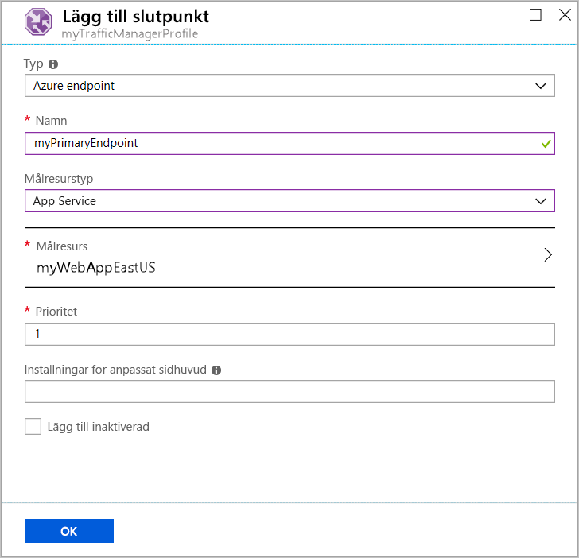

# Snabbstart: Skapa en Traffic Manager profil med hjälp av Azure Portal

I den här snabbstarten beskrivs hur du skapar en Traffic Manager-profil som ger hög tillgänglighet för din webbapp.

I den här snabbstarten läser du om två instanser av en webbapp. Var och en av dem körs i olika Azure-regioner. Du skapar Traffic Manager-profil baserat på [slutpunktsprioritet](traffic-manager-routing-methods.md#priority). Profilen dirigerar användartrafik till den primära plats som kör webbappen. Traffic Manager övervakar kontinuerligt webbappen. Om den primära platsen inte är tillgänglig ger den automatisk redundans till säkerhetskopieringsplatsen.

Om du inte har någon Azure-prenumeration kan du skapa ett [kostnadsfritt konto](https://azure.microsoft.com/free/?WT.mc_id=A261C142F) nu.

## Logga in på Azure

Logga in på [Azure-portalen](https://portal.azure.com).

## Nödvändiga komponenter

För den här snabbstarten behöver du två instanser av en webbapp som distribuerats i två olika Azure-regioner (*USA, östra* och *Europa, västra*). Var och en av dessa kommer att fungera som primär- och redundansslutpunkter för Traffic Manager.

1. Uppe till vänster på skärmen väljer du **Skapa en resurs** > **Webb** > **Webbapp**.

1. I **skapa en webbapp**skriver eller väljer du följande värden på fliken **grundläggande** :

   - **Prenumeration** > **Resursgrupp**: Välj **Skapa ny** och skriv sedan **myResourceGroupTM1**.
   -  > **Namn på**instans information: Skriv *myWebAppEastUS*.
   - **Instans information** > **publicera**: Välj **kod**.
   -  > **Körnings stack**för instans information: Välj **ASP.net v 4.7**
   - **Instans information** > **operativ system**: Välj **Windows**.
   - **Instans informations** > **region**:  Välj **USA, östra**.
   - **App Service planera** > **Windows-plan (USA, östra)** : Välj **Skapa ny** och skriv sedan **myAppServicePlanEastUS**
   - **App Service planera** > **SKU och storlek**: Välj **standard S1**.
   
3. Välj fliken **övervakning** eller Välj **Nästa: övervakning**.  Under **övervakning**, ange **Application Insights** > **Aktivera Application Insights** till **Nej**.

4. Välj **Granska och skapa**

5. Granska inställningarna och klicka sedan på **skapa**.  När webbappen har distribuerats skapar den en standardwebbplats.

6. Följ stegen för att skapa en andra webbapp med namnet *myWebAppWestEurope*, med **resurs grupp** namnet *MyResourceGroupTM2*, en **region** i *Västeuropa*, ett **App Service plan** namn för  **myAppServicePlanWestEurope**och alla andra inställningar är samma som för *myWebAppEastUS*.

## Skapa en Traffic Manager-profil

Skapa en Traffic Manager-profil som dirigerar användartrafik baserat på slutpunktsprioritet.

1. Uppe till vänster på skärmen väljer du **Skapa en resurs** > **Nätverk** > **Traffic Manager-profil**.
2. I **Skapa Traffic Manager-profil** anger eller väljer du de här inställningarna:

    | Inställning | Värde |
    | --------| ----- |
    | Namn | Ange ett unikt namn för din Traffic Manager-profil.|
    | Routningsmetod | Välj **Prioritet**.|
    | Prenumeration | Välj den prenumeration som du vill att Traffic Manager-profilen ska gälla för. |
    | Resursgrupp | Välj *myResourceGroupTM1*.|
    | Plats |Den här inställningen refererar till platsen för resursgruppen. Den har ingen effekt på den Traffic Manager-profil som ska distribueras globalt.|

3. Välj **Skapa**.

## Lägga till Traffic Manager-slutpunkter

Lägg till webbplatsen i *USA, östra* som primär slutpunkt för att dirigera all användartrafik. Lägg till webbplatsen i *Europa, västra* som en redundansslutpunkt. När den primära slutpunkten inte är tillgänglig dirigeras trafiken automatiskt till redundansslutpunkten.

1. I portalens sökfält anger du det Traffic Manager-profilnamn som du skapade i föregående avsnitt.
2. Välj profilen bland sökresultatet.
3. I **Traffic Manager-profil** går du till avsnittet **Inställningar** och väljer **Slutpunkter** följt av **Lägg till**.
4. Ange eller välj de här inställningarna:

    | Inställning | Värde |
    | ------- | ------|
    | Typ | Välj **Azure-slutpunkt**. |
    | Namn | Ange *myPrimaryEndpoint*. |
    | Målresurstyp | Välj **App Service**. |
    | Målresurs | Välj **Välj en apptjänst** > **USA, östra**. |
    | Prioritet | Välj **1**. All trafik skickas till den här slutpunkten när den är felfri. |

    

5. Välj **OK**.
6. För att skapa en redundansslutpunkt för din andra Azure-region upprepar du steg 3 och 4 med de här inställningarna:

    | Inställning | Värde |
    | ------- | ------|
    | Typ | Välj **Azure-slutpunkt**. |
    | Namn | Ange *myFailoverEndpoint*. |
    | Målresurstyp | Välj **App Service**. |
    | Målresurs | Välj **Välj en apptjänst** > **Europa, västra**. |
    | Prioritet | Välj **2**. All trafik skickas till den här redundansslutpunkten om den primära slutpunkten är skadad. |

7. Välj **OK**.

När du är klar med att lägga till de två slutpunkterna visas de i **Traffic Manager-profilen**. Observera att deras övervakningsstatus är **Online** nu.

## Testa Traffic Manager-profil

I det här avsnittet kontrollerar domännamnet för Traffic Manager-profilen. Du kan även konfigurera den primära slutpunkten till att inte vara tillgänglig. Slutligen ser du att webbappen fortfarande är tillgänglig. Det beror på att Traffic Manager skickar trafiken till redundansslutpunkten.

### Kontrollera DNS-namnet

1. I portalens sökfält söker du efter det **Traffic Manager-profil**namn som du skapade i föregående avsnitt.
2. Välj Traffic Manager-profilen. **Översikten** visas.
3. **Traffic Manager-profilen** visar DNS-namnet på din nyligen skapade Traffic Manager-profil.
  
   

### Se hur Traffic Manager fungerar i praktiken

1. I en webbläsare anger du DNS-namnet för din Traffic Manager-profil för att visa webbappens standardwebbplats.

    > [!NOTE]
    > I det här snabbstartsscenariot dirigeras alla begäranden till den primära slutpunkten. Den är inställd på **Prioritet 1**.

    

2. För att se hur Traffic Manager-redundans fungerar i praktiken inaktiverar du din primära plats:
    1. På Traffic Manager-profilsidan går du till avsnittet **Översikt** och väljer **myPrimaryEndpoint**.
    2. I *myPrimaryEndpoint* väljer du **Inaktiverad** > **Spara**.
    3. Stäng **myPrimaryEndpoint**. Lägg märke till att statusen är **Inaktiverad** nu.
3. Kopiera DNS-namnet för din Traffic Manager-profil från det föregående steget för att visa webbplatsen i en ny webbläsarsession.
4. Kontrollera att webbappen fortfarande är tillgänglig.

Den primära slutpunkten är inte tillgänglig, så du dirigerades till redundansslutpunkten.

## Rensa resurser

Ta bort resursgrupperna, webbapparna och alla relaterade resurser när du är klar. Det gör du genom att markera varje enskilt objekt instrumentpanelen och välja **Ta bort** längst upp på varje sida.

## Nästa steg

I den här snabbstarten skapade du en Traffic Manager-profil. Med den kan du dirigera användartrafik för webbappar med hög tillgänglighet. Om du vill veta mer om att dirigera trafik kan du gå vidare till Traffic Manager-självstudierna.

> [!div class="nextstepaction"]
> [Självstudier för Traffic Manager](tutorial-traffic-manager-improve-website-response.md)
