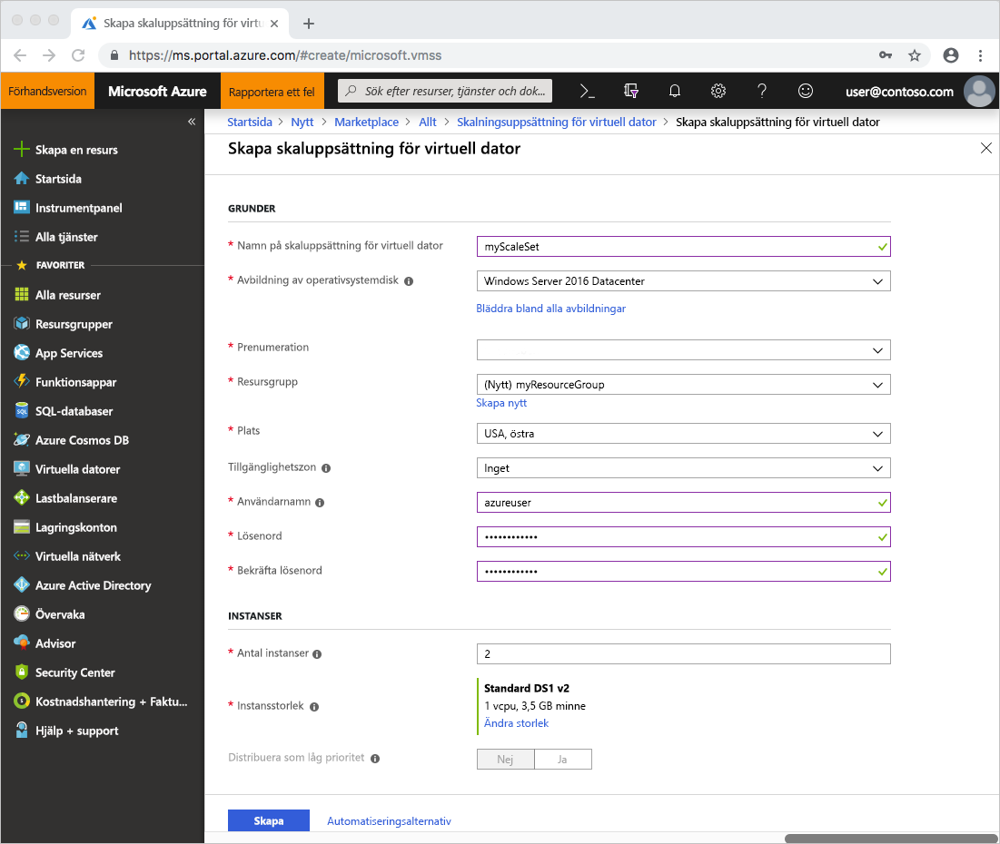

# Snabbstart: Skapa en VM-skalningsuppsättning i Azure Portal
Med en VM-skalningsuppsättning kan du distribuera och hantera en uppsättning identiska, virtuella datorer med automatisk skalning. Du kan skala antalet virtuella datorer i skalningsuppsättningen manuellt eller definiera regler för automatisk skalning baserat på resursanvändning som CPU, minnesefterfrågan eller nätverkstrafik. En Azure-lastbalanserare distribuerar sedan trafiken till de virtuella datorinstanserna i skalningsuppsättningen. I den här snabbstarten skapar du en VM-skalningsuppsättning i Azure Portal.

Om du inte har en Azure-prenumeration kan du skapa ett [kostnadsfritt konto](https://azure.microsoft.com/free/?WT.mc_id=A261C142F) innan du börjar.

## Logga in på Azure
Logga in på Azure Portal på http://portal.azure.com.

## Skapa VM-skalningsuppsättningar
Du kan distribuera en skalningsuppsättning som anges med en Windows Server-avbildning eller en Linux-avbildningen som RHEL, CentOS, Ubuntu eller SLES.

1. Klicka på **Skapa en resurs** längst upp till vänster i Azure Portal.
2. Sök efter *skalningsuppsättning*, välj först **VM-skalningsuppsättning**och sedan **Skapa**.
3. Ange ett namn för skalningsuppsättningen, t.ex. *myScaleSet*.
4. Välj önskad typ av operativsystem, t.ex. *Windows Server 2016 Datacenter*.
5. Ange önskat resursgruppsnamn, t.ex *myResourceGroup*, och plats, t.ex *USA, östra*.
6. Ange önskat användarnamn och välj den autentiseringstyp du föredrar.
    - Ett **lösenord** måste innehålla minst 12 tecken och måste uppfylla tre av följande fyra komplexitetskrav: en gemen, en versal, en siffra och ett specialtecken. Mer information finns i [kraven om användarnamn och lösenord](../virtual-machines/windows/faq.md#what-are-the-username-requirements-when-creating-a-vm).
    - Om du väljer en Linux OS-diskavbildning kan du istället välja **offentlig SSH-nyckel**. Du behöver bara ange din offentliga nyckel, t.ex. *~/.ssh/id_rsa.pub*. Du kan använda Azure Cloud Shell från portalen för att [skapa och använda SSH-nycklar](../virtual-machines/linux/mac-create-ssh-keys.md).

    
1. Välj ett alternativ för belastningsutjämning, till exempel *Lastbalanserare*, under **Välj belastningsutjämningsalternativ**. Ange återstående information för ditt alternativ för belastningsutjämning. För till exempel *Lastbalanserare* behöver du ange ett **namn på offentlig IP-adress** och en **domännamnsetikett**.
1. Ange informationen för virtuellt nätverk under **Konfigurera virtuella nätverk**. Till exempel kan du skapa ett nytt virtuellt nätverk, *myVirtualNetwork*, och ett nytt undernät, *standard*.
1. Bekräfta skalningsuppsättningsalternativen genom att välja **Skapa**.
    

## Anslut till en virtuell dator i skalningsuppsättningen
När du skapar en skalningsuppsättning i portalen skapas en lastbalanserare. Regler för Network Address Translation (NAT) används för att distribuera trafiken till skalningsuppsättningsinstanserna för fjärranslutningar, t.ex. RDP och SSH.

Om du vill visa dessa NAT-regler och anslutningsinformationen för dina skalningsuppsättningsinstanser gör du så här:

1. Välj den resursgrupp som du skapade i föregående steg, t.ex. *myResourceGroup*.
2. Välj **lastbalanserare** i listan över resurser, t.ex. *myScaleSetLab*.
3. Välj **Inkommande NAT-regler** på menyn till vänster i fönstret.

    

Du kan ansluta till varje virtuell dator i skalningsuppsättningen med dessa NAT-regler. Varje VM-instans listar en IP-måladress och ett TCP-portvärde. Om IP-måladressen t.ex. är *104.42.1.19* och TCP-porten är *50001* ansluter du till VM-instansen på följande sätt:

- För en Windows-skalningsuppsättning ansluter du till VM-instansen med RDP på `104.42.1.19:50001`
- För en Windows-skalningsuppsättning ansluter du till VM-instansen med RDP på `ssh azureuser@104.42.1.19 -p 50001`

Ange, när du uppmanas till detta, de autentiseringsuppgifter du angav i föregående steg när du skapade skalningsuppsättningen. Skalningsuppsättningsinstanserna är vanliga virtuella datorer som du kan interagera med som vanligt. Mer information om hur du distribuerar och kör program på dina skalningsuppsättningsinstanser finns i [Distribuera dina program på VM-skalningsuppsättningar](virtual-machine-scale-sets-deploy-app.md)

## Rensa resurser
Ta bort resursgruppen, skalningsuppsättningen och alla relaterade resurser när de inte längre behövs. Det gör du genom att välja resursgruppen för den virtuella datorn och klicka på **Ta bort**.

## Nästa steg
I den här snabbstarten har du skapat en grundläggande skalningsuppsättning i Azure Portal. Om du vill veta mer kan du gå till självstudiekursen om hur man skapar och hanterar VM-skalningsuppsättningar för Azure.

> [!div class="nextstepaction"]
> [Skapa och hantera VM-skalningsuppsättningar för Azure](tutorial-create-and-manage-powershell.md)