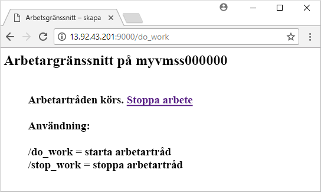

# <a name="quickstart-create-a-linux-virtual-machine-scale-set-with-an-azure-template"></a>Snabbstart: Skapa en Linux VM-skalningsuppsättning med en Azure-mall
Med en VM-skalningsuppsättning kan du distribuera och hantera en uppsättning identiska, virtuella datorer med automatisk skalning. Du kan skala antalet virtuella datorer i skalningsuppsättningen manuellt eller definiera regler för automatisk skalning baserat på resursanvändning, till exempel CPU, minneskrav eller nätverkstrafik. En Azure-belastningsutjämnare distribuerar sedan trafiken till de virtuella datorinstanserna i skalningsuppsättningen. I den här snabbstarten skapar du en VM-skalningsuppsättning och distribuerar ett exempelprogram med en Azure Resource Manager-mall.

Om du inte har en Azure-prenumeration kan du skapa ett [kostnadsfritt konto](https://azure.microsoft.com/free/?WT.mc_id=A261C142F) innan du börjar.

[!INCLUDE [cloud-shell-try-it.md](../../includes/cloud-shell-try-it.md)]

Om du väljer att installera och använda CLI lokalt, måste du köra Azure CLI version 2.0.29 eller senare. Kör `az --version` för att hitta versionen. Om du behöver installera eller uppgradera kan du läsa [Installera Azure CLI 2.0]( /cli/azure/install-azure-cli).


## <a name="define-a-scale-set-in-a-template"></a>Definiera en skalningsuppsättning i en mall
Du kan distribuera grupper av relaterade resurser med hjälp av Azure Resource Manager-mallar. Mallarna är skrivna i JavaScript Object Notation (JSON) och definierar hela infrastrukturen i Azure-miljön för din app. Med en enda mall kan du skapa VM-skalningsuppsättningen, installera program och ange regler för automatisk skalning. Du kan återanvända mallen och använda variabler och parametrar till att uppdatera befintliga, eller skapa ytterligare, skalningsuppsättningar. Du kan distribuera mallar via Azure Portal, Azure CLI 2.0 eller Azure PowerShell eller från pipelines för kontinuerlig integrering/kontinuerlig leverans (CI/CD).

Mer information om mallar finns i [Översikt över Azure Resource Manager](https://docs.microsoft.com/azure/azure-resource-manager/resource-group-overview#template-deployment)

När du skapar en skalningsuppsättning med en mall definierar du lämpliga resurser. Huvuddelarna i resurstypen för VM-skalningsuppsättning:

| Egenskap                     | Egenskapsbeskrivning                                  | Exempelmallvärde                    |
|------------------------------|----------------------------------------------------------|-------------------------------------------|
| typ                         | Azure-resurstypen som ska skapas                            | Microsoft.Compute/virtualMachineScaleSets |
| namn                         | Namnet på skalningsuppsättningen                                       | myScaleSet                                |
| location                     | Platsen där skalningsuppsättningen skapas                     | Östra USA                                   |
| sku.name                     | VM-storleken för varje skalningsuppsättningsinstans                  | Standard_A1                               |
| sku.capacity                 | Antal VM-instanser som skapas inledningsvis           | 2                                         |
| upgradePolicy.mode           | Uppgraderingsläge för VM-instanser när ändringar sker              | Automatisk                                 |
| imageReference               | Plattform eller anpassad avbildning som ska användas för VM-instanserna | Canonical Ubuntu Server 16.04-LTS         |
| osProfile.computerNamePrefix | Namnprefix för varje VM-instans                     | myvmss                                    |
| osProfile.adminUsername      | Användarnamn för varje VM-instans                        | azureuser                                 |
| osProfile.adminPassword      | Lösenord för varje VM-instans                        | P@ssw0rd!                                 |

 Följande exempel visar resursdefinitionen för skalningsuppsättningen. Om du vill anpassa en skalningsuppsättningsmall kan du ändra VM-storleken eller den inledande kapaciteten, eller använda en annan plattform eller en anpassad avbildning.

```json
{
  "type": "Microsoft.Compute/virtualMachineScaleSets",
  "name": "myScaleSet",
  "location": "East US",
  "apiVersion": "2017-12-01",
  "sku": {
    "name": "Standard_A1",
    "capacity": "2"
  },
  "properties": {
    "upgradePolicy": {
      "mode": "Automatic"
    },
    "virtualMachineProfile": {
      "storageProfile": {
        "osDisk": {
          "caching": "ReadWrite",
          "createOption": "FromImage"
        },
        "imageReference":  {
          "publisher": "Canonical",
          "offer": "UbuntuServer",
          "sku": "16.04-LTS",
          "version": "latest"
        }
      },
      "osProfile": {
        "computerNamePrefix": "myvmss",
        "adminUsername": "azureuser",
        "adminPassword": "P@ssw0rd!"
      }
    }
  }
}
```

 Av utrymmesskäl visas inte nätverkskortkonfigurationen. Ytterligare komponenter, till exempel belastningsutjämnare, visas inte heller. En fullständig skalningsuppsättningsmall visas [i slutet av den här artikeln](#deploy-the-template).


## <a name="add-a-sample-application"></a>Lägg till ett exempelprogram
Testa din skalningsuppsättning genom att installera ett grundläggande webbprogram. När du distribuerar en skalningsuppsättning kan du använda VM-tillägg för att utföra konfigurations- och automatiseringsåtgärder efter distributionen, till exempel installera en app. Skript kan laddas ned från Azure Storage eller GitHub, eller tillhandahållas via Azure Portal vid tilläggskörning. Om du vill använda ett tillägg för skalningsuppsättningen lägger du till avsnittet *extensionProfile* i föregående resursexempel. Tilläggsprofilen definierar vanligtvis följande egenskaper:

- Tilläggstyp
- Tilläggsutgivare
- Tilläggsversion
- Plats för konfiguration eller installation av skript
- Kommandon för att köra VM-instanserna

Mallen [Python HTTP-servern på Linux](https://github.com/Azure/azure-quickstart-templates/tree/master/201-vmss-bottle-autoscale) använder tillägget för anpassat skript för att installera [Bottle](http://bottlepy.org/docs/dev/) (ett Python-webbramverk) och en enkel HTTP-server. 

Två skript definieras i **fileUris** - *installserver.sh* och *workserver.py*. De här filerna laddas ned från GitHub. Sedan kör *commandToExecute* `bash installserver.sh` för att installera och konfigurera appen:

```json
"extensionProfile": {
  "extensions": [
    {
      "name": "AppInstall",
      "properties": {
        "publisher": "Microsoft.Azure.Extensions",
        "type": "CustomScript",
        "typeHandlerVersion": "2.0",
        "autoUpgradeMinorVersion": true,
        "settings": {
          "fileUris": [
            "https://raw.githubusercontent.com/Azure/azure-quickstart-templates/master/201-vmss-bottle-autoscale/installserver.sh",
            "https://raw.githubusercontent.com/Azure/azure-quickstart-templates/master/201-vmss-bottle-autoscale/workserver.py"
          ],
          "commandToExecute": "bash installserver.sh"
        }
      }
    }
  ]
}
```


## <a name="deploy-the-template"></a>Distribuera mallen
Du kan distribuera mallen [Python HTTP-servern på Linux](https://github.com/Azure/azure-quickstart-templates/tree/master/201-vmss-bottle-autoscale) med knappen **Deploy to Azure** (Distribuera till Azure). Knappen öppnar Azure Portal, läser in hela mallen och frågar efter ett par parametrar, till exempel namn på skalningsuppsättningen, antal instanser och administratörsautentiseringsuppgifter.

[](https://portal.azure.com/#create/Microsoft.Template/uri/https%3A%2F%2Fraw.githubusercontent.com%2FAzure%2Fazure-quickstart-templates%2Fmaster%2F201-vmss-bottle-autoscale%2Fazuredeploy.json)

Du kan också använda Azure CLI 2.0 för att installera Python HTTP-servern på Linux med [az group deployment create](/cli/azure/group/deployment#az_group_deployment_create) på följande sätt:

```azurecli-interactive
# Create a resource group
az group create --name myResourceGroup --location EastUS

# Deploy template into resource group
az group deployment create \
    --resource-group myResourceGroup \
    --template-uri https://raw.githubusercontent.com/Azure/azure-quickstart-templates/master/201-vmss-bottle-autoscale/azuredeploy.json
```

Svara på frågorna och ange namn på skalningsuppsättningen, antal instanser och administratörsautentiseringsuppgifter för VM-instanserna. Det tar några minuter att skapa skalningsuppsättningen och de resurser som behövs.


## <a name="test-your-scale-set"></a>Testa din skalningsuppsättning
Om du vill se din skalningsuppsättning i praktiken så gå till exempelwebbprogrammet i en webbläsare. Hämta den offentliga IP-adressen för belastningsutjämnaren med [az network public-ip list](/cli/azure/network/public-ip#show) på följande sätt:

```azurecli-interactive
az network public-ip list \
    --resource-group myResourceGroup \
    --query [*].ipAddress -o tsv
```

Ange den offentliga IP-adressen för belastningsutjämnaren i en webbläsare i formatet *http://publicIpAddress:9000/do_work*. Belastningsutjämnaren distribuerar trafik till en av dina VM-instanser enligt följande exempel:




## <a name="clean-up-resources"></a>Rensa resurser
När resurserna inte behövs längre kan du använda [az group delete](/cli/azure/group#az_group_delete) för att ta bort resursgruppen, skalningsuppsättningen och alla relaterade resurser. Parametern `--no-wait` återför kontrollen till kommandotolken utan att vänta på att uppgiften slutförs. Parametern `--yes` bekräftar att du vill ta bort resurserna utan att tillfrågas ytterligare en gång.

```azurecli-interactive
az group delete --name myResourceGroup --yes --no-wait
```


## <a name="next-steps"></a>Nästa steg
I den här snabbstarten skapade du en Linux-skalningsuppsättning med en Azure-mall och använde tillägget för anpassat skript för att installera en grundläggande Python-webbserver på VM-instanser. Om du vill veta mer kan du gå till självstudiekursen om hur man skapar och hanterar VM-skalningsuppsättningar för Azure.

> [!div class="nextstepaction"]
> [Skapa och hantera VM-skalningsuppsättningar för Azure](tutorial-create-and-manage-cli.md)