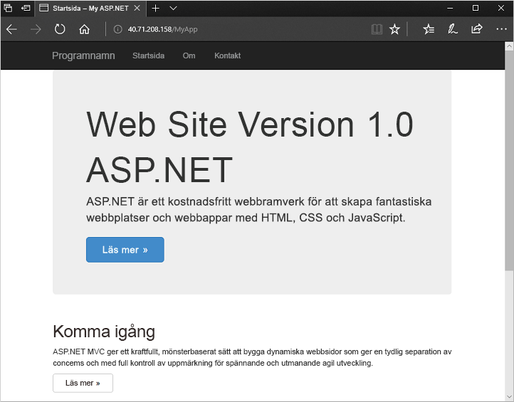

# <a name="quickstart-create-a-windows-virtual-machine-scale-set-with-an-azure-template"></a>Snabbstart: Skapa en VM-skalningsuppsättning med en Azure-mall i Windows

Med en VM-skalningsuppsättning kan du distribuera och hantera en uppsättning identiska, virtuella datorer med automatisk skalning. Du kan skala antalet virtuella datorer i skalningsuppsättningen manuellt eller definiera regler för automatisk skalning baserat på resursanvändning som CPU, minnesefterfrågan eller nätverkstrafik. En Azure-lastbalanserare distribuerar sedan trafiken till de virtuella datorinstanserna i skalningsuppsättningen. I den här snabbstarten skapar du en VM-skalningsuppsättning och distribuerar ett exempelprogram med en Azure Resource Manager-mall.

Om du inte har en Azure-prenumeration kan du skapa ett [kostnadsfritt konto](https://azure.microsoft.com/free/?WT.mc_id=A261C142F) innan du börjar.

[!INCLUDE [cloud-shell-powershell.md](../../includes/cloud-shell-powershell.md)]


## <a name="define-a-scale-set-in-a-template"></a>Definiera en skalningsuppsättning i en mall
Du kan distribuera grupper av relaterade resurser med hjälp av Azure Resource Manager-mallar. Mallarna är skrivna i JavaScript Object Notation (JSON) och definierar hela infrastrukturen i Azure-miljön för din app. Med en enda mall kan du skapa VM-skalningsuppsättningen, installera program och ange regler för automatisk skalning. Du kan återanvända mallen och använda variabler och parametrar till att uppdatera befintliga, eller skapa ytterligare, skalningsuppsättningar. Du kan distribuera mallar via Azure-portalen, Azure CLI eller Azure PowerShell eller från pipelines för kontinuerlig integrering/kontinuerlig leverans (CI/CD).

Mer information om mallar finns i [Översikt över Azure Resource Manager](https://docs.microsoft.com/azure/azure-resource-manager/resource-group-overview#template-deployment). Information om JSON-syntaxen och JSON-egenskaperna finns i mallreferensen [Microsoft.Compute/virtualMachineScaleSets](/azure/templates/microsoft.compute/virtualmachinescalesets).

En mall definierar konfigurationen för varje resurstyp. Resurstypen för VM-skalningsuppsättning är ungefär samma som för en enskild virtuell dator. Huvuddelarna i resurstypen för VM-skalningsuppsättning:

| Egenskap                      | Egenskapsbeskrivning                                  | Exempelmallvärde                    |
|------------------------------|----------------------------------------------------------|-------------------------------------------|
| typ                         | Azure-resurstypen som ska skapas                            | Microsoft.Compute/virtualMachineScaleSets |
| namn                         | Namnet på skalningsuppsättningen                                       | myScaleSet                                |
| location                     | Platsen där skalningsuppsättningen skapas                     | Östra USA                                   |
| sku.name                     | VM-storleken för varje skalningsuppsättningsinstans                  | Standard_A1                               |
| sku.capacity                 | Antal VM-instanser som skapas inledningsvis           | 2                                         |
| upgradePolicy.mode           | Uppgraderingsläge för VM-instanser när ändringar sker              | Automatisk                                 |
| imageReference               | Plattform eller anpassad avbildning som ska användas för VM-instanserna | Microsoft Windows Server 2016 Datacenter  |
| osProfile.computerNamePrefix | Namnprefix för varje VM-instans                     | myvmss                                    |
| osProfile.adminUsername      | Användarnamn för varje VM-instans                        | azureuser                                 |
| osProfile.adminPassword      | Lösenord för varje VM-instans                        | P@ssw0rd!                                 |

 Följande exempel visar resursdefinitionen för skalningsuppsättningen. Om du vill anpassa en skalningsuppsättningsmall kan du ändra VM-storleken eller den inledande kapaciteten, eller använda en annan plattform eller en anpassad avbildning.

```json
{
  "type": "Microsoft.Compute/virtualMachineScaleSets",
  "name": "myScaleSet",
  "location": "East US",
  "apiVersion": "2017-12-01",
  "sku": {
    "name": "Standard_A1",
    "capacity": "2"
  },
  "properties": {
    "upgradePolicy": {
      "mode": "Automatic"
    },
    "virtualMachineProfile": {
      "storageProfile": {
        "osDisk": {
          "caching": "ReadWrite",
          "createOption": "FromImage"
        },
        "imageReference":  {
          "publisher": "MicrosoftWindowsServer",
          "offer": "WindowsServer",
          "sku": "2016-Datacenter",
          "version": "latest"
        }
      },
      "osProfile": {
        "computerNamePrefix": "myvmss",
        "adminUsername": "azureuser",
        "adminPassword": "P@ssw0rd!"
      }
    }
  }
}
```

 Av utrymmesskäl visas inte nätverkskortkonfigurationen. Ytterligare komponenter, till exempel lastbalanserare, visas inte heller. En fullständig skalningsuppsättningsmall visas [i slutet av den här artikeln](#deploy-the-template).


## <a name="add-a-sample-application"></a>Lägg till ett exempelprogram
Testa din skalningsuppsättning genom att installera ett grundläggande webbprogram. När du distribuerar en skalningsuppsättning kan du använda VM-tillägg för att utföra konfigurations- och automatiseringsåtgärder efter distributionen, till exempel installera en app. Skript kan laddas ned från Azure Storage eller GitHub, eller tillhandahållas via Azure Portal vid tilläggskörning. Om du vill använda ett tillägg för skalningsuppsättningen lägger du till avsnittet *extensionProfile* i föregående resursexempel. Tilläggsprofilen definierar vanligtvis följande egenskaper:

- Tilläggstyp
- Tilläggsutgivare
- Tilläggsversion
- Plats för konfiguration eller installation av skript
- Kommandon som körs för VM-instanser

Exempelmallen [ASP.NET-app i Windows](https://github.com/Azure/azure-quickstart-templates/tree/master/201-vmss-windows-webapp-dsc-autoscale) använder tillägget PowerShell DSC för att installera en ASP.NET MVC-app som körs i IIS. 

Ett installationsskript hämtas från GitHub enligt definitionen i *url*. Tillägget kör sedan *InstallIIS* från skriptet *IISInstall.ps1* enligt definitionen i *funktion* och *Skript*. Själva ASP.NET-appen tillhandahålls som ett webbdistributionspaket, vilket också hämtas från GitHub enligt definitionen i *WebDeployPackagePath*:

```json
"extensionProfile": {
  "extensions": [
    {
      "name": "Microsoft.Powershell.DSC",
      "properties": {
        "publisher": "Microsoft.Powershell",
        "type": "DSC",
        "typeHandlerVersion": "2.9",
        "autoUpgradeMinorVersion": true,
        "forceUpdateTag": "1.0",
        "settings": {
          "configuration": {
            "url": "https://raw.githubusercontent.com/Azure/azure-quickstart-templates/master/201-vmss-windows-webapp-dsc-autoscale/DSC/IISInstall.ps1.zip",
            "script": "IISInstall.ps1",
            "function": "InstallIIS"
          },
          "configurationArguments": {
            "nodeName": "localhost",
            "WebDeployPackagePath": "https://raw.githubusercontent.com/Azure/azure-quickstart-templates/master/201-vmss-windows-webapp-dsc-autoscale/WebDeploy/DefaultASPWebApp.v1.0.zip"
          }
        }
      }
    }
  ]
}
```

## <a name="deploy-the-template"></a>Distribuera mallen
Du kan distribuera mallen [ASP.NET MVC-appen i Windows](https://github.com/Azure/azure-quickstart-templates/tree/master/201-vmss-windows-webapp-dsc-autoscale) med knappen **Deploy to Azure** (Distribuera till Azure). Knappen öppnar Azure Portal, läser in hela mallen och frågar efter ett par parametrar, till exempel namn på skalningsuppsättningen, antal instanser och administratörsautentiseringsuppgifter.

[](https://portal.azure.com/#create/Microsoft.Template/uri/https%3A%2F%2Fraw.githubusercontent.com%2FAzure%2Fazure-quickstart-templates%2Fmaster%2F201-vmss-windows-webapp-dsc-autoscale%2Fazuredeploy.json)

Du kan också använda Azure PowerShell för att installera ASP.NET-programmet i Windows med [New-AzResourceGroupDeployment](/powershell/module/az.resources/new-azresourcegroupdeployment) så här:

```azurepowershell-interactive
# Create a resource group
New-AzResourceGroup -Name myResourceGroup -Location EastUS

# Deploy template into resource group
New-AzResourceGroupDeployment `
    -ResourceGroupName myResourceGroup `
    -TemplateFile https://raw.githubusercontent.com/Azure/azure-quickstart-templates/master/201-vmss-windows-webapp-dsc-autoscale/azuredeploy.json

# Update the scale set and apply the extension
Update-AzVmss `
    -ResourceGroupName myResourceGroup `
    -VmScaleSetName myVMSS `
    -VirtualMachineScaleSet $vmssConfig
```

Svara på frågorna och ange namn på skalningsuppsättningen och administratörsautentiseringsuppgifter för VM-instanserna. Det kan ta 10–15 minuter för skalningsuppsättningen att skapas och tillämpa tillägget för att konfigurera appen.


## <a name="test-your-scale-set"></a>Testa din skalningsuppsättning
Om du vill se din skalningsuppsättning i praktiken så gå till exempelwebbprogrammet i en webbläsare. Hämta den offentliga IP-adressen för lastbalanseraren med [Get-AzPublicIpAddress](/powershell/module/az.network/get-azpublicipaddress) enligt följande:

```azurepowershell-interactive
Get-AzPublicIpAddress -ResourceGroupName myResourceGroup | Select IpAddress
```

Ange den offentliga IP-adressen för belastningsutjämnaren i en webbläsare i formatet *http:\//publicIpAddress/MyApp*. Lastbalanseraren distribuerar trafik till en av dina VM-instanser enligt följande exempel:




## <a name="clean-up-resources"></a>Rensa resurser
När resursgruppen inte längre behövs kan du använda [Remove-AzResourceGroup](/powershell/module/az.resources/remove-azresourcegroup) för att ta bort resursgruppen och skalningsuppsättningen. Parametern `-Force` bekräftar att du vill ta bort resurserna utan att tillfrågas ytterligare en gång. Parametern `-AsJob` återför kontrollen till kommandotolken utan att vänta på att uppgiften slutförs.

```azurepowershell-interactive
Remove-AzResourceGroup -Name "myResourceGroup" -Force -AsJob
```


## <a name="next-steps"></a>Nästa steg
I den här snabbstarten skapade du en Windows-skalningsuppsättning med en Azure-mall och använde PowerShell DSC-tillägget för att installera en grundläggande ASP.NET-app på VM-instanser. Om du vill veta mer kan du gå till självstudiekursen om hur man skapar och hanterar VM-skalningsuppsättningar för Azure.

> [!div class="nextstepaction"]
> [Skapa och hantera VM-skalningsuppsättningar för Azure](tutorial-create-and-manage-powershell.md)
