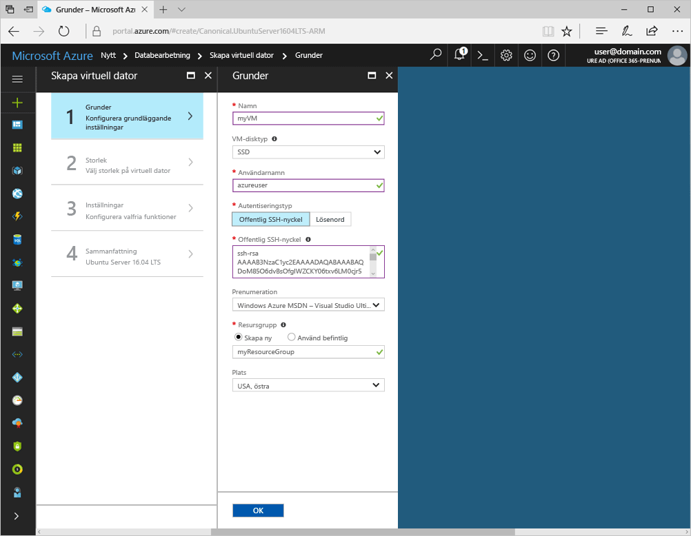
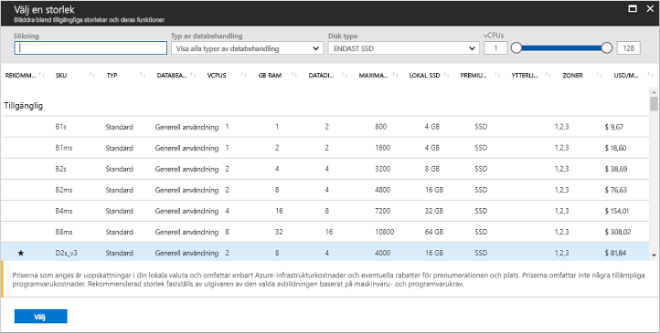
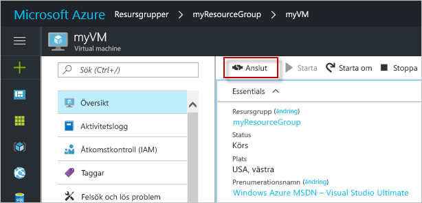

# <a name="quickstart-create-a-linux-virtual-machine-in-the-azure-portal"></a>Snabbstart: Skapa en virtuell Linux-dator i Azure Portal

Det går att skapa virtuella Azure-datorer via Azure Portal. Den här metoden ger dig ett webbläsarbaserat användargränssnitt för att skapa virtuella datorer och alla relaterade resurser. Den här snabbstarten visar hur du använder Azure Portal för att distribuera en virtuell Linux-dator (VM) i Azure som kör Ubuntu. För att se hur den virtuella datorn fungerar i praktiken använder du sedan SSH för att ansluta till den virtuella datorn och installerar NGINX-webbservern.

Om du inte har en Azure-prenumeration kan du skapa ett [kostnadsfritt konto](https://azure.microsoft.com/free/?WT.mc_id=A261C142F) innan du börjar.

## <a name="create-ssh-key-pair"></a>Skapa SSH-nyckelpar

Du behöver ett SSH-nyckelpar för att slutföra den här snabbstarten. Om du har ett befintligt SSH-nyckelpar kan du hoppa över det här steget.

Skapa ett SSH-nyckelpar och logga in på den virtuella Linux-datorn genom att köra följande kommando från ett Bash-gränssnitt och följa instruktionerna på skärmen. Du kan till exempel använda [Azure Cloud Shell](../../cloud-shell/overview.md) eller [Windows delsystemet för Linux](/windows/wsl/install-win10). Kommandoutdata innehåller filnamnet för den offentliga nyckeln. Kopiera innehållet i den offentliga nyckelfilen (`cat ~/.ssh/id_rsa.pub`) till urklipp:

```bash
ssh-keygen -t rsa -b 2048
```

Mer detaljerad information om hur du skapar SSH-nyckelpar, inklusive användning av PuTTy, finns i [Använd SSH-nycklar med Windows](ssh-from-windows.md).

## <a name="log-in-to-azure"></a>Logga in på Azure

Logga in på Azure Portal på http://portal.azure.com

## <a name="create-virtual-machine"></a>Skapa en virtuell dator

1. Välj **Skapa en resurs** längst upp till vänster i Azure Portal.

2. I sökrutan ovanför listan över Azure Marketplace-resurser, söker du efter och väljer **Ubuntu Server 16.04 LTS** av Canonical och väljer sedan **Skapa**.

3. Ange ett namn på den virtuella datorn, till exempel *myVM*, lämna disktypen som *SSD* och ange sedan ett användarnamn, som *azureuser*.

4. . Som **autentiseringstyp** väljer du **offentlig SSH-nyckel** och klistrar in den offentliga nyckeln i textrutan. Var noga med att ta bort eventuella inledande eller avslutande blanksteg i din offentliga nyckel.

    

5. Välj att **Skapa ny** resursgrupp och ange sedan ett namn, till exempel *myResourceGroup*. Välj din önskade **Plats** och välj **OK**.

4. Välj en storlek för den virtuella datorn. Du kan till exempel filtrera efter *Beräkningstyp* eller *Disktyp*. En föreslagen virtuell datorstorlek är *D2s_v3*.

    

5. Lämna standardinställningarna under **Inställningar** och välj **OK**.

6. På sammanfattningssidan klickar du på **Skapa** för att starta distributionen av den virtuella datorn.

7. Den virtuella datorn fästs på Azure Portals instrumentpanel. När distributionen är klar öppnas sammanfattningen för den virtuella datorn automatiskt.

## <a name="connect-to-virtual-machine"></a>Ansluta till den virtuella datorn

Skapa en SSH-anslutning med den virtuella datorn.

1. Välj **Anslut**-knappen på översiktssidan för din virtuella dator. 

    

2. På sidan **Anslut till den virtuella datorn** behåller du standardalternativen för att ansluta med DNS-namn via port 22. I **Logga in med lokalt virtuellt datorkonto** visas ett anslutningskommando. Klicka på knappen för att kopiera kommandot. Följande exempel visar hur SSH-anslutningskommandot ser ut:

    ```bash
    ssh azureuser@myvm-123abc.eastus.cloudapp.azure.com
    ```

3. Klistra in SSH-anslutningskommandot i ett gränssnitt, till exempel Azure Cloud Shell eller Bash på Ubuntu i Windows för att skapa anslutningen. 

## <a name="install-web-server"></a>Installera webbservern

Om du vill se hur den virtuella datorn fungerar i praktiken installerar du NGINX-webbservern. Om du vill uppdatera paketkällorna och installera det senaste NGINX-paketet kör du följande kommandon från SSH-sessionen:

```bash
# update packages
sudo apt-get -y update

# install NGINX
sudo apt-get -y install nginx
```

När det är klart, `exit` du SSH-sessionen och återgår till egenskaperna för den virtuella datorn i Azure Portal.

## <a name="open-port-80-for-web-traffic"></a>Öppna port 80 för webbtrafik

En nätverkssäkerhetsgrupp (NSG) säkrar ingående och utgående trafik. När en VM skapas från Azure Portal skapas en regel för inkommande trafik på port 22 för SSH-anslutningar. Eftersom den här virtuella datorn är värd för en webbserver, måste du skapa en NSG-regel för port 80.

1. Välj **Nätverk** på översiktssidan för den virtuella datorn.
2. Listan med befintliga regler för inkommande och utgående visas. Välj att **Lägga till regel för inkommande portar**.
3. Välj alternativet **Grundläggande** överst och välj sedan *HTTP* från listan över tillgängliga tjänster. Du tilldelas port 80, en prioritet och ett namn.
4. Välj **Lägg till** för att skapa regeln.

## <a name="view-the-web-server-in-action"></a>Se hur webbservern fungerar i praktiken

När NGINX är installerat och port 80 är öppen för den virtuella datorn kan webbservern nås från internet. Öppna en webbläsare och ange den virtuella datorns offentliga IP-adress. Den offentliga IP-adressen finns på översiktssidan för den virtuella datorn eller längst upp i *Nätverk*-sidan där du lägger till en regel för inkommande portar.


## <a name="clean-up-resources"></a>Rensa resurser

Du kan ta bort resursgruppen, den virtuella datorn och alla relaterade resurser när de inte längre behövs. Om du vill göra detta väljer du resursgruppen för den virtuella datorn. Välj sedan **Ta bort** och kontrollera namnet på resursgruppen som du vill ta bort.

## <a name="next-steps"></a>Nästa steg

I den här snabbstarten distribuerade du en enkel virtuell dator, skapade en nätverkssäkerhetsgrupp och en regel och installerade en enkel webbserver. Om du vill veta mer om virtuella Azure-datorer fortsätter du till självstudien för virtuella Linux-datorer.

> [!div class="nextstepaction"]
> [Självstudier om virtuella Azure Linux-datorer](./tutorial-manage-vm.md)
