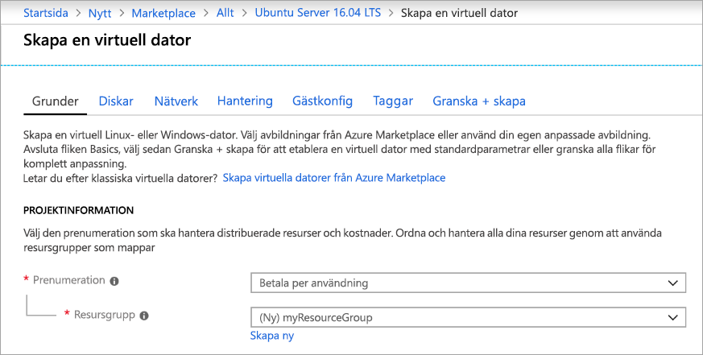
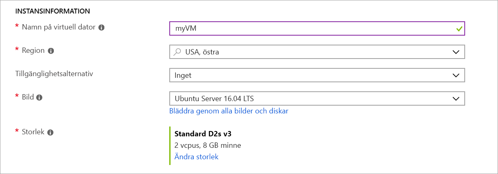
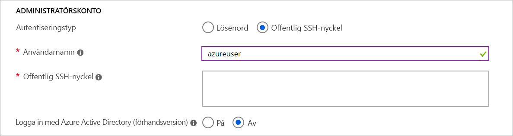
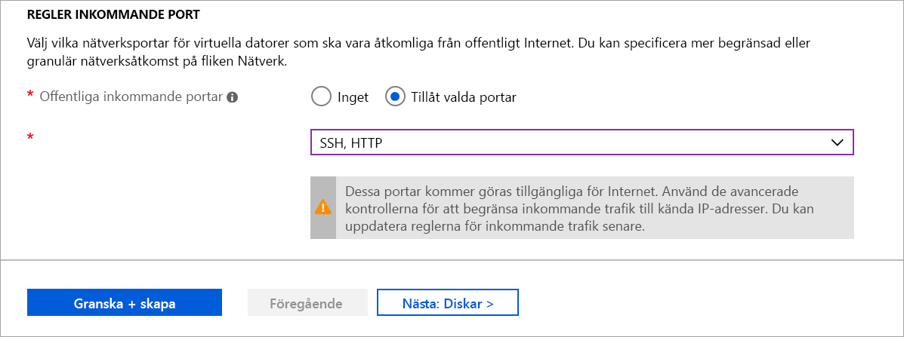

# <a name="quickstart-create-a-linux-virtual-machine-in-the-azure-portal"></a>Snabbstart: Skapa en virtuell Linux-dator i Azure Portal

Det går att skapa virtuella Azure-datorer via Azure Portal. Azure Portal är ett webbläsarbaserat användar gränssnitt för att skapa Azure-resurser. Den här snabb starten visar hur du använder Azure Portal för att distribuera en virtuell Linux-dator (VM) som kör Ubuntu 18,04 LTS. För att se hur den virtuella datorn fungerar i praktiken använder du sedan SSH för att ansluta till den virtuella datorn och installerar NGINX-webbservern.

Om du inte har någon Azure-prenumeration kan du [skapa ett kostnadsfritt konto](https://azure.microsoft.com/free/?WT.mc_id=A261C142F) innan du börjar.

## <a name="sign-in-to-azure"></a>Logga in på Azure

Logga in på [Azure Portal](https://portal.azure.com) om du inte redan gjort det.

## <a name="create-virtual-machine"></a>Skapa en virtuell dator

1. Skriv **virtuella datorer** i sökningen.
1. Under **tjänster** väljer du **virtuella datorer**.
1. På sidan **virtuella datorer** väljer du **Lägg till**. Sidan **skapa en virtuell dator** öppnas.
1. På fliken **Grundläggande inställningar** går du till **Projektinformation**, kontrollerar att korrekt prenumeration har valts och väljer sedan **Skapa ny** för resursgruppen. Skriv *myResourceGroup* som namn. *. 

    

1. Under **instans information** skriver du *myVM* för namnet på den **virtuella datorn**, väljer *östra usa* för din **region** och väljer *Ubuntu 18,04-LTS* för din **avbildning**. Låt de övriga standardvärdena vara som de är.

    

1. Under **administratörs konto** väljer du **Offentlig SSH-nyckel**.

1. Skriv *azureuser* i **användar namn** .

1. För **Offentlig SSH-nyckel**, lämna standardvärdet **generera nytt nyckel par** och skriv sedan *myKey* som **nyckel par namn**.

    

1. Under **ingående port regler**  >  **offentliga inkommande portar** väljer du **Tillåt valda portar** och väljer **SSH (22)** och **http (80)** i list rutan. 

    

1. Låt de återstående standardinställningarna vara och välj sedan knappen **Granska + skapa** längst ned på sidan.

1. På sidan **Skapa en virtuell dator** kan du se information om den virtuella datorn som du håller på att skapa. När du är klar väljer du **Skapa**.

1. När fönstret **Skapa nytt nyckel par** öppnas väljer du **Hämta privat nyckel och skapa resurs**. Din nyckel fil kommer att hämtas som **myKey. pem**. Se till att du vet var `.pem` filen hämtades, du behöver sökvägen till den i nästa steg.

1. När distributionen är färdig väljer **du gå till resurs**.

1. På sidan för den nya virtuella datorn väljer du den offentliga IP-adressen och kopierar den till Urklipp.


    

## <a name="connect-to-virtual-machine"></a>Ansluta till den virtuella datorn

Skapa en SSH-anslutning med den virtuella datorn.

1. Om du använder en Mac-eller Linux-dator öppnar du en bash-prompt. Om du använder en Windows-dator öppnar du en PowerShell-prompt. 

1. Öppna en SSH-anslutning till den virtuella datorn i din prompt. Ersätt IP-adressen med den som finns på den virtuella datorn och ersätt sökvägen med `.pem` sökvägen till den plats där nyckel filen hämtades.

```console
ssh -i .\Downloads\myKey1.pem azureuser@10.111.12.123
```

> [!TIP]
> Den SSH-nyckel du skapade kan användas nästa gången du skapar en virtuell dator i Azure. Du behöver bara markera källan **Använd en nyckel som lagrats i Azure** för **Offentlig SSH-nyckel** nästa gången du skapar en virtuell dator. Du har redan den privata nyckeln på datorn, så du behöver inte hämta något.

## <a name="install-web-server"></a>Installera webbservern

Om du vill se hur den virtuella datorn fungerar i praktiken installerar du NGINX-webbservern. Från din SSH-session uppdaterar du dina paketkällor och installera det senaste NGINX-paketet.

```bash
sudo apt-get -y update
sudo apt-get -y install nginx
```

När du är klar avslutar du SSH-sessionen genom att skriva `exit`.


## <a name="view-the-web-server-in-action"></a>Se hur webbservern fungerar i praktiken

Använd valfri webbläsare för att visa välkomstsidan för NGINX. Ange den offentliga IP-adressen för den virtuella datorn som webb adress. Den offentliga IP-adressen kan hittas på översiktssidan för den virtuella datorn eller som en del av SSH-anslutningssträngen du använde tidigare.


## <a name="clean-up-resources"></a>Rensa resurser

Du kan ta bort resursgruppen, den virtuella datorn och alla relaterade resurser när de inte längre behövs. Om du vill göra detta väljer du resursgruppen för den virtuella datorn. Välj sedan **Ta bort** och kontrollera namnet på resursgruppen som du vill ta bort.

## <a name="next-steps"></a>Nästa steg

I den här snabbstarten distribuerade du en enkel virtuell dator, skapade en nätverkssäkerhetsgrupp och en regel och installerade en enkel webbserver. Om du vill veta mer om virtuella Azure-datorer fortsätter du till självstudien för virtuella Linux-datorer.

> [!div class="nextstepaction"]
> [Självstudier om virtuella Azure Linux-datorer](./tutorial-manage-vm.md)
