<properties
    pageTitle="Skapa din första virtuella Windows-dator | Microsoft Azure"
    description="Lär dig hur du skapar din första virtuella Windows-dator med hjälp av Azure Portal."
    keywords="Virtuell Windows-dator, skapa en virtuell dator, virtuell dator, konfigurera en virtuell dator"
    services="virtual-machines-windows"
    documentationCenter=""
    authors="cynthn"
    manager="timlt"
    editor=""
    tags="azure-resource-manager"/>
<tags
    ms.service="virtual-machines-windows"
    ms.workload="infrastructure-services"
    ms.tgt_pltfrm="vm-windows"
    ms.devlang="na"
    ms.topic="hero-article"
    ms.date="09/06/2016"
    ms.author="cynthn"/>

# Skapa din första virtuella Windows-dator på Azure Portal

I den här självstudiekursen ser du hur enkelt det är att skapa en virtuell Windows-dator (VM) på bara några minuter med hjälp av Azure Portal.  

Om du inte har en Azure-prenumeration kan du skapa ett [kostnadsfritt konto](https://azure.microsoft.com/free/) innan du börjar.

## Välja VM-avbildning från Marketplace

Vi använder en Windows Server 2012 R2 Datacenter-avbildning som exempel, men det är bara en av de många avbildningar som är tillgängliga i Azure. Vilka avbildningsalternativ som är tillgängliga beror på din prenumeration. Exempelvis kan vissa skrivbordsavbildningar vara tillgängliga för [MSDN-prenumeranter](https://azure.microsoft.com/pricing/member-offers/msdn-benefits-details/?WT.mc_id=A261C142F).

1. Logga in på [Azure-portalen](https://portal.azure.com).

2. På navmenyn klickar du på **Nytt** > **Virtual Machines** > **Windows Server 2012 R2 Datacenter**.

    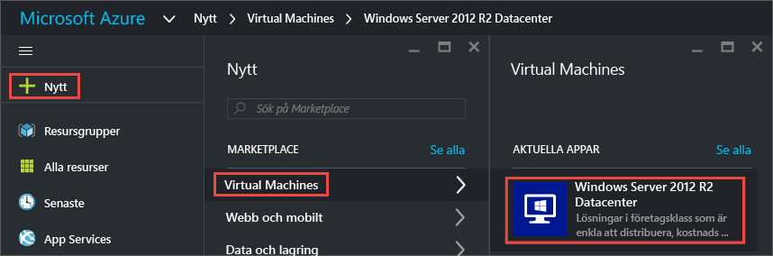

3. Kontrollera att **Resource Manager** är valt i **Välj en distributionsmodell** på bladet **Windows Server 2012 R2 Datacenter**. Klicka på **Skapa**.

    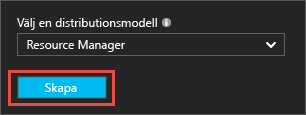

## Skapa den virtuella Windows-datorn

När du har valt avbildningen kan du använda standardinställningarna och snabbt skapa den virtuella datorn.

1. På bladet **Grundläggande inställningar** anger du ett **namn** för den virtuella datorn. Namnet måste vara mellan 1 och 15 tecken långt och får inte innehålla specialtecken.

2. Ange ett **användarnamn** och ett starkt **lösenord** som ska användas för att skapa ett lokalt konto på den virtuella datorn. Det lokala kontot används för att logga in på och hantera den virtuella datorn. 

    Lösenordet måste innehålla mellan 8 och 123 tecken och uppfylla tre av följande fyra komplexitetskrav: en gemen, en versal, en siffra och ett specialtecken. Läs mer om [krav för användarnamn och lösenord](virtual-machines-windows-faq.md#what-are-the-username-requirements-when-creating-a-vm).

3. Välj en befintlig [resursgrupp](../resource-group-overview.md#resource-groups) eller skriv namnet på en ny. Ange **platsen** för ett Azure-datacenter, t.ex. **USA, västra**. 

4. När du är klar klickar du på **OK** för att fortsätta till nästa avsnitt. 

    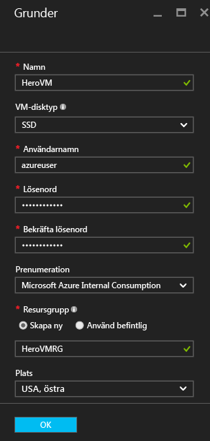

    
5. Välj en [storlek](virtual-machines-windows-sizes.md) för den virtuella datorn och fortsätt genom att klicka på **Välj**. 

    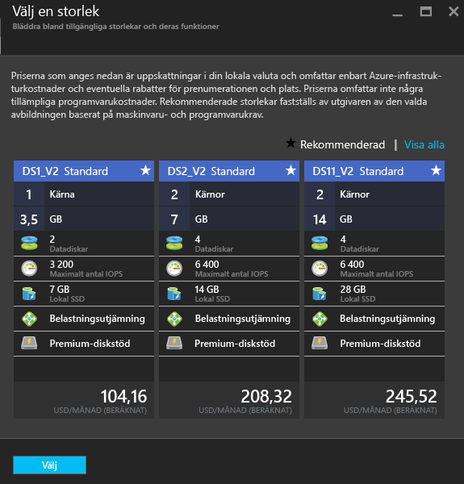

6. På bladet **Inställningar** kan du ändra lagrings- och nätverksalternativen. I den här självstudiekursen accepterar du standardinställningarna. Om du valde en VM-storlek som stöder det kan du prova Azure Premium Storage genom att välja **Premium (SSD)** i **Disktyp**. När du har gjort önskade ändringar klickar du på **OK**.

    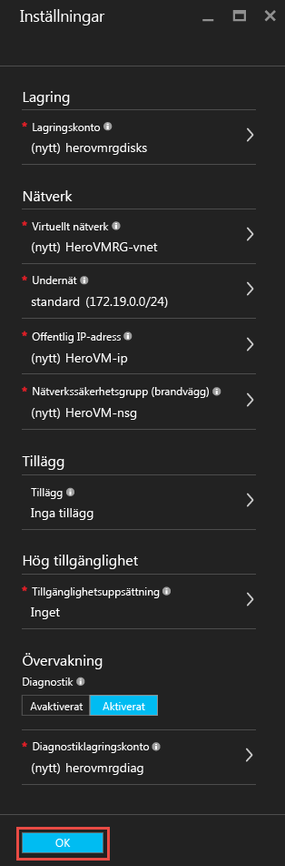

7. Klicka på **Sammanfattning** och granska dina val. När du ser ett meddelande som anger att **valideringen har slutförts** klickar du på **OK**.

    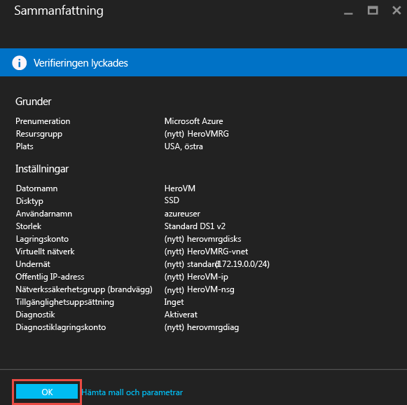

8. Medan Azure skapar den virtuella datorn kan du följa förloppet i **Virtual Machines** på navmenyn. 

## Ansluta till den virtuella datorn och logga in

1.  Klicka på **Virtual Machines** på navmenyn.

2.  Välj den virtuella datorn i listan.

3. Klicka på **Anslut** i bladet för den virtuella datorn. När du gör det skapas och hämtas en RDP-fil (Remote Desktop Protocol) som fungerar som en genväg för att ansluta till din dator. Du kan spara filen på skrivbordet för enkel åtkomst. **Öppna** den här filen när du vill ansluta till den virtuella datorn.

    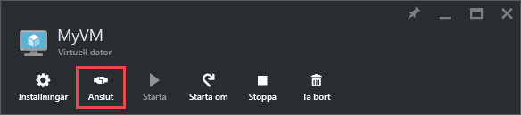

4. En varning visas som anger att RDP-filen kommer från en okänd utgivare. Detta är normalt. Fortsätt genom att klicka på **Anslut** i fjärrskrivbordsfönstret.

    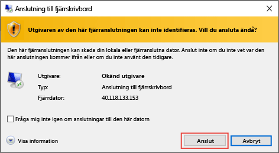

5. I fönstret Windows-säkerhet anger du användarnamnet och lösenordet för det lokala kontot som du skapade när du skapade den virtuella datorn. Användarnamnet anges som *vm-namn*&#92;*användarnamn*. Klicka på **OK**.

    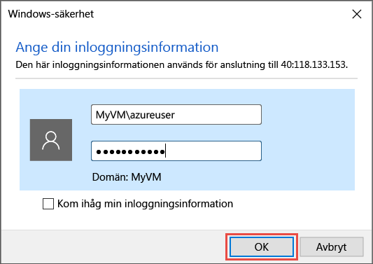
    
6.  Du får en varning om att certifikatet inte kan verifieras. Detta är normalt. Klicka på **Ja** för att verifiera den virtuella datorns identitet och slutföra inloggning.

    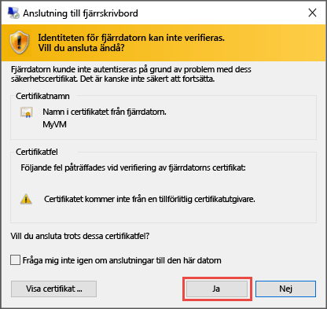

Om du får problem när du försöker ansluta läser du [Felsöka anslutningar till fjärrskrivbord till en Windows-baserad virtuell dator i Azure](virtual-machines-windows-troubleshoot-rdp-connection.md).

Nu kan du arbeta med den virtuella datorn som med andra servrar.

## Valfritt: Stoppa den virtuella datorn

Det är en bra idé att stoppa den virtuella datorn så att du inte debiteras när du inte använder den. Klicka på **Stoppa** och klicka sedan på **Ja**.

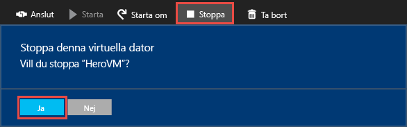
    
Klicka på knappen **Starta** när du vill starta om den virtuella datorn och börja använda den igen.

## Nästa steg

- [Installera IIS](virtual-machines-windows-hero-role.md) för att experimentera med din nya VM. Den här kursen visar också hur du öppnar port 80 för inkommande webbtrafik med en nätverkssäkerhetsgrupp (NSG). 

- Du kan också [skapa en virtuell Windows-dator med hjälp av PowerShell](virtual-machines-windows-ps-create.md) eller [skapa en virtuell Linux-dator](virtual-machines-linux-quick-create-cli.md) med Azure CLI.

- Om du är intresserad av att automatisera distributioner kan du läsa [Skapa en virtuell Windows-dator med hjälp av en Resource Manager-mall](virtual-machines-windows-ps-template.md).

<!--HONumber=Sep16_HO3-->

