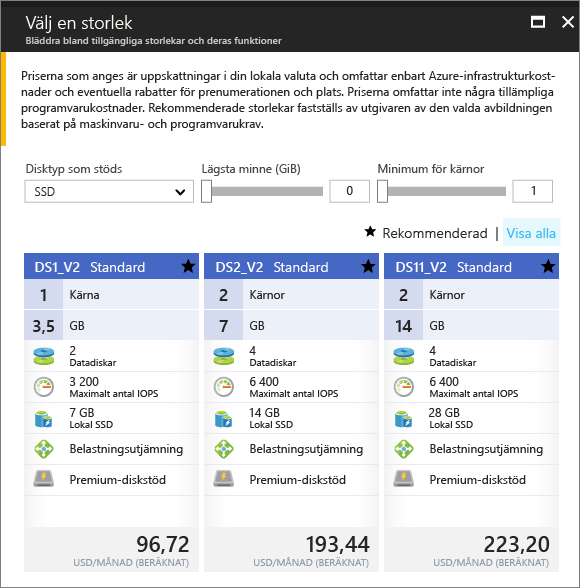

# <a name="create-a-windows-virtual-machine-in-an-availability-zone-with-the-azure-portal"></a>Skapa en virtuell Windows-dator i en zon för tillgänglighet med Azure-portalen

Den här artikeln steg genom att använda Azure portal för att skapa en virtuell dator i en Azure tillgänglighet zonen. En [tillgänglighetszon](../../availability-zones/az-overview.md) är en fysiskt separat zon i en Azure-region. Använd tillgänglighetszoner för att skydda dina appar och data från ett osannolikt fel eller förlust av ett helt datacenter.

[!INCLUDE [availability-zones-preview-statement.md](../../../includes/availability-zones-preview-statement.md)]


## <a name="log-in-to-azure"></a>Logga in på Azure 

Logga in på Azure-portalen på https://portal.azure.com.

## <a name="create-virtual-machine"></a>Skapa en virtuell dator

1. Klicka på **skapar du en resurs** i det övre vänstra hörnet i Azure-portalen.

2. Välj **Compute**, och välj sedan **Windows Server 2016 Datacenter**. 

3. Ange informationen för den virtuella datorn. Användarnamnet och lösenordet som anges här används för att logga in på den virtuella datorn. När du är klar klickar du på **OK**.

    

4. Välj en storlek för den virtuella datorn. Om du vill se fler storlekar väljer du **Visa alla** eller så ändrar du filtret för **disktyper som stöds**. Var noga med för att välja ett av de storlekar som stöds i förhandsgranskningen tillgänglighet zoner som *DS1_v2 Standard*. 

      

5. Under **inställningar** > **hög tillgänglighet**, Välj någon av zonerna numrerade från den **tillgänglighet zonen** listrutan Behåll återstående standardvärdena och Klicka på **OK**.

    

6. På sidan Sammanfattning klickar du på **inköp** att starta distributionen av virtuella datorer.

7. Den virtuella datorn fästs på Azure Portals instrumentpanel. När distributionen är klar öppnas sammanfattningen för den virtuella datorn automatiskt.


## <a name="zone-for-ip-address-and-managed-disk"></a>Zon för IP-adress och hanterade diskar

När den virtuella datorn distribueras i en zon för tillgänglighet, distribueras IP-adress och hanterade diskresurser i samma zon tillgänglighet. Du kan bekräfta Zoninställningar med hjälp av Azure PowerShell. Om du behöver installera eller uppgradera kan du läsa [Install Azure PowerShell module](/powershell/azure/install-azurerm-ps) (Installera Azure PowerShell-modul).

I följande exempel hämta information om resurserna i en resursgrupp med namnet *myResourceGroup*. Ersätt namnet på resursgruppen som du använde för att skapa den virtuella datorn.

Hitta zonen för den offentliga IP-adressen med [Get-AzureRmPublicIpAddress](/en-us/powershell/module/azurerm.network/get-azurermpublicipaddress):

```powershell
Get-AzureRmPublicIpAddress -ResourceGroupName myResourceGroup
```
Den `Zones` inställningen i utdata visar att den offentliga IP-adressen är i samma tillgänglighet zon som den virtuella datorn:

```powershell
Name                     : myVM-ip
ResourceGroupName        : myResourceGroup
Location                 : eastus2
Id                       : /subscriptions/e44f251c-c67e-4760-9ed6-bf99a306ecff/resourceGroups/danlep0911/providers/Micr
                           osoft.Network/publicIPAddresses/myVM-ip
Etag                     : W/"b67e14c0-7e8a-4d12-91c5-da2a5dfad132"
ResourceGuid             : 314bf57d-9b25-4474-9282-db3561d536aa
ProvisioningState        : Succeeded
Tags                     :
PublicIpAllocationMethod : Dynamic
IpAddress                : 13.68.16.25
PublicIpAddressVersion   : IPv4
IdleTimeoutInMinutes     : 4
IpConfiguration          : {
                             "Id": "/subscriptions/e44f251c-c67e-4760-9ed6-bf99a306ecff/resourceGroups/myResourceGroup/providers/Microsoft.Network/networkInterfaces/myVM11842/ipConfigurations/ipconfig1"
                           }
DnsSettings              : null
Zones                    : {2}
```


Den hanterade diskresursen för den virtuella datorn skapas också i samma tillgänglighetszon. Du kan kontrollera detta med [Get-AzureRmDisk](/powershell/module/azurerm.compute/get-azurermdisk):

```powershell
Get-AzureRmDisk -ResourceGroupName myResourceGroup
```

Utdata visar att de hanterade diskarna är i samma tillgänglighetszon som den virtuella datorn:

```powershell
ResourceGroupName  : myResourceGroup
AccountType        : PremiumLRS
OwnerId            : /subscriptions/d5b9d4b7-6fc1-0000-0000-000000000000/resourceGroups/myResourceGroup/providers/Microsoft.
                     Compute/virtualMachines/myVM
ManagedBy          : /subscriptions/d5b9d4b7-6fc1-0000-0000-000000000000/resourceGroups/myResourceGroup/providers/Microsoft.
                     Compute/virtualMachines/myVM
Sku                : Microsoft.Azure.Management.Compute.Models.DiskSku
Zones              : {2}
TimeCreated        : 9/7/2017 6:57:26 PM
OsType             : Windows
CreationData       : Microsoft.Azure.Management.Compute.Models.CreationData
DiskSizeGB         : 127
EncryptionSettings :
ProvisioningState  : Succeeded
Id                 : /subscriptions/d5b9d4b7-6fc1-0000-0000-000000000000/resourceGroups/myResourceGroup/providers/Microsoft.
                     Compute/disks/myVM_OsDisk_1_bd921920bb0a4650becfc2d830000000
Name               : myVM_OsDisk_1_bd921920bb0a4650becfc2d830000000
Type               : Microsoft.Compute/disks
Location           : eastus2
Tags               : {}
```

## <a name="next-steps"></a>Nästa steg

I den här artikeln har du lärt dig hur du skapar en virtuell dator i en tillgänglighetszon. Läs mer om [regioner och tillgänglighet](regions-and-availability.md) för virtuella Azure-datorer.
