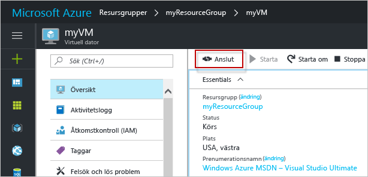

# <a name="create-a-windows-virtual-machine-with-the-azure-portal"></a>Skapa en virtuell Windows-dator med Azure Portal

Det går att skapa virtuella datorer via Azure Portal. Den här metoden ger ett webbläsarbaserat användargränssnitt för att skapa och konfigurera virtuella datorer och alla relaterade resurser. I den här snabbstarten beskrivs hur du skapar en virtuell dator och installerar en webbserver på den virtuella datorn.

Om du inte har en Azure-prenumeration kan du skapa ett [kostnadsfritt konto](https://azure.microsoft.com/free/?WT.mc_id=A261C142F) innan du börjar.

## <a name="log-in-to-azure"></a>Logga in på Azure

Logga in på Azure Portal på http://portal.azure.com.

## <a name="create-virtual-machine"></a>Skapa en virtuell dator

1. Klicka på knappen **New** (Nytt) i det övre vänstra hörnet i Azure Portal.

2. Välj**Beräkna**, sedan **Windows Server 2016 Datacenter** och se till att **Resource Manager** är vald som distributionsmodell. Klicka på knappen **Skapa**. 

3. Ange informationen för den virtuella datorn. Användarnamnet och lösenordet som anges här används för att logga in på den virtuella datorn. När du är klar klickar du på **OK**.

      

4. Välj en storlek för den virtuella datorn. Om du vill se fler storlekar väljer du **Visa alla** eller så ändrar du filtret för **disktyper som stöds**. 

      

5. På inställningsbladet väljer du **Ja** under **Use managed disks** (Använd hanterade diskar), låter standardinställningarna vara kvar för resten och klickar på **OK**.

6. På sammanfattningssidan klickar du på **Ok** för att starta distributionen av den virtuella datorn.

7. Den virtuella datorn fästs på Azure Portals instrumentpanel. När distributionen är klar öppnar den virtuella datorn VM-sammanfattningsbladet automatiskt.


## <a name="connect-to-virtual-machine"></a>Ansluta till den virtuella datorn

Skapa en fjärrskrivbordsanslutning till den virtuella datorn.

1. Klicka på knappen **Anslut** på den virtuella datorns egenskaper. En protokollfil för fjärrskrivbord (.rdp-fil) skapas och hämtas.

     

2. Öppna den hämtade RDP-filen för att ansluta till den virtuella datorn. Om du uppmanas till detta klickar du på **Anslut**. På en Mac-dator behöver du en RDP-klient som denna [Fjärrskrivbordsklient](https://itunes.apple.com/us/app/microsoft-remote-desktop/id715768417?mt=12) från Mac App Store.

3. Ange användarnamnet och lösenordet du angav när du skapade den virtuella datorn och klicka sedan på **Ok**.

4. Du kan få en certifikatvarning under inloggningen. Klicka på **Ja** eller **Fortsätt** för att fortsätta med anslutningen.


## <a name="install-iis-using-powershell"></a>Installera IIS med PowerShell

Starta en PowerShell-session och kör följande kommando för att installera IIS på den virtuella datorn.

```powershell
Install-WindowsFeature -name Web-Server -IncludeManagementTools
```

När det är klart avslutar du RDP-sessionen och återgår till VM-egenskaperna i Azure Portal.

## <a name="open-port-80-for-web-traffic"></a>Öppna port 80 för webbtrafik 

En nätverkssäkerhetsgrupp (NSG) säkrar ingående och utgående trafik. När en VM skapas från Azure Portal skapas en regel för inkommande trafik på port 3389 för RDP-anslutningar. Eftersom denna VM är värd för en webbserver måste du skapa en NSG-regel för port 80.

1. Klicka på namnet på den virtuella datorns **resursgrupp**.
2. Välj **nätverkssäkerhetsgruppen**. Du kan identifiera NSG med kolumnen **Typ**. 
3. På menyn till vänster under inställningarna klickar du på **Ingående säkerhetsregel**.
4. Klicka på **Lägg till**.
5. Skriv **http** i fältet **Namn**. Kontrollera att 80 har angetts för **Portintervall** och att **Tillåt** har angetts för **Åtgärd**. 
6. Klicka på **OK**.


## <a name="view-the-iis-welcome-page"></a>Visa välkomstsidan för IIS

När IIS är installerat och port 80 är öppen för din VM kan webbservern nu nås från internet. Öppna en webbläsare och ange den virtuella datorns offentliga IP-adress. den offentliga IP-adressen finns på VM-bladet i Azure Portal.

 

## <a name="clean-up-resources"></a>Rensa resurser

Ta bort resursgruppen, den virtuella datorn och alla relaterade resurser när de inte längre behövs. Om du vill göra det väljer du resursgruppen på bladet för den virtuella datorn och klickar på **Ta bort**.

## <a name="next-steps"></a>Nästa steg

I den här snabbstarten har du distribuerat en virtuell dator och en regel för nätverkssäkerhetsgrupp samt installerat en webbserver. Om du vill veta mer om virtuella Azure-datorer fortsätter du till självstudien för virtuella Windows-datorer.

> [!div class="nextstepaction"]
> [Självstudier om virtuella Azure Windows-datorer](./tutorial-manage-vm.md)

