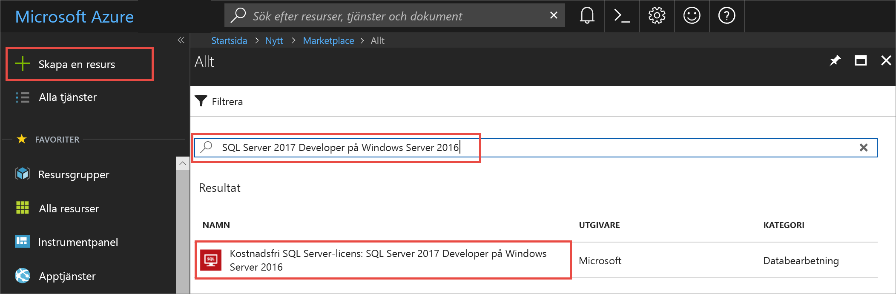
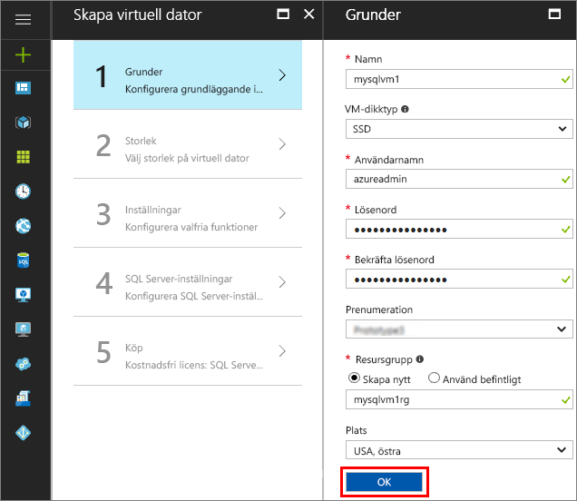
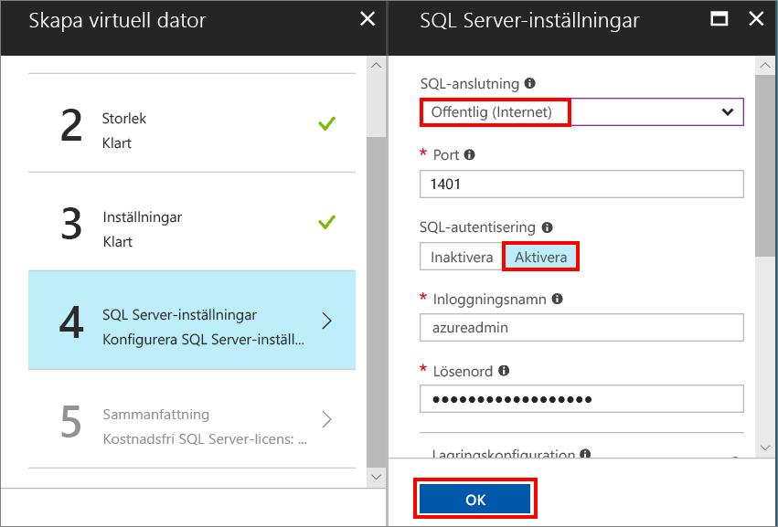
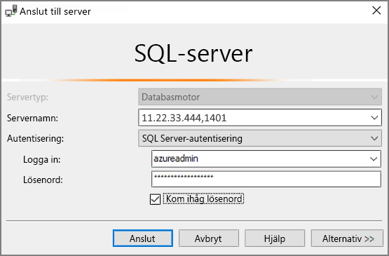

# Snabbstart: Skapa en virtuell Windows-dator med SQL Server 2017 i Azure Portal

> [!div class="op_single_selector"]
> * [Windows](quickstart-sql-vm-create-portal.md)
> * [Linux](../../linux/sql/provision-sql-server-linux-virtual-machine.md)

Den här snabbstarten beskriver hur du skapar en virtuell SQL Server-dator i Azure Portal.

> [!TIP]
> I snabbstarten finns en sökväg för snabb etablering och anslutning till en SQL-VM. Mer information om andra etableringsalternativ för SQL-VM finns i [Etableringsguide för Windows SQL Server-datorer i Azure-portalen](virtual-machines-windows-portal-sql-server-provision.md).

> [!TIP]
> Om du har frågor om virtuella SQL Server-datorer kan du läsa [Vanliga frågor](virtual-machines-windows-sql-server-iaas-faq.md).

##  Skaffa en Azure-prenumeration

Om du inte har en Azure-prenumeration kan du skapa ett [kostnadsfritt konto](https://azure.microsoft.com/free/?WT.mc_id=A261C142F) innan du börjar.

##  Välj en avbildning av en virtuell SQL Server-dator

1. Logga in på [Azure Portal](https://portal.azure.com) med ditt konto.

1. Klicka på **Skapa en resurs** i Azure Portal. 

1. Skriv **SQL Server 2017 Developer på Windows Server 2016** i sökfältet och tryck på RETUR.

1. Välj avbildningen **Kostnadsfri SQL Server-licens: SQL Server 2017 Developer på Windows Server 2016**.

   

   > [!TIP]
   > Vi använder Developer-versionen i den här självstudiekursen eftersom det är en komplett version av SQL Server som är kostnadsfri i samband med utvecklingstester. Du betalar endast för kostnaden för den VM som körs. Fullständig prisinformation finns i [Pricing guidance for SQL Server Azure VMs](virtual-machines-windows-sql-server-pricing-guidance.md) (Prisvägledning för virtuella SQL Server Azure-datorer).

1. Klicka på **Skapa**.

##  Ange grundläggande information

Ange följande i fönstret **Grundläggande inställningar**:

1. Ange ett unikt namn för den virtuella datorn i fältet **Namn**. 

1. Ange ett användarnamn för det lokala administratörskontot på den virtuella datorn i fältet **Användarnamn**.

1. Ange ett starkt **lösenord**.

1. Ange ett nytt namn på **resursgruppen**. Med den här gruppen kan du hantera alla resurser som är kopplade till den virtuella datorn.

1. Kontrollera de andra standardinställningarna och klicka på **OK** att fortsätta.

   

## Välj den virtuella datorns storlek

I steget **Storlek** väljer du en storlek för den virtuella datorn i fönstret **Välj en storlek**. I fönstret visas först rekommenderade datorstorlekar baserat på den avbildning som du har valt. 

1. Klicka på **Visa alla** för att se alla tillgängliga datorstorlekar.

1. För den här snabbstarten väljer du **D2S_V3**. Portalen visar den beräknade månadskostnaden för kontinuerlig användning av datorerna (licensieringskostnader för SQL Server omfattas inte). Observera att Developer Edition inte omfattas av några extra licensieringskostnader för SQL Server. Mer specifik prisinformation finns på sidan med [priser](https://azure.microsoft.com/pricing/details/virtual-machines/windows/).

   > [!TIP]
   > Med datorstorleken **D2S_V3** sparar du pengar under testning. Men för produktionsarbetsbelastningar hittar du rekommendationer om datorstorlek och konfiguration i [Performance best practices for SQL Server in Azure Virtual Machines](virtual-machines-windows-sql-performance.md) (Prestandametodtips för SQL Server i Azure Virtual Machines).

1. Klicka på **Välj** för att fortsätta.

## Konfigurera valfria funktioner

Klicka på **OK** för att välja standardvärdena i fönstret **Inställningar**.

## SQL Server-inställningar

Konfigurera följande alternativ i fönstret **SQL Server-inställningar**.

1. Välj **Offentlig (Internet)** i listrutan **SQL-anslutning**. Detta möjliggör SQL Server-anslutningar via Internet.

1. Ändra **porten** till **1401** för att undvika att använda ett välkänt portnamn i ett offentligt scenario.

1. Klicka på **Aktivera** under **SQL-autentisering**. SQL-inloggningen konfigureras till samma användarnamn och lösenord som du konfigurerade för den virtuella datorn.

1. Ändra andra inställningar om det behövs och klicka på **OK** för att slutföra konfigurationen av den virtuella SQL Server-datorn.

   

## Skapa den virtuella SQL Server-datorn

I fönstret **Sammanfattning** granskar du sammanfattningen och klickar på **Köp** för att skapa SQL Server, resursgrupp och resurser för den här virtuella datorn.

Du kan övervaka distributionen från Azure Portal. Knappen **Meddelanden** längst upp på skärmen visar grundläggande status för distributionen.

> [!TIP]
> Det kan ta flera minuter att distribuera en virtuell Windows SQL Server-dator.

## Anslut till SQL Server

1. Sök efter den **offentliga IP-adressen** för den virtuella datorn i avsnittet **Översikt** i den virtuella datorns egenskaper i portalen.

1. Öppna SQL Server Management Studio (SSMS) från en annan dator som är ansluten till Internet.

   > [!TIP]
   > Om du inte har SQL Server Management Studio kan du ladda ned den [här](https://docs.microsoft.com/sql/ssms/download-sql-server-management-studio-ssms).

1. I dialogrutan **Anslut till server** eller **Anslut till databasmotor**, redigerar du värdet för **Servernamn**. Ange den virtuella datorns offentliga IP-adress. Sedan lägger du till ett kommatecken och den anpassade porten **1401** som angavs när du konfigurerade den nya virtuella datorn. Till exempel `11.22.33.444,1401`.

1. I rutan **Autentisering**, markerar du **SQL Server-autentisering**.

1. I rutan **Inloggning**, skriver du namnet på en giltig SQL-inloggning.

1. I rutan **Lösenord**, skriver du lösenordet för inloggningen.

1. Klicka på **Anslut**.

    

##  Logga in på den virtuella datorn via en fjärranslutning

Använd följande anvisningar för att ansluta till den virtuella SQL Server-datorn med Fjärrskrivbord:

[!INCLUDE [Connect to SQL Server VM with remote desktop](../../../../includes/virtual-machines-sql-server-remote-desktop-connect.md)]

När du ansluter till den virtuella SQL Server-datorn kan du starta SQL Server Management Studio och ansluta med Windows-autentisering med hjälp av dina autentiseringsuppgifter som lokal administratör. Om du har aktiverat SQL Server-autentisering kan du också ansluta med SQL-autentisering med hjälp av SQL-inloggningsnamnet och SQL-lösenordet som du konfigurerade under etableringen.

När du har anslutit till datorn kan du direkt ändra inställningarna för datorn och SQL Server efter behov. Du kan till exempel konfigurera brandväggsinställningarna eller ändra konfigurationsinställningarna för SQL Server.

## Rensa resurser

Om du inte behöver köra den virtuella SQL-datorn kontinuerligt kan du undvika onödiga kostnader genom att stoppa den när den inte används. Du kan även permanent ta bort alla resurser som är kopplade till den virtuella datorn genom att ta bort deras kopplade resursgrupper i portalen. Det här tar även permanent bort den virtuella datorn, så använd det här kommandot med försiktighet. Mer information finns i [Manage Azure resources through portal](../../../azure-resource-manager/resource-group-portal.md) (Hantera Azure-resurser genom portalen).

## Nästa steg

Med den här snabbstarten skapade du en virtuell SQL Server 2017-dator i Azure Portal. Mer information om hur du migrerar data till den nya SQL-servern finns i följande artikel.

> [!div class="nextstepaction"]
> [Migrera en databas till en virtuell SQL-dator](virtual-machines-windows-migrate-sql.md)
