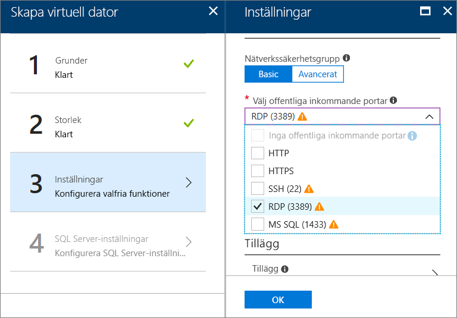

# Hur du etablerar en virtuell dator i Windows SQL Server i Azure-portalen

Den här guiden innehåller information om de olika alternativ som är tillgängliga när du skapar en virtuell dator med Windows SQL Server i Azure-portalen. Den här artikeln beskriver fler konfigurationsalternativ än den [Snabbstart för SQL Server-VM](quickstart-sql-vm-create-portal.md), som är mer via ett möjligt etablering aktivitet. 

Använd den här guiden för att skapa din egen SQL Server-VM. Eller använda den som en referens för de tillgängliga alternativen i Azure-portalen.

> [!TIP]
> Om du har frågor om virtuella SQL Server-datorer kan du läsa [Vanliga frågor](virtual-machines-windows-sql-server-iaas-faq.md).

Om du inte har en Azure-prenumeration kan du skapa ett [kostnadsfritt konto](https://azure.microsoft.com/free/?WT.mc_id=A261C142F) innan du börjar.

##  SQL Server galleriavbildningar för virtuell dator

När du skapar en virtuell dator med SQL Server kan välja du en av flera förkonfigurerade avbildningar från galleriet för virtuella datorer. Följande steg visar hur du väljer du något av 2017 för SQL Server-avbildningar.

1. Logga in på [Azure Portal](https://portal.azure.com) med ditt konto.

1. Klicka på **Skapa en resurs** i Azure Portal. Fönstret **Nytt** öppnas.

1. I fönstret **Nytt** klickar du på **Compute** och sedan på **Visa alla**.

   

1. Skriv**SQL Server 2017** i sökfältet och tryck på RETUR.

1. Klicka sedan på **filterikonen**.

1. I filterfönstren markerar du underkategorin **Windows-baserad** och **Microsoft** som utgivare. Klicka sedan på **Klar** för att filtrera resultaten efter Microsoft-publicerade, Windows SQL Server-avbilder.

   

1. Granska de tillgängliga SQL Server-avbildningarna. Varje avbildning identifierar en version av SQL Server och ett operativsystem.

1. Välj avbildningen med namnet **Kostnadsfri SQL Server-licens: SQL Server 2017 Developer på Windows Server 2016**.

   > [!TIP]
   > Utvecklarversionen används i den här genomgången eftersom det är en komplett, ledigt utgåva av SQL Server för att testa utveckling. Du betalar endast för kostnaden för den VM som körs. Men kan du välja någon av bilderna som ska användas i den här genomgången. En beskrivning av tillgängliga avbildningar finns i [SQL Server Windows virtuella datorer – översikt](virtual-machines-windows-sql-server-iaas-overview.md#payasyougo).

   > [!TIP]
   > Licensieringskostnaderna för SQL Server ingår i prissättning per sekund på den virtuella datorn som du skapar och varierar av edition och kärnor. SQL Server Developer edition är gratis för utveckling/testning (inte produktion) och SQL Express är gratis för lightweight arbetsbelastningar (mindre än 1 GB minne med mindre än 10 GB lagringsutrymme). Du kan också bring-your-äger-licens (BYOL) och betala endast för den virtuella datorn. Dessa avbildningsnamn föregås av {BYOL}. 
   >
   > Mer information om alternativen finns i [Pricing guidance for SQL Server Azure VMs](virtual-machines-windows-sql-server-pricing-guidance.md) (Prisvägledning för virtuella SQL Server Azure-datorer).

1. Under **Välj en distributionsmodell** kontrollerar du att **Resource Manager** är valt. Resource Manager är den rekommenderade distributionsmodellen för nya virtuella datorer. 

1. Klicka på **Skapa**.

    

##  Konfigurationsalternativ
Det finns fem fönster för att konfigurera en virtuell dator med SQL Server.

| Steg | Beskrivning |
| --- | --- |
| **Grundläggande inställningar** |[Konfigurera grundläggande inställningar](#1-configure-basic-settings) |
| **Storlek** |[Välj den virtuella datorns storlek](#2-choose-virtual-machine-size) |
| **Inställningar** |[Konfigurera valfria funktioner](#3-configure-optional-features) |
| **SQL Server-inställningar** |[Konfigurera SQL Server-inställningar](#4-configure-sql-server-settings) |
| **Sammanfattning** |[Granska sammanfattningen](#5-review-the-summary) |

## 1. Konfigurera grundläggande inställningar

Ange följande i fönstret **Grundläggande inställningar**:

* Ange ett unikt **namn** för den virtuella datorn.

* Välj **SSD** som disktyp för virtuell dator för bästa prestanda.

* Ange ett **användarnamn** för det lokala administratörskontot på den virtuella datorn. Det här kontot läggs också till i den fasta SQL Server-serverrollen **sysadmin**.

* Ange ett starkt **lösenord**.

* Om du har flera prenumerationer kontrollerar du att prenumerationen är rätt för den nya virtuella datorn.

* I rutan **Resursgrupp** skriver du ett namn för en ny resursgrupp. Du kan även använda en befintlig resursgrupp genom att klicka på **Använd befintlig**. En resursgrupp är en samling relaterade resurser i Azure (virtuella datorer, lagringskonton, virtuella nätverk osv.).

  > [!NOTE]
  > En ny resursgrupp är praktiskt om du bara testar eller lär dig om SQL Server-distributioner i Azure. När du är klar med testet tar du bort resursgruppen. När du gör det tas den virtuella datorn och alla resurser som associeras med resursgruppen bort automatiskt. Mer information om resursgrupper finns i [Översikt över Azure Resource Manager](../../../azure-resource-manager/resource-group-overview.md).

* Välj en **plats** för Azure-region som värd för den här distributionen.

* Spara inställningarna genom att klicka på **OK**.

    

## 2. Välj den virtuella datorns storlek

I steget **Storlek** väljer du en storlek för den virtuella datorn i fönstret **Välj en storlek**. I fönstret visas först rekommenderade datorstorlekar baserat på den avbildning som du har valt.

> [!IMPORTANT]
> Den uppskattade månadskostnaden som visas på sidan **Välj en storlek** omfattar inte SQL Server-licenskostnaden. Denna uppskattning är kostnaden för den virtuella datorn enbart. Denna uppskattning är den totala uppskattade kostnaden för snabb och Developer-versioner av SQL Server. För andra utgåvor kan du se [sidan med priser för Windows Virtual Machines](https://azure.microsoft.com/pricing/details/virtual-machines/windows/) and och välja din utgåva av SQL Server. Läs också [Pricing guidance for SQL Server Azure VMs](virtual-machines-windows-sql-server-pricing-guidance.md) (Prisvägledning för virtuella SQL Server Azure-datorer).

Vad gäller produktionsarbetsbelastningar hittar du rekommendationer för datorstorlek och konfiguration i [Prestandametodtips för SQL Server på virtuella Azure-datorer](virtual-machines-windows-sql-performance.md).

> [!NOTE]
> Mer information om storlekar för virtuella datorer finns i [Storlekar för virtuella datorer](../sizes.md?toc=%2fazure%2fvirtual-machines%2fwindows%2ftoc.json).

Välj din datorstorlek och klicka på **Välj**.

## 3. Konfigurera valfria funktioner

På sidan **Inställningar** ställer du in Azure-lagring, nätverk och övervakning för den virtuella datorn.

* Under **Lagring** väljer du **Ja** under använd **Managed Disks**.

   > [!NOTE]
   > Microsoft rekommenderar Managed Disks för SQL Server. Managed Disks hanterar lagring i bakgrunden. När virtuella datorer med Managed Disks finns i samma tillgänglighetsuppsättning, distribuerar Azure dessutom lagringsresurser för att tillhandahålla rätt redundans. Mer information finns i [hanterade diskar översikt över Azure] [... / hanteras-diskar-overview.md). Mer information om hanterade diskar i en tillgänglighetsuppsättning finns i [Använda hanterade diskar för virtuella datorer i tillgänglighetsuppsättning](../manage-availability.md).

* Under **nätverk**, Välj alla inkommande portar som i den **Välj offentlig ingående portar** lista. Om du vill fjärrskrivbord på den virtuella datorn, väljer du exempelvis den **RDP (port 3389)** port.

   

   > [!NOTE]
   > Du kan välja den **MS SQL (1433)** porten till SQL Server via fjärranslutning. Men detta behövs inte här, eftersom den **SQL Server-inställningar** ger även det här alternativet. Om du väljer port 1433 i det här steget, öppnas den oberoende dina val i den **SQL Server-inställningar** steg.

   Du kan göra andra ändringar i nätverksinställningar eller Behåll standardinställningarna.

* Azure aktiverar **övervakning** som standard med samma lagringskonto som används för den virtuella datorn. Du kan ändra dessa inställningar här.

* Under **tillgänglighetsuppsättning**, du kan lämna standardvärdet **ingen** för den här genomgången. Om du planerar att konfigurera SQL AlwaysOn-tillgänglighetsgrupper konfigurerar du tillgängligheten för att undvika att behöva återskapa den virtuella datorn.  Mer information finns i [Hantera tillgängligheten för Virtual Machines](../manage-availability.md?toc=%2fazure%2fvirtual-machines%2fwindows%2ftoc.json).

När du har konfigurerat dessa inställningar klickar du på **OK**.

## 4. Konfigurera SQL Server-inställningar
På sidan **SQL Server-inställningar** anger du specifika inställningar och optimeringar för SQL Server. Du kan bland annat konfigurera följande inställningar för SQL Server.

| Inställning |
| --- |
| [Anslutning](#connectivity) |
| [Autentisering](#authentication) |
| [Storage-konfiguration](#storage-configuration) |
| [Automatisk uppdatering](#automated-patching) |
| [Automatisk säkerhetskopiering](#automated-backup) |
| [Azure Key Vault-integrering](#azure-key-vault-integration) |
| [SQL Server Machine Learning Services](#sql-server-machine-learning-services) |

### Anslutning

Under **SQL-anslutning** anger du vilken typ av åtkomst du vill ha till SQL Server-instansen på den här virtuella datorn. I den här genomgången avses Välj **offentlig (internet)** att tillåta anslutningar till SQL Server från datorer eller tjänster på internet. När det här alternativet är valt konfigurerar Azure automatiskt brandväggen och nätverkssäkerhetsgruppen så att trafik tillåts på port 1433.

> [!TIP]
> Som standard lyssnar SQL Server på en känd port, **1433**. För ökad säkerhet kan du ändra porten så att den lyssnar på en icke-standardport, till exempel 1401, i den föregående dialogrutan. Om du ändrar porten som måste du ansluta den porten från alla klientverktyg, till exempel SSMS.

Om du vill ansluta till SQL Server via Internet måste du också aktivera SQL Server-autentisering, som beskrivs i nästa avsnitt.

Om du föredrar att inte aktivera anslutningar till databasmotorn via Internet väljer du något av följande alternativ:

* **Lokalt (endast inuti VM)** om du bara vill tillåta anslutningar till SQL Server inifrån den virtuella datorn.
* **Privat (inom Virtual Network)** om du vill tillåta anslutningar till SQL Server från datorer eller tjänster i samma virtuella nätverk.

I allmänhet kan du förbättra säkerheten genom att välja den mest restriktiva anslutningen som ditt scenario medger. Men alla alternativ kan skyddas med regler för nätverkssäkerhetsgrupper och SQL/Windows-autentisering. Du kan redigera nätverkssäkerhetsgruppen när den virtuella datorn har skapats. Mer information finns i [Säkerhetsöverväganden för SQL Server på Azure Virtual Machines](virtual-machines-windows-sql-security.md).

### Autentisering

Om du kräver SQL Server-autentisering klickar du på **Aktivera** under **SQL-autentisering**.

> [!NOTE]
> Om du planerar att ansluta till SQL Server via internet (alternativet anslutning för offentliga) måste du aktivera SQL-autentisering här. Offentlig åtkomst till SQL Server kräver användning av SQL-autentisering.

Om du aktiverar SQL Server-autentisering anger du ett **inloggningsnamn** och **lösenord**. Det här användarnamnet är konfigurerat som en inloggning med SQL Server-autentisering och som en medlem i den fasta serverrollen **sysadmin**. Mer information om autentiseringslägen finns i [Välja ett autentiseringsläge](https://docs.microsoft.com/sql/relational-databases/security/choose-an-authentication-mode).

Om du inte aktiverar SQL Server-autentisering kan du använda det lokala administratörskontot på den virtuella datorn för att ansluta till SQL Server-instansen.

### Storage-konfiguration

Klicka på **Storage-konfiguration** för att ange lagringskraven.

> [!NOTE]
> Det här alternativet är inte tillgängligt om du manuellt har konfigurerat den virtuella datorn för användning av standardlagring. Automatisk lagringsoptimering är endast tillgängligt för Premium Storage.

> [!TIP]
> Antalet stopp och den övre gränsen för varje skjutreglage beror på den valda storleken för virtuell dator. En större och kraftfullare virtuell dator kan skalas upp mer.

Du kan ange krav som I/O-åtgärder per sekund (IOPs), genomflöde i MB/s och totalt lagringsutrymme. Konfigurera dessa värden med hjälp av reglagen. Du kan ändra dessa lagringsinställningar baserat på arbetsbelastningen. Portalen beräknar automatiskt antalet diskar som ska anslutas och konfigureras baserat på de här kraven.

Under **Storage optimerat för** väljer du något av följande alternativ:

* **Allmänt** är standardinställningen och har stöd för de flesta arbetsbelastningar.
* **Transaktionell** bearbetning optimerar lagringen för traditionella OLTP-arbetsbelastningar för databaser.
* **Datalagerhantering** optimerar lagringen för analys- och rapporteringsarbetsbelastningar.

### Automatisk uppdatering

**Automatisk uppdatering** är aktiverat som standard. Med inställningen Automatisk uppdatering kan Azure korrigera SQL Server och operativsystemet automatiskt. Ange en dag i veckan, en tid och längden på en underhållsperiod. Azure utför uppdateringar under den här underhållsperioden. Den virtuella datorns lokala tid används för underhållsperiodens schema. Om du inte vill att Azure ska uppdatera SQL Server och operativsystemet automatiskt klickar du på **Inaktivera**.  

Mer information finns i [Automatisk uppdatering av SQL Server i Azure Virtual Machines](virtual-machines-windows-sql-automated-patching.md).

### Automatisk säkerhetskopiering

Aktivera automatiska säkerhetskopieringar för alla databaser under **Automatisk säkerhetskopiering**. Automatisk säkerhetskopiering är inaktiverat som standard.

När du aktiverar automatisk SQL-säkerhetskopiering kan du konfigurera följande inställningar:

* Kvarhållningsperiod (dagar) för säkerhetskopieringar
* Lagringskonto som ska användas för säkerhetskopieringar
* Krypteringsalternativ och lösenord för säkerhetskopieringar
* Säkerhetskopiera systemdatabaser
* Konfigurera schema för säkerhetskopiering

Om du vill kryptera säkerhetskopian klickar du på **Aktivera**. Ange sedan **lösenordet**. Azure skapar ett certifikat för att kryptera säkerhetskopiorna och använder det angivna lösenordet för att skydda certifikatet.

 Mer information finns i [Automatisk säkerhetskopiering av SQL Server i Azure Virtual Machines](virtual-machines-windows-sql-automated-backup.md).

### Azure Key Vault-integrering

Om du vill lagra säkerhetshemligheter i Azure för kryptering klickar du på **Azure Key Vault-integrering** och klickar sedan på **Aktivera**.

Följande tabell innehåller de parametrar som krävs för att konfigurera Azure Key Vault-integrering.

| PARAMETER | BESKRIVNING | EXEMPEL |
| --- | --- | --- |
| **Key Vault-URL** |Platsen för nyckelvalvet. |https://contosokeyvault.vault.azure.net/ |
| **Huvudnamn** |Azure Active Directory-tjänstens huvudnamn. Det här namnet kallas också för klient-ID:t. |fde2b411-33d5-4e11-af04eb07b669ccf2 |
| **Huvudhemlighet** |Azure Active Directory-tjänstens huvudhemlighet. Den här hemligheten kallas även för klienthemligheten. |9VTJSQwzlFepD8XODnzy8n2V01Jd8dAjwm/azF1XDKM= |
| **Namn på autentiseringsuppgifter** |**Namn på autentiseringsuppgifter**: AKV-integreringen skapar autentiseringsuppgifter på SQL-servern som gör att den virtuella datorn kan komma åt nyckelvalvet. Välj ett namn för autentiseringsuppgifterna. |mycred1 |

Mer information finns i [Konfigurera Azure Key Vault-integrering för SQL Server på Azure Virtual Machines](virtual-machines-windows-ps-sql-keyvault.md).

### SQL Server Machine Learning Services

Du kan aktivera [SQL Server Machine Learning Services](https://msdn.microsoft.com/library/mt604845.aspx). Det här alternativet kan du använda avancerade analyser med SQL Server 2017. Klicka på **Aktivera** i fönstret **SQL Server-inställningar**.

När du har konfigurerat inställningarna för SQL Server klickar du på **OK**.

## 5. Granska sammanfattningen

I fönstret **Sammanfattning** granskar du sammanfattningen och klickar på **Köp** för att skapa SQL Server, resursgrupp och resurser för den här virtuella datorn.

Du kan övervaka distributionen från Azure Portal. Knappen **Meddelanden** längst upp på skärmen visar grundläggande status för distributionen.

> [!NOTE]
> För att ge dig en uppfattning om distributionstiden distribuerade jag en virtuell dator med SQL till östra USA med standardinställningar. Det här testdistributionen tog cirka 12 minuter att slutföra. Distributionen kan dock gå snabbare eller långsammare beroende på din region och dina valda inställningar.

##  Öppna den virtuella datorn med Fjärrskrivbord

Använd följande anvisningar för att ansluta till den virtuella SQL Server-datorn med Fjärrskrivbord:

[!INCLUDE [Connect to SQL Server VM with remote desktop](../../../../includes/virtual-machines-sql-server-remote-desktop-connect.md)]

När du ansluter till den virtuella SQL Server-datorn kan du starta SQL Server Management Studio och ansluta med Windows-autentisering med hjälp av dina autentiseringsuppgifter som lokal administratör. Om du har aktiverat SQL Server-autentisering kan du också ansluta med SQL-autentisering med hjälp av SQL-inloggningsnamnet och SQL-lösenordet som du konfigurerade under etableringen.

När du har anslutit till datorn kan du direkt ändra inställningarna för datorn och SQL Server efter behov. Du kan till exempel konfigurera brandväggsinställningarna eller ändra konfigurationsinställningarna för SQL Server.

##  Fjärransluta till SQL Server

Du valde i den här genomgången **offentliga** åtkomst för den virtuella datorn och **SQL Server-autentisering**. Dessa inställningar konfigurerade automatiskt den virtuella datorn så att SQL Server-anslutningar tillåts från alla klienter över Internet (förutsatt att de har rätt SQL-inloggningsuppgifter).

> [!NOTE]
> Om du inte valde Offentlig under etableringen kan du ändra SQL-anslutningsinställningarna via portalen efter etableringen. Mer information hittar du i [Ändra SQL-anslutningsinställningarna](virtual-machines-windows-sql-connect.md#change).

Följande avsnitt visar hur du ansluter via internet till SQL Server-VM-instans.

[!INCLUDE [Connect to SQL Server in a VM Resource Manager](../../../../includes/virtual-machines-sql-server-connection-steps-resource-manager.md)]

## Nästa steg

Mer information om hur du använder SQL Server i Azure finns i [SQL Server på Azure Virtual Machines](virtual-machines-windows-sql-server-iaas-overview.md) och [Vanliga frågor och svar](virtual-machines-windows-sql-server-iaas-faq.md).