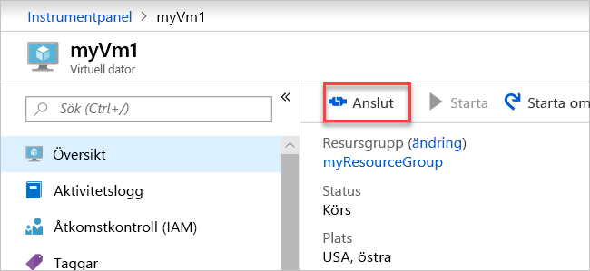

# <a name="quickstart-create-a-virtual-network-using-the-azure-portal"></a>Snabbstart: Skapa ett virtuellt nätverk med hjälp av Azure-portalen

Ett virtuellt nätverk gör det möjligt för Azure-resurser, till exempel virtuella datorer (VM), att kommunicera privat med varandra och med Internet. I den här snabbstarten får du lära dig hur du skapar ett virtuellt nätverk. När du har skapat ett virtuellt nätverk distribuerar du två virtuella datorer i det virtuella nätverket. Sedan ansluter du till en virtuell dator från Internet och kommunicerar privat mellan de två virtuella datorerna.

Om du inte har en Azure-prenumeration kan du skapa ett [kostnadsfritt konto](https://azure.microsoft.com/free/?WT.mc_id=A261C142F) innan du börjar.

## <a name="log-in-to-azure"></a>Logga in på Azure 

Logga in på Azure Portal på https://portal.azure.com.

## <a name="create-a-virtual-network"></a>Skapa ett virtuellt nätverk

1. Klicka på **+ Skapa en resurs** längst upp till vänster på Azure Portal.
2. Välj **Nätverk** och välj därefter **Virtuellt nätverk**.
3. Ange eller välj följande information, acceptera standardinställningarna för återstående inställningar och välj sedan **Skapa**:

    |Inställning|Värde|
    |---|---|
    |Namn|myVirtualNetwork|
    |Prenumeration| Välj din prenumeration.|
    |Resursgrupp| Välj **Skapa ny** och skriv *myResourceGroup*.|
    |Plats| Välj **USA, östra**.|

    

## <a name="create-virtual-machines"></a>Skapa virtuella datorer

Skapa två virtuella datorer i det virtuella nätverket:

### <a name="create-the-first-vm"></a>Skapa den första virtuella datorn

1. Klicka på **+ Skapa en resurs** längst upp till vänster på Azure Portal.
2. Välj **Compute**, och välj sedan **Windows Server 2016 Datacenter**.
3. Ange eller välj följande information, acceptera standardinställningarna för återstående inställningar och välj sedan **OK**:

    |Inställning|Värde|
    |---|---|
    |Namn|myVm1|
    |Användarnamn| Ange ett valfritt användarnamn.|
    |Lösenord| Ange ett valfritt lösenord. Lösenordet måste vara minst 12 tecken långt och uppfylla [de definierade kraven på komplexitet](../virtual-machines/windows/faq.md?toc=%2fazure%2fvirtual-network%2ftoc.json#what-are-the-password-requirements-when-creating-a-vm).|
    |Prenumeration| Välj din prenumeration.|
    |Resursgrupp| Välj **Använd befintlig** och sedan **myResourceGroup**.|
    |Plats| Välj **USA, östra**|

    

4. Välj en storlek för den virtuella datorn och sedan **Välj**.
5. Under **Inställningar** accepterar du alla standardinställningar och väljer därefter **OK**.

    

6. Under **Skapa** i **sammanfattningen** väljer du **Skapa** för att starta VM-distributionen. Det tar några minuter att distribuera den virtuella datorn. 

### <a name="create-the-second-vm"></a>Skapa den andra virtuella datorn

Slutför steg 1–6 igen, men i steg 3 ger du den virtuella datorn namnet *myVm2*.

## <a name="connect-to-a-vm-from-the-internet"></a>Ansluta till en virtuell dator från internet

1. När du har skapat *myVm1* ansluter du till den. Överst i Azure-portalen skriver du *myVm1*. När **myVm1** visas i sökresultatet väljer du den. Välj knappen **Anslut**.

    

2. När du har valt knappen **Anslut** skapas en .rdp-fil (Remote Desktop Protocol) som laddas ned till datorn.  
3. Öppna den nedladdade rdp-filen. Om det händer väljer du **Anslut**. Ange användarnamnet och lösenordet du angav när du skapade den virtuella datorn. Du kan behöva välja **Fler alternativ** och sedan **Använd ett annat konto** för att ange autentiseringsuppgifterna du angav när du skapade den virtuella datorn. 
4. Välj **OK**.
5. Du kan få en certifikatvarning under inloggningen. Om du ser varningen väljer du **Ja** eller **Fortsätt** för att fortsätta med anslutningen.

## <a name="communicate-between-vms"></a>Kommunicera mellan virtuella datorer

1. Från PowerShell anger du `ping myvm2`. Ping misslyckas, eftersom ping som standard använder ICMP (Internet Control Message Protocol), och ICMP är inte tillåtet via Windows-brandväggen.
2. För att tillåta *myVm2* att pinga *myVm1* i ett senare steg anger du följande kommando från PowerShell, som tillåter inkommande ICMP via Windows-brandväggen:

    ```powershell
    New-NetFirewallRule –DisplayName “Allow ICMPv4-In” –Protocol ICMPv4
    ```

3. Stäng fjärrskrivbordsanslutningen till *myVm1*. 

4. Utför stegen i [Ansluta till en virtuell dator från Internet](#connect-to-a-vm-from-the-internet) igen, men anslut till *myVm2*. Från en kommandotolk anger du `ping myvm1`.

    Du får svar från *myVm1*, eftersom du har tillåtit ICMP via Windows-brandväggen på den virtuella datorn *myVm1* i ett tidigare steg.

5. Stäng fjärrskrivbordsanslutningen till *myVm2*.

## <a name="clean-up-resources"></a>Rensa resurser

Ta bort resursgruppen, skalningsuppsättningen och alla resurser som den innehåller:

1. Skriv *myResourceGroup* i **sökrutan** överst i portalen. När du ser **myResourceGroup** i sökresultatet väljer du det.
2. Välj **Ta bort resursgrupp**.
3. Skriv *myResourceGroup* där du uppmanas att **skriva resursgruppens namn:** (Skriv resursgruppens namn) och välj **Ta bort**.

## <a name="next-steps"></a>Nästa steg

I den här snabbstarten har du skapat ett virtuellt standardnätverk och två virtuella datorer. Du anslöt till en virtuell dator från internet och kommunicerade privat mellan den virtuella datorn och en annan virtuell dator. Läs mer om virtuella nätverksinställningar i [Hantera ett virtuellt nätverk](manage-virtual-network.md).

Som standard tillåter Azure obegränsad privat kommunikation mellan virtuella datorer, men tillåter endast anslutningar till fjärrskrivbord till virtuella Windows-datorer från internet. Om du vill lära dig mer om hur du tillåter eller begränsar olika typer av nätverkskommunikation till och från virtuella datorer fortsätter du till självstudien [Filtrera nätverkstrafik](tutorial-filter-network-traffic.md).