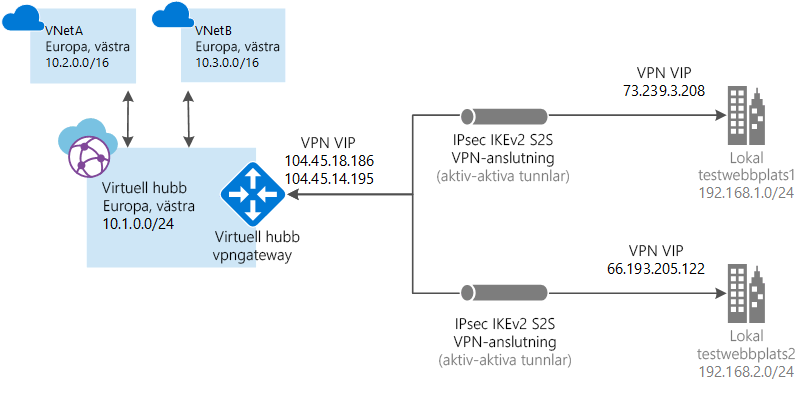

# <a name="tutorial-create-a-site-to-site-connection-using-azure-virtual-wan"></a>Självstudie: Skapa en plats-till-plats-anslutning med Azure Virtual WAN

Här förklarar vi hur du ansluter resurser i Azure via en IPsec/IKE (IKEv1 och IKEv2) VPN-anslutning med Virtual WAN. Den här typen av anslutning kräver en lokal VPN-enhet som tilldelats till en extern offentlig IP-adress. Mer information om virtuella WAN-nätverk finns i [översikten om virtuellt WAN](virtual-wan-about.md).

I den här guiden får du lära du dig hur man:

> [!div class="checklist"]
> * Skapa ett virtuellt WAN
> * Skapa en hubb
> * Skapa en plats
> * Ansluta en plats till en hubb
> * Ansluta en VPN-plats till en hubb
> * Ansluta ett virtuellt nätverk till en hubb
> * Hämta en konfigurations fil
> * Konfigurera din VPN-gateway

> [!NOTE]
> Om du har många webbplatser är det vanligast att använda en [virtuellt WAN-partner](https://aka.ms/virtualwan) för att skapa den här konfigurationen. Du kan dock skapa den här konfigurationen själv om du har erfarenhet av att arbeta med nätverk och är skicklig på konfigurera din egen VPN-enhet.
>



## <a name="prerequisites"></a>Förutsättningar

Kontrollera att du har uppfyllt följande villkor innan du påbörjar konfigurationen:

[!INCLUDE [Before you begin](../../includes/virtual-wan-before-include.md)]

## <a name="create-a-virtual-wan"></a><a name="openvwan"></a>Skapa ett virtuellt WAN

[!INCLUDE [Create a virtual WAN](../../includes/virtual-wan-create-vwan-include.md)]

## <a name="create-a-hub"></a><a name="hub"></a>Skapa en hubb

En hubb är ett virtuellt nätverk som kan innehålla gatewayer för plats-till-plats-, ExpressRoute-eller punkt-till-plats-funktioner. När hubben har skapats debiteras du för hubben, även om du inte kopplar några platser. Det tar 30 minuter att skapa VPN-gatewayen för plats-till-plats i den virtuella hubben.

[!INCLUDE [Create a hub](../../includes/virtual-wan-tutorial-s2s-hub-include.md)]

## <a name="create-a-site"></a><a name="site"></a>Skapa en plats

Du är nu redo att skapa de platser som motsvarar dina fysiska platser. Skapa så många platser som du behöver för att motsvara de fysiska platserna. Om du till exempel har ett avdelningskontor i New York, ett i London och ett i LA kan du skapa tre separata platser. Platserna innehåller de lokala VPN-enhetsslutpunkterna. Du kan skapa upp till 1000 platser per virtuell hubb i ett virtuellt WAN-nätverk. Om du har flera hubbar kan du skapa 1000 per var och en av dessa hubbar. Om du har en virtuell WAN-partner (länk infogning) CPE-enhet kan du kontakta dem för att lära dig om deras automatisering av Azure. Vanligt vis förutsätter Automation enkel klickning för att exportera storskalig gren information till Azure och konfigurera anslutning från CPE till Azure Virtual WAN-VPN gateway. Mer information finns i [Automation-vägledning från Azure till CPE-partner](virtual-wan-configure-automation-providers.md).

[!INCLUDE [Create a site](../../includes/virtual-wan-tutorial-s2s-site-include.md)]

## <a name="connect-the-vpn-site-to-the-hub"></a><a name="connectsites"></a>Anslut VPN-platsen till hubben

I det här steget ansluter du VPN-platsen till hubben.

[!INCLUDE [Connect VPN sites](../../includes/virtual-wan-tutorial-s2s-connect-vpn-site-include.md)]

## <a name="connect-the-vnet-to-the-hub"></a><a name="vnet"></a>Anslut VNet till hubben

[!INCLUDE [Connect](../../includes/virtual-wan-connect-vnet-hub-include.md)]

## <a name="download-vpn-configuration"></a><a name="device"></a>Ladda ned VPN-konfiguration

Konfigurera den lokala VPN-enheten med hjälp av konfigurationen för VPN-enheten.

1. Klicka på **Översikt** på sidan för det virtuella WAN-nätverket.
2. Klicka på **Hämta VPN-konfiguration** överst på **VPNSite-sidan för hubb->** . Azure skapar ett lagrings konto i resurs gruppen "Microsoft-Network-[location]", där plats är platsen för WAN. När du har tillämpat konfigurationen på VPN-enheterna kan du ta bort det här lagringskontot.
3. När filen har skapats klickar du på länken för att ladda ned den.
4. Tillämpa konfigurationen på din lokala VPN-enhet.

### <a name="understanding-the-vpn-device-configuration-file"></a>Förstå konfigurationsfilen för VPN-enheten

Konfigurationsfilen för enheten innehåller de inställningarna du ska använda när du konfigurerar den lokala VPN-enheten. När du visar den här filen ser du följande information:

* **vpnSiteConfiguration** I det här avsnittet anges enhetsinformation konfigurerad som en plats som ansluter till det virtuella WAN-nätverket. Det omfattar namn och offentlig IP-adress för grenenheten.
* **vpnSiteConnections –** Det här avsnittet innehåller information om följande inställningar:

    * **adressutrymme** för de virtuella hubbarnas virtuella nätverk<br>Exempel:
 
        ```
        "AddressSpace":"10.1.0.0/24"
        ```
    * **adressutrymme** för de virtuella nätverk som är anslutna till hubben<br>Exempel:

         ```
        "ConnectedSubnets":["10.2.0.0/16","10.3.0.0/16"]
         ```
    * **IP-adresser** till vpngateway för den virtuella hubben. Eftersom varje anslutning av vpngateway består av två tunnlar i en aktiv-aktiv-konfiguration ser du båda IP-adresserna som anges i den här filen. I det här exemplet ser du "Instance0" och "Instance1" för varje plats.<br>Exempel:

        ``` 
        "Instance0":"104.45.18.186"
        "Instance1":"104.45.13.195"
        ```
    * **Vpngateway anslutnings konfigurations information** som BGP, i förväg delad nyckel osv. PSK är den i förväg delade nyckeln som skapas automatiskt åt dig. Du kan alltid redigera anslutningen på översiktssidan för en anpassad PSK.
  
### <a name="example-device-configuration-file"></a>Konfigurationsfil för exempelenhet

  ```
  { 
      "configurationVersion":{ 
         "LastUpdatedTime":"2018-07-03T18:29:49.8405161Z",
         "Version":"r403583d-9c82-4cb8-8570-1cbbcd9983b5"
      },
      "vpnSiteConfiguration":{ 
         "Name":"testsite1",
         "IPAddress":"73.239.3.208"
      },
      "vpnSiteConnections":[ 
         { 
            "hubConfiguration":{ 
               "AddressSpace":"10.1.0.0/24",
               "Region":"West Europe",
               "ConnectedSubnets":[ 
                  "10.2.0.0/16",
                  "10.3.0.0/16"
               ]
            },
            "gatewayConfiguration":{ 
               "IpAddresses":{ 
                  "Instance0":"104.45.18.186",
                  "Instance1":"104.45.13.195"
               }
            },
            "connectionConfiguration":{ 
               "IsBgpEnabled":false,
               "PSK":"bkOWe5dPPqkx0DfFE3tyuP7y3oYqAEbI",
               "IPsecParameters":{ 
                  "SADataSizeInKilobytes":102400000,
                  "SALifeTimeInSeconds":3600
               }
            }
         }
      ]
   },
   { 
      "configurationVersion":{ 
         "LastUpdatedTime":"2018-07-03T18:29:49.8405161Z",
         "Version":"1f33f891-e1ab-42b8-8d8c-c024d337bcac"
      },
      "vpnSiteConfiguration":{ 
         "Name":" testsite2",
         "IPAddress":"66.193.205.122"
      },
      "vpnSiteConnections":[ 
         { 
            "hubConfiguration":{ 
               "AddressSpace":"10.1.0.0/24",
               "Region":"West Europe"
            },
            "gatewayConfiguration":{ 
               "IpAddresses":{ 
                  "Instance0":"104.45.18.187",
                  "Instance1":"104.45.13.195"
               }
            },
            "connectionConfiguration":{ 
               "IsBgpEnabled":false,
               "PSK":"XzODPyAYQqFs4ai9WzrJour0qLzeg7Qg",
               "IPsecParameters":{ 
                  "SADataSizeInKilobytes":102400000,
                  "SALifeTimeInSeconds":3600
               }
            }
         }
      ]
   },
   { 
      "configurationVersion":{ 
         "LastUpdatedTime":"2018-07-03T18:29:49.8405161Z",
         "Version":"cd1e4a23-96bd-43a9-93b5-b51c2a945c7"
      },
      "vpnSiteConfiguration":{ 
         "Name":" testsite3",
         "IPAddress":"182.71.123.228"
      },
      "vpnSiteConnections":[ 
         { 
            "hubConfiguration":{ 
               "AddressSpace":"10.1.0.0/24",
               "Region":"West Europe"
            },
            "gatewayConfiguration":{ 
               "IpAddresses":{ 
                  "Instance0":"104.45.18.187",
                  "Instance1":"104.45.13.195"
               }
            },
            "connectionConfiguration":{ 
               "IsBgpEnabled":false,
               "PSK":"YLkSdSYd4wjjEThR3aIxaXaqNdxUwSo9",
               "IPsecParameters":{ 
                  "SADataSizeInKilobytes":102400000,
                  "SALifeTimeInSeconds":3600
               }
            }
         }
      ]
   }
  ```

### <a name="configuring-your-vpn-device"></a>Konfigurera en VPN-enhet

>[!NOTE]
> Om du arbetar med en partnerlösning med virtuellt WAN-nätverk sker VPN-enhetens konfiguration automatiskt. Enhetens styrenhet hämtar konfigurationsfilen från Azure och tillämpar den på enheten för att skapa en anslutning till Azure. Det innebär att du inte behöver veta hur du konfigurerar VPN-enheten manuellt.
>

Om du behöver anvisningar för att konfigurera enheten kan du använda instruktionerna på sidan om [konfigurationsskript till VPN-enheter](~/articles/vpn-gateway/vpn-gateway-about-vpn-devices.md#configscripts) med följande förbehåll:

* Instruktionerna på VPN-enhetssidan inte är skrivna för virtuella WAN-nätverk, men du kan använda värdena för de virtuella WAN-nätverken från konfigurationsfilen och manuellt konfigurera VPN-enheten. 
* De nedladdningsbara skripten för enhetskofiguration till VPN-gatewayen fungerar inte för virtuellt WAN. Konfigurationerna skiljer sig åt.
* Ett nytt virtuellt WAN-nätverk kan stödja både IKEv1 och IKEv2.
* Virtuella WAN kan använda både principbaserade och dirigerade VPN-enheter och enhets instruktioner.

## <a name="configure-your-vpn-gateway"></a><a name="gateway-config"></a>Konfigurera din VPN-gateway

Du kan visa och konfigurera inställningarna för VPN-gateway när som helst genom att välja **Visa/konfigurera**.

:::image type="content" source="media/virtual-wan-site-to-site-portal/view-configuration-1.png" alt-text="Skärm bild som visar sidan &quot;VPN (plats-till-plats)&quot; med en pil som pekar på åtgärden &quot;Visa/konfigurera&quot;." lightbox="media/virtual-wan-site-to-site-portal/view-configuration-1-expand.png":::

På sidan **redigera VPN gateway** kan du se följande inställningar:

* VPN Gateway offentlig IP-adress (tilldelad av Azure)
* VPN Gateway privat IP-adress (tilldelad av Azure)
* VPN Gateway standard-BGP IP-adress (tilldelad av Azure)
* Konfigurations alternativ för anpassad BGP IP-adress: det här fältet är reserverat för APIPA (automatisk privat IP-adressering). Azure har stöd för BGP IP i intervallen 169.254.21. * och 169.254.22. *. Azure accepterar BGP-anslutningar i dessa intervall, men kommer att ansluta till standard-BGP-IP.

   :::image type="content" source="media/virtual-wan-site-to-site-portal/view-configuration-2.png" alt-text="Visa konfiguration" lightbox="media/virtual-wan-site-to-site-portal/view-configuration-2-expand.png":::

## <a name="clean-up-resources"></a><a name="cleanup"></a>Rensa resurser

Du kan använda [Remove-AzureRmResourceGroup](/powershell/module/azurerm.resources/remove-azurermresourcegroup) för att ta bort resursgruppen och alla resurser den innehåller när du inte längre behöver dem. Ersätt myResourceGroup med namnet på resursgruppen och kör följande PowerShell-kommando:

```azurepowershell-interactive
Remove-AzResourceGroup -Name myResourceGroup -Force
```

## <a name="next-steps"></a>Nästa steg

Sedan kan du läsa mer om virtuellt WAN-nätverk i:

> [!div class="nextstepaction"]
> * [Vanliga frågor om Virtual WAN](virtual-wan-faq.md)
