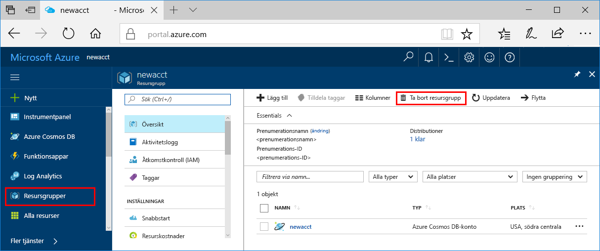

Om du inte planerar att fortsätta använda den här appen tar du bort alla resurser som skapades i snabbstarten med följande steg, så att inga kostnader uppstår:

>[!NOTE]
>Dessa resurser är användbara när du följer andra självstudier för Azure Machine Learning-tjänster.

1. I Azure-portalen väljer du **Resursgrupper** längst till vänster.  
 
   

2. I listan med resursgrupper väljer du den resursgrupp som du skapade. Klicka sedan på **Ta bort resursgrupp**.

3. Skriv namnet på resursgruppen som ska tas bort och klicka sedan på **Ta bort**.

