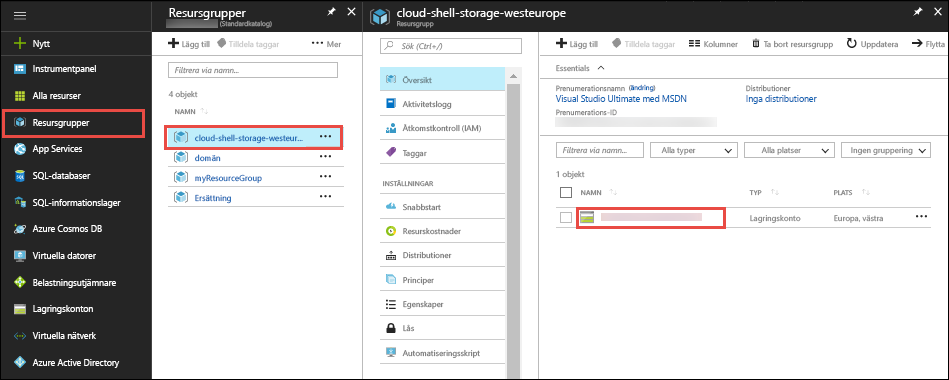
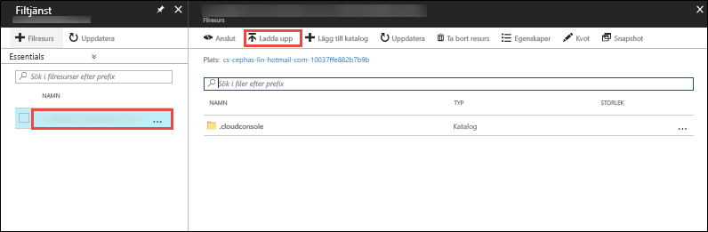

I den [Azure-portalen](https://portal.azure.com), klickar du på **resursgrupper** > **cloud-shell-storage -\<your_region >**  >   **\<storage_account_name >**.



I den **översikt** sidan i lagringskontot, Välj **filer**.

Välj den automatiskt genererade filresursen och välj **överför**. Den här filresursen monteras i Cloud Shell som `clouddrive`.



Klickar du på väljaren för filen och välj din ZIP-fil och sedan på **överför**. 

I Cloud Shell använder `ls` att verifiera att du kan se den uppladdade ZIP-filen i standard `clouddrive` dela.

```azurecli-interactive
ls clouddrive
```
