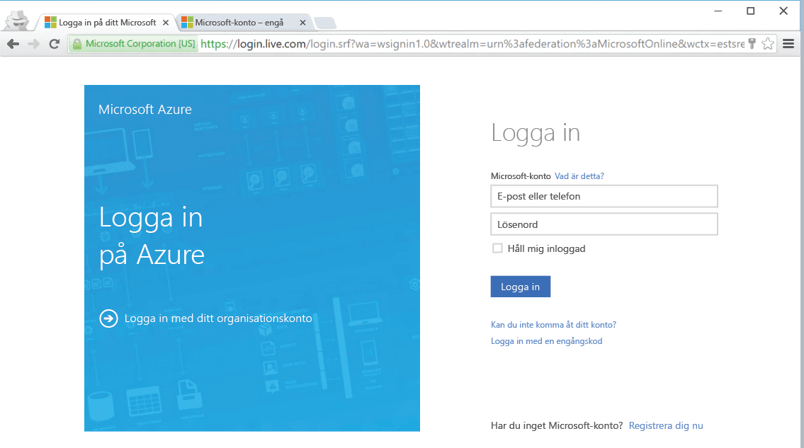

<!--
includes/azure-include-getting-started-v12portal-gettings-an-account.md

Latest Freshness check:  2016-04-11 , carlrab.

As of circa 2016-04-11, the following topics might include this include:
articles/sql-database/sql-database-get-started-tutorial.md

-->
## Anslut till Azure Portal med en prenumeration

Du måste ha en prenumeration för att ansluta till Azure Portal.

### Skaffa ett nytt konto

Om du inte har ett befintligt Azure-konto, kan du välja ett alternativ nedan för att skaffa ett konto:

- Skaffa ett [kostnadsfritt konto](https://azure.microsoft.com/get-started/).
- Använd en [MSDN-prenumeration](https://azure.microsoft.com/pricing/member-offers/msdn-benefits/).

### Logga in med ditt befintliga konto

Använd din [befintliga prenumeration]( https://account.windowsazure.com/Home/Index) och följ dessa steg för att ansluta till Azure Portal.

1. Öppna din webbläsare och anslut till [Azure-portalen](https://portal.azure.com/).

1. Logga in på [Azure-portalen](https://portal.azure.com/).

1. Ange autentiseringsuppgifterna för din prenumeration på sidan **Logga in**.

   

<!--HONumber=sep12_HO2-->

