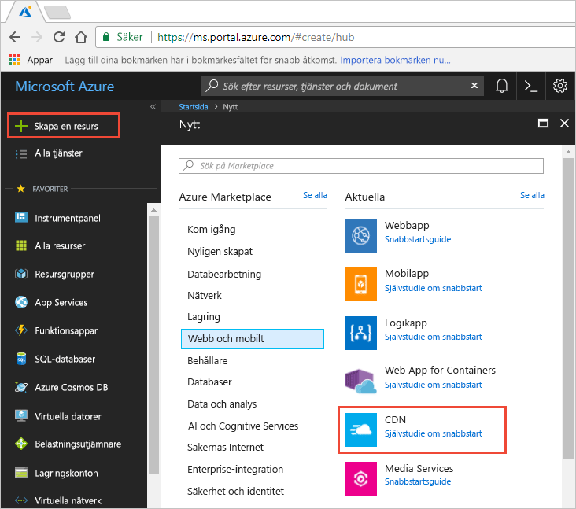
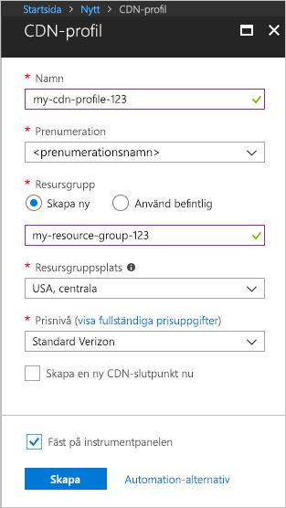

## Skapa en ny CDN-profil

En CDN-profil är en behållare för CDN-slutpunkter och anger en prisnivå.

1. Välj i Azure-portalen i det övre vänstra **skapar du en resurs**.
    
    Den **ny** visas.
   
2. Välj **webb + mobilt**, sedan **CDN**.
   
    

    Den **CDN-profilen** visas.

    Använd de inställningar som anges i tabellen enligt bilden.
   
    

    | Inställning  | Värde |
    | -------- | ----- |
    | **Namn** | Ange *min-cdn-profil-123* för ditt profilnamn. Det här namnet måste vara globalt unika. Om den redan används, kan du ange en annan. |
    | **Prenumeration** | Välj en Azure-prenumeration från den nedrullningsbara listan.|
    | **Resursgrupp** | Välj **Skapa nytt** och ange *min-resurs-grupp-123* för din resursgruppens namn. Det här namnet måste vara globalt unika. Om den redan används, kan du ange en annan. | 
    | **Resursgruppens plats** | Välj **centrala USA** från den nedrullningsbara listan. |
    | **prisnivå** | Välj **Standard Verizon** från den nedrullningsbara listan. |
    | **Skapa en ny CDN-slutpunkt nu** | Lämna inte är markerad. |  
   
3. Välj **fäst på instrumentpanelen** att spara profilen på instrumentpanelen när den har skapats.
    
4. Välj **skapa** att skapa profilen. 

