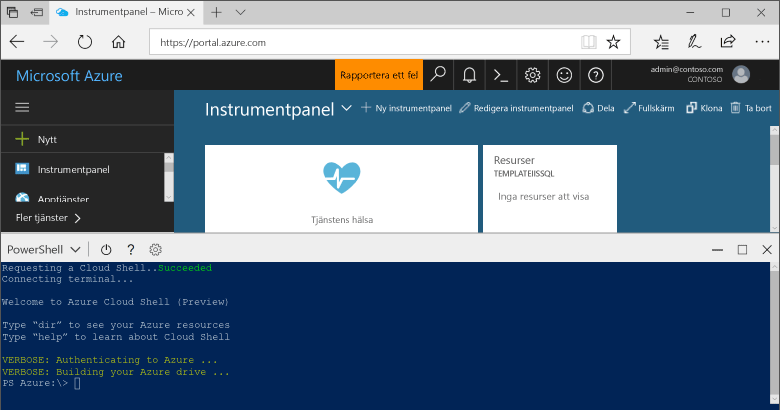

## Starta Azure Cloud Shell

Azure Cloud Shell är ett kostnadsfritt gränssnitt som du kan köra direkt i Azure-portalen. Den har vanliga Azure-verktyg förinstallerat och har konfigurerats för användning med ditt konto. Klicka på knappen **Cloud Shell** på menyn längst upp till höger i [Azure-portalen](https://portal.azure.com).

Knappen startar ett interaktivt gränssnitt som du kan använda för att köra alla steg i det här avsnittet:

