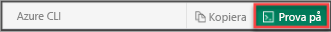

## Öppna Azure Cloud Shell

Azure Cloud Shell är ett kostnadsfritt, interaktivt gränssnitt som du kan använda för att utföra stegen i den här artikeln. Vanliga Azure-verktyg förinstalleras och konfigureras i Cloud Shell och kan användas med kontot. Välj knappen **Kopiera** för att kopiera koden, klistra in den i Cloud Shell och tryck på RETUR för att köra den. Det finns flera olika sätt att öppna Cloud Shell:

|  |   |
|-----------------------------------------------|---|
| Välj **Prova** i det övre högra hörnet av ett kodblock. |  |
| Öppna Cloud Shell i din webbläsare. |  |
| Välj knappen **Cloud Shell** på menyn längst upp till höger i [Azure Portal](https://portal.azure.com). |     |
|  |  |

