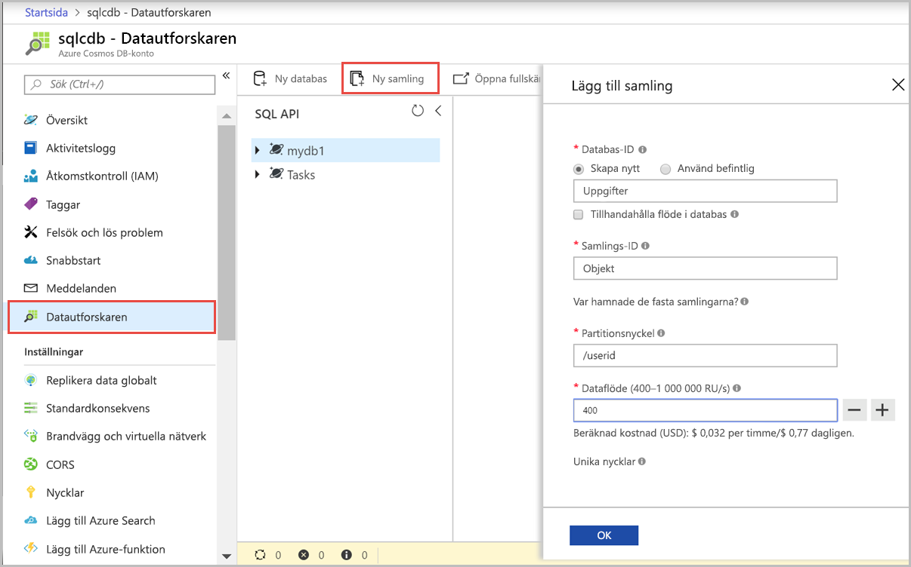
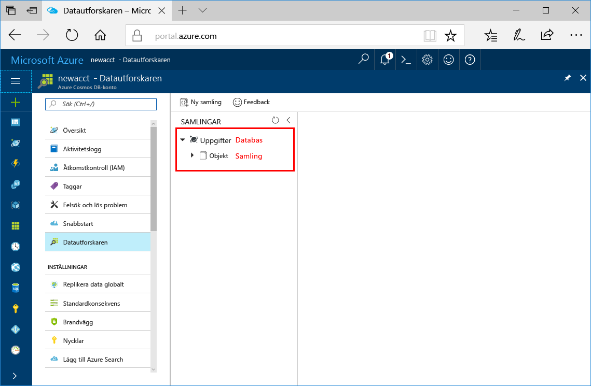

Nu kan du använda datautforskarverktyget i Azure Portal för att skapa en databas och samling. 

1. Klicka på **Datautforskaren** > **Ny samling**. 
    
    Området **Lägg till samling** visas längst till höger, du kan behöva bläddra åt höger för att se det.

    

2. På sidan **Lägg till samling** anger du inställningarna för den nya samlingen.

    Inställning|Föreslaget värde|Beskrivning
    ---|---|---
    Databas-id|Uppgifter|Ange *Uppgifter* som namn på den nya databasen. Databasnamn måste innehålla 1–255 tecken och får inte innehålla `/, \\, #, ?`, eller avslutande blanksteg.
    Samlings-id|Objekt|Ange *Objekt* som namnet på din nya samling. Samma teckenkrav gäller för samlings-ID:n som databasnamn.
    Partitionsnyckeln| `<Your partition key>`| Ange en partitionsnyckel, exempelvis */userid*.
    Dataflöde|400 RU|Ändra genomflödet till 400 begäransenheter per sekund (RU/s). Du kan skala upp dataflödet senare om du vill minska svarstiden. 
    
    Utöver föregående inställningar kan du lägga till **unika nycklar** för samlingen om du vill. Vi lämnar fältet tomt i det här exemplet. Unika nycklar ger utvecklarna möjlighet att lägga till ett lager med dataintegritet till databasen. När du skapar en unik nyckelprincip medan du skapar en samling garanterar du unikheten för ett eller flera värden per partitionsnyckel. Läs mer i artikeln om [unika nycklar i Azure Cosmos DB](../articles/cosmos-db/unique-keys.md).
    
    Klicka på **OK**.

    Datautforskaren visar den nya databasen och samlingen.

    