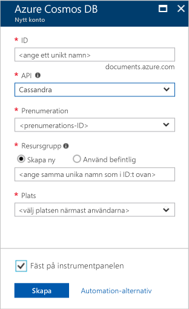

1. Ett nytt fönster i webbläsaren, logga in på [Azure-portalen](https://portal.azure.com/).
2. Klicka på **nya** > **databaser** > **Cosmos Azure DB**.
   
   

3. I den **nytt konto** anger du inställningarna för det nya kontot i Azure Cosmos DB. 
 
    Inställning|Föreslaget värde|Beskrivning
    ---|---|---
    ID|*Ange ett unikt namn*|Ange ett unikt namn som identifierar det här kontot i Azure Cosmos DB. Eftersom *documents.azure.com* läggs till det ID som du anger för att skapa din kontaktpunkt, använder en unik men identifierbar-ID.  Ditt id får bara innehålla gemener, siffror och bindestreck och måste innehålla mellan 3 och 50 tecken.
    API|Cassandra|API: et avgör vilken typ av konto för att skapa. Azure Cosmos-DB innehåller fem-API: er som passar bäst för ditt program: SQL (dokumentdatabasen), Gremlin (graph-databas), MongoDB (dokumentdatabasen), Azure Table och Cassandra, varje som för närvarande kräver ett särskilt konto.   Välj **Cassandra** eftersom den här snabbstarten du skapar en databas i hela kolumner som är frågbar med CQL syntax.  Om Cassandra (wide kolumn) visas inte i listan, så du behöver [tillämpa för att ansluta till](../articles/cosmos-db/cassandra-introduction.md#sign-up-now) förhandsgranskningsprogrammet Cassandra API.   [Mer information om Cassandra-API](../articles/cosmos-db/cassandra-introduction.md)|
    Prenumeration|*Din prenumeration*|Välj Azure-prenumeration som du vill använda för det här kontot i Azure Cosmos DB. 
    Resursgrupp|*Ange samma unika namn som anges ovan i ID: T*|Ange ett nytt resursgrupp namn för ditt konto. För enkelhetens skull kan du använda samma namn som för ditt ID. 
    Plats|*Välj regionen som är närmast dina användare*|Välj geografisk plats som värd för ditt Azure DB som Cosmos-konto. Använd den plats som är närmast dina användare att ge dem snabbast åtkomst till data.
    Fäst vid instrumentpanelen | Välj | Markera den här kryssrutan så att ditt nya konto har lagts till på portalen instrumentpanelen för enkel åtkomst.

    Klicka sedan på **Skapa**.

    

4. Skapa konto tar några minuter. När kontot skapas på portalens instrumentpanel visar den **distribuerar Azure Cosmos DB** panelen.

    

    När kontot har skapats kan den **Grattis! Azure DB som Cosmos-kontot skapades** visas. 

