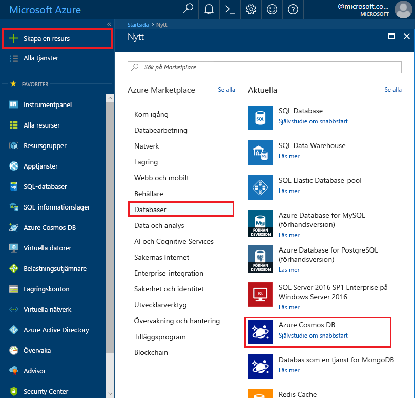

1. Logga in på [Azure Portal](https://portal.azure.com/) i ett nytt webbläsarfönster.
2. Klicka på **Skapa en resurs** > **Databaser** > **Azure Cosmos DB**.
   
   

3. På sidan **Nytt konto** anger du inställningarna för det nya Azure Cosmos DB-kontot. 
 
    Inställning|Föreslaget värde|Beskrivning
    ---|---|---
    ID|*Ange ett unikt namn*|Ange ett unikt namn som identifierar Azure Cosmos DB-kontot. Eftersom*cassandra.cosmosdb.azure.com* läggs till det ID du anger för att skapa din kontaktpunkt bör du använda ett unikt men identifierbart ID.  Ditt id får bara innehålla gemener, siffror och bindestreck och måste innehålla mellan 3 och 50 tecken.
    API|Cassandra|API:n avgör vilken typ av konto som skapas. Azure Cosmos DB innehåller fem API:er för ditt program: SQL (dokumentdatabas), Gremlin (grafdatabas), MongoDB (dokumentdatabas), Azure-tabell och Cassandra, där var och en för närvarande kräver ett separat konto.   Välj **Cassandra** eftersom du i den här snabbstarten ska skapa en databas med breda kolumner som är frågningsbar med CQL-syntax.  Om Cassandra (bred kolumn) inte visas i listan, måste du [applicera den för att ansluta till](../articles/cosmos-db/cassandra-introduction.md#sign-up-now) Cassandra-API:ns förhandsversionsprogram.   [Läs mer om Cassandra-API:n](../articles/cosmos-db/cassandra-introduction.md)|
    Prenumeration|*Din prenumeration*|Välj den Azure-prenumeration som ska användas för det här Azure Cosmos DB-kontot. 
    Resursgrupp|Skapa ny  *Ange sedan samma unika namn som angavs ovan i ID:t*|Välj **Skapa ny** och ange sedan ett nytt resursgruppsnamn för ditt konto. För enkelhetens skull kan du använda samma namn som för ditt ID. 
    Plats|*Välj den region som är närmast dina användare*|Välj den geografiska plats som ska vara värd för ditt Azure Cosmos DB-konto. Använd den plats som är närmast dina användare så att de får så snabb åtkomst till data som möjligt.
    Fäst vid instrumentpanelen | Välj | Markera den här kryssrutan så att ditt nya databaskonto läggs till på portalens instrumentpanel för enkel åtkomst.

    Klicka sedan på **Skapa**.

    

4. Det tar några minuter att skapa kontot. Vänta tills portalen visar sidan **Grattis! Azure Cosmos DB-kontot har skapats**.

