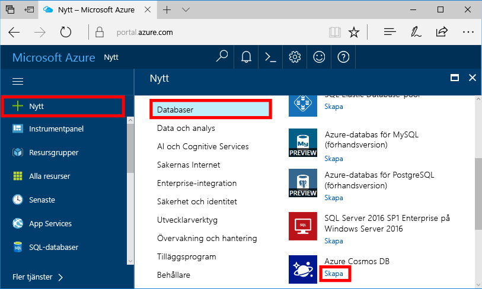
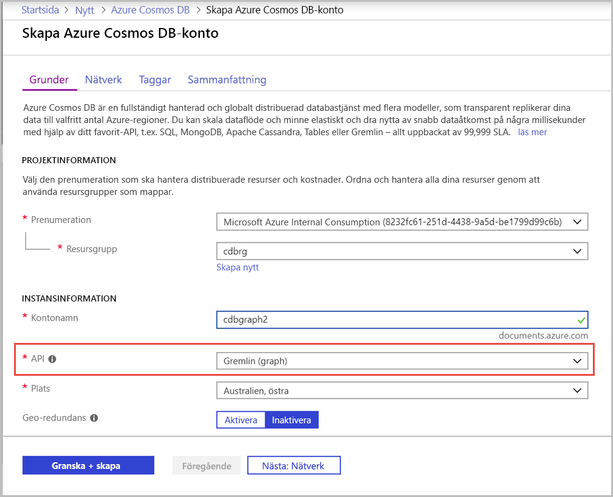
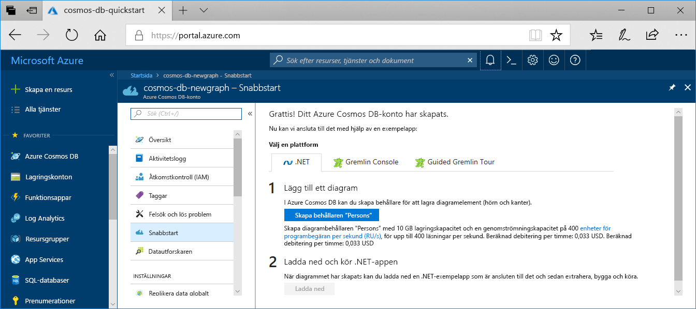

1. Logga in på [Azure Portal](https://portal.azure.com/) i ett nytt webbläsarfönster.

2. Välj **skapa en resurs** i den vänstra menyn.
   
   
   
3. Välj **databaser** Azure Cosmos DB på sidan **nytt**  >  **Azure Cosmos DB**.
   
   
   
   > [!TIP]
   > Om du inte ser Azure Cosmos DB i listan skriver du den i rutan Sök högst upp på sidan och trycker på _RETUR_ . 

3. På sidan **skapa Azure Cosmos DB konto** anger du inställningarna för det nya Azure Cosmos DB-kontot. 
 
    Inställning|Värde|Beskrivning
    ---|---|---
    Prenumeration|Din prenumeration|Välj den Azure-prenumeration som ska användas för det här Azure Cosmos DB-kontot. 
    Resursgrupp|Skapa ny  Ange sedan samma namn som konto namnet|Välj **Skapa ny**. Ange sedan ett nytt resurs grupps namn för ditt konto. För enkelhetens skull använder du samma namn som ditt Azure Cosmos DB konto namn. 
    Account Name|Ange ett unikt namn|Ange ett unikt namn som identifierar ditt Azure Cosmos DB-konto. Din konto-URI kommer att *Gremlin.Azure.com* till ditt unika konto namn.  Konto namnet får bara innehålla gemena bokstäver, siffror och bindestreck (-) och måste vara mellan 3 och 31 tecken långt.
    API|Gremlin (graf)|API:et avgör vilken typ av konto som skapas. Azure Cosmos DB tillhandahåller fem API: er: Core (SQL) för dokument databaser, Gremlin för graf-databaser, MongoDB för dokument databaser, Azure Table och Cassandra. Du måste skapa ett separat konto för varje API.   Välj **Gremlin (graf)**, eftersom du i den här snabb starten skapar en tabell som fungerar med Gremlin-API: et.   [Läs mer om Gremlin-API: et](../articles/cosmos-db/graph-introduction.md).|
    Plats|Välj den region som är närmast dina användare|Välj en geografisk plats som värd för ditt Azure Cosmos DB-konto. Använd den plats som är närmast dina användare så att de får så snabb åtkomst till data som möjligt.
    Kapacitetsläge|Allokerat data flöde eller Server lös|Välj **tillhandahållet data flöde** för att skapa ett konto i ett [allokerat data flödes](../articles/cosmos-db/set-throughput.md) läge. Välj **Server** lös om du vill skapa ett konto i [Server](../articles/cosmos-db/serverless.md) fritt läge.

    Välj **Granska + skapa**. Du kan hoppa över avsnittet **Nätverk** och **Taggar**. 

    

4. Det tar några minuter att skapa kontot. Vänta tills portalen visar **Grattis! Ditt Azure Cosmos DB konto har skapats** .
   
   

