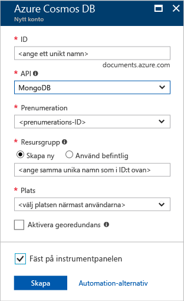
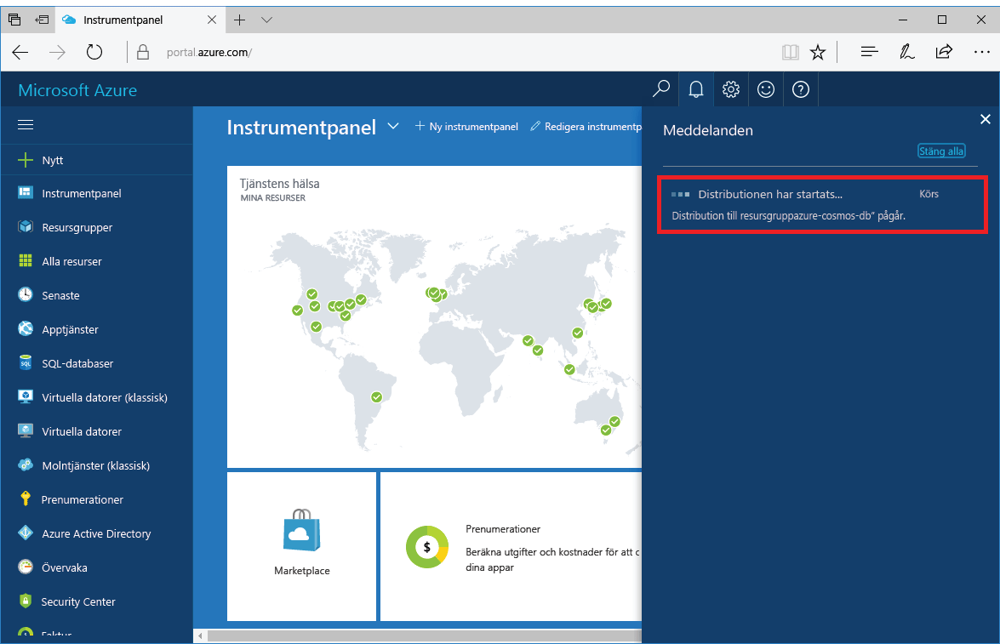
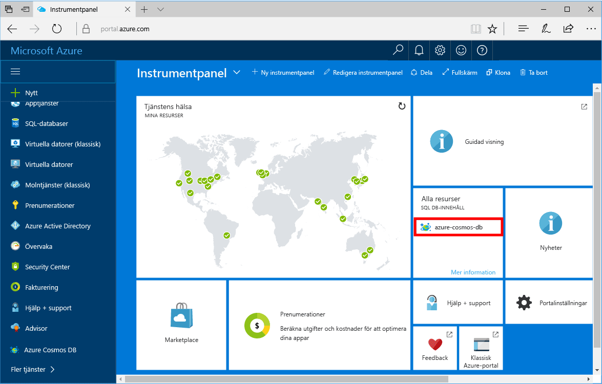

1. Logga in på [Azure Portal](https://portal.azure.com/) i ett nytt fönster.
2. Klicka på **Nytt** på menyn till vänster. Klicka på **Databaser** och sedan på **Skapa** under **Azure Cosmos DB**.
   
   

3. På bladet **Nytt konto** anger du önskad konfiguration för Azure Cosmos DB-kontot. 

    Med Azure Cosmos DB kan du välja någon av fyra programmeringsmodeller: Gremlin (graf), MongoDB, SQL (DocumentDB) och Tabell (nyckelvärde). 
       
    I den här snabbstarten kommer vi att programmera mot ett MongoDB API så du väljer **MongoDB** när du fyller i formuläret. Men om du har grafdata för en app för sociala medier, dokumentdata från en katalogapp eller nyckelvärdedata (tabell) ska du tänka på att Azure Cosmos DB kan tillhandahålla en mycket tillgänglig, globalt distribuerad databastjänstplattform för alla dina verksamhetskritiska program.

    Fyll i bladet **Nytt konto** med informationen i tabellen som vägledning.
 
    
   
    Inställning|Föreslaget värde|Beskrivning
    ---|---|---
    ID|*Unikt värde*|Ett unikt namn du väljer för att identifiera Azure Cosmos DB-kontot. *documents.azure.com* läggs till det ID du anger för att skapa din URI, så använd ett unikt men identifierbart ID. Id:n får bara innehålla gemener, siffror och bindestreck och måste vara mellan 3 och 50 tecken.
    API|MongoDB|API: et avgör vilken typ av konto för att skapa. Azure Cosmos-DB innehåller fem-API: er som passar bäst för ditt program: SQL (dokumentdatabasen), Gremlin (graph-databas), MongoDB (dokumentdatabasen), Azure Table och Cassandra, varje som för närvarande kräver ett särskilt konto.   Välj **MongoDB** eftersom den här snabbstarten du skapar en databas för dokument som är frågbar med MongoDB.  [Mer information om MongoDB-API](../articles/cosmos-db/mongodb-introduction.md)|
    Prenumeration|*Din prenumeration*|Den Azure-prenumeration du vill använda för Azure Cosmos DB-kontot. 
    Resursgrupp|*Samma värde som ID*|Namnet på den nya resursgruppen för kontot. För enkelhetens skull kan du använda samma namn som för ditt ID. 
    Plats|*Regionen som ligger närmast dina användare*|Den geografiska plats som ska vara värd för ditt Azure Cosmos DB-konto. Välj den plats som är närmast dina användare så att de får så snabb åtkomst till data som möjligt.

4. Skapa kontot genom att klicka på **Skapa**.
5. Klicka på **Aviseringar** i verktygsfältet för att övervaka distributionsprocessen.

    

6.  När distributionen är färdig öppnar du det nya kontot från panelen Alla resurser. 

    
