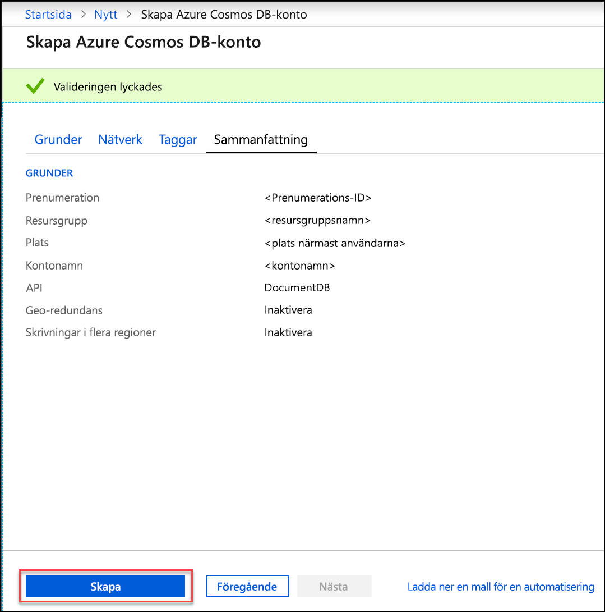
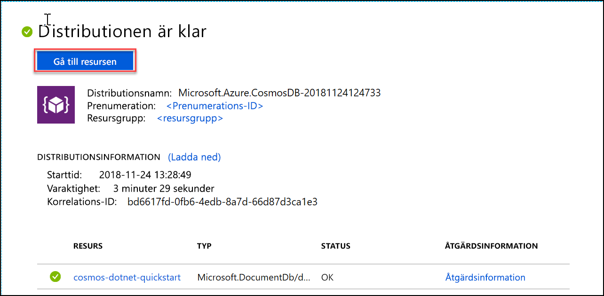

1. Logga in på [Azure Portal](https://portal.azure.com/) i ett nytt webbläsarfönster.
2. Klicka på **Skapa en resurs** > **Databaser** > **Azure Cosmos DB**.
   
   

3. På sidan **Skapa Azure Cosmos DB-konto** anger du inställningarna för det nya Azure Cosmos DB-kontot. 
 
    Inställning|Värde|Beskrivning
    ---|---|---
    Prenumeration|*Din prenumeration*|Välj den Azure-prenumeration som ska användas för det här Azure Cosmos DB-kontot. 
    Resursgrupp|Skapa ny  *Ange ett unikt namn*|Välj **Skapa ny** och ange sedan ett nytt resursgruppsnamn för ditt konto. För enkelhetens skull kan du använda samma namn som för ditt kontonamn. 
    Kontonamn|*Ange ett unikt namn*|Ange ett unikt namn som identifierar ditt Azure Cosmos DB-konto. Eftersom*documents.azure.com* läggs till det ID du anger för att skapa din URI ska du använda ett unikt ID.  Ditt ID får bara innehålla gemener, siffror och bindestreck och måste innehålla mellan 3 och 50 tecken.
    API|Core (SQL)|API:n avgör vilken typ av konto som skapas. Azure Cosmos DB innehåller fem API:er: SQL (dokumentdatabas), Gremlin (grafdatabas), MongoDB (dokumentdatabas), Tabell-API och API för Cassandra. Varje API kräver för närvarande att du skapar ett separat konto.   Välj **Core (SQL)** eftersom du i den här artikeln skapar en dokumentdatabas och fråga med hjälp av SQL-syntax.   [Läs mer om SQL-API:et](../articles/cosmos-db/documentdb-introduction.md)|
    Plats|*Välj den region som är närmast dina användare*|Välj en geografisk plats som värd för ditt Azure Cosmos DB-konto. Använd den plats som är närmast dina användare så att de får så snabb åtkomst till data som möjligt.
    Aktivera geo-redundans| Lämna tomt | Detta skapar en replikerad version av databasen i en andra (parad) region. Låt den vara tom.  
    Skrivningar för flera regioner| Lämna tomt | Detta gör det möjligt för var och en av dina databasregioner att vara både läs- och skrivregioner. Låt den vara tom.  

    Klicka därefter på **Granska + skapa**. Du kan hoppa över avsnittet **Nätverk** och **Taggar**. 

    

    Granska sammanfattningsinformationen och klicka på **Skapa**. 

    

4. Det tar några minuter att skapa kontot. Vänta tills portalen visar meddelandet **Your deployment is complete** (Distributionen är klar) och klicka på **Gå till resurs**.     

    

5. Portalen visar nu **Grattis! Azure Cosmos DB-kontot har skapats**.

    

