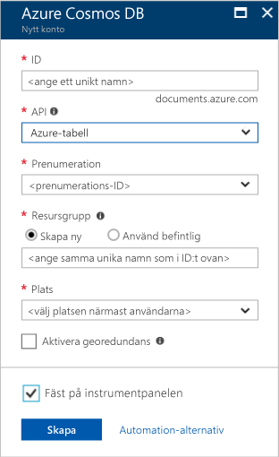
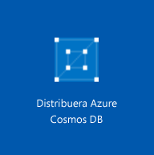

1. Logga in på [Azure Portal](https://portal.azure.com/) i ett nytt webbläsarfönster.
2. Klicka på **Skapa en resurs** i menyn till vänster. Klicka på **Databaser** och sedan på **Skapa** under **Azure Cosmos DB**. 
   
   

3. På sidan **Nytt konto** anger du inställningarna för det nya Azure Cosmos DB-kontot. 
 
    Inställning|Föreslaget värde|Beskrivning
    ---|---|---
    ID|*Ange ett unikt namn*|Ange ett unikt namn som identifierar Azure Cosmos DB-kontot. Eftersom*documents.azure.com* läggs till det ID du anger för att skapa din URI ska du använda ett unikt men identifierbart ID.  Ditt id får bara innehålla gemener, siffror och bindestreck och måste innehålla mellan 3 och 50 tecken.
    API|Azure-tabell|API:n avgör vilken typ av konto som skapas. Azure Cosmos DB innehåller fem API:er för ditt program: SQL (dokumentdatabas), Gremlin (grafdatabas), MongoDB (dokumentdatabas), Azure-tabell och Cassandra, där var och en för närvarande kräver ett separat konto.  Välj **Azure-tabell**, eftersom du i den här snabbstarten skapar en tabell som fungerar med tabell-API.  [Läs mer om tabell-API](../articles/cosmos-db/table-introduction.md) |
    Prenumeration|*Ange samma unika namn som angavs ovan i ID:t*|Välj den Azure-prenumeration som ska användas för det här Azure Cosmos DB-kontot. 
    Resursgrupp|*Samma värde som ID*|Ange ett nytt resursgruppnamn för kontot. För enkelhetens skull kan du använda samma namn som för ditt ID. 
    Plats|*Välj den region som är närmast dina användare*|Välj den geografiska plats som ska vara värd för ditt Azure Cosmos DB-konto. Använd den plats som är närmast dina användare så att de får så snabb åtkomst till data som möjligt.
    Aktivera geo-redundans| Lämna tomt | Detta skapar en replikerad version av databasen i en andra (parad) region. Låt den vara tom.  
    Fäst vid instrumentpanelen | Välj | Markera den här kryssrutan så att ditt nya databaskonto läggs till på portalens instrumentpanel för enkel åtkomst.

    Klicka på **Skapa**.  

    

4. Det tar några minuter att skapa kontot. När kontot skapas visar portalen panelen **Distribuerar Azure Cosmos DB**.

    

    När kontot har skapats visas sidan **Grattis! Azure Cosmos DB-kontot har skapats**.
