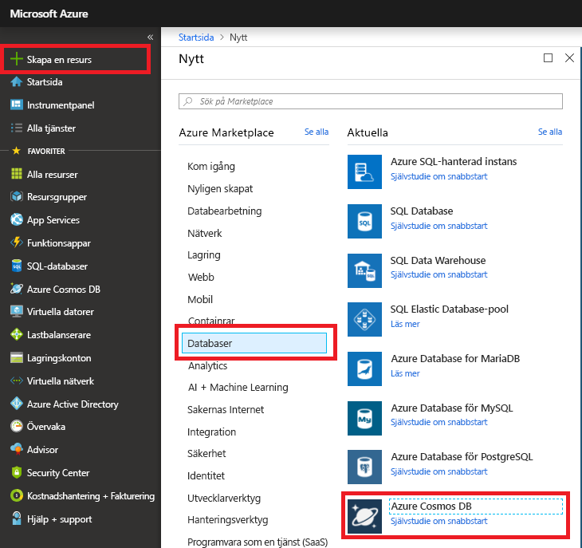
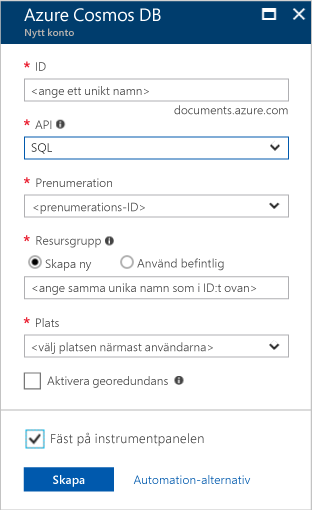
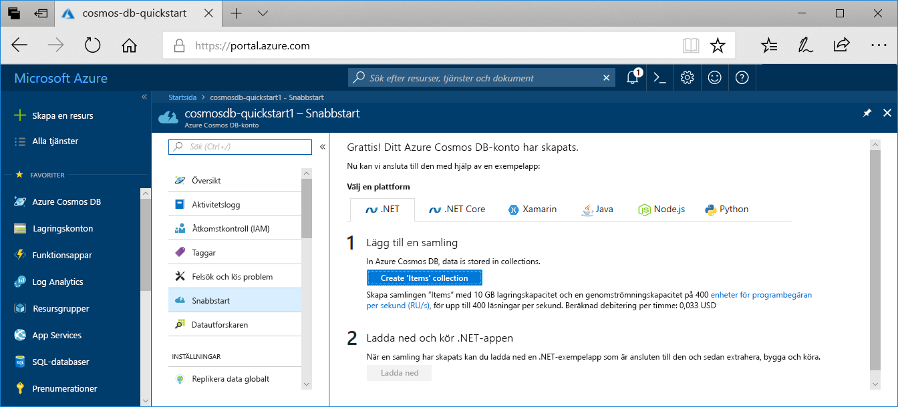

1. Logga in på [Azure Portal](https://portal.azure.com/) i ett nytt webbläsarfönster.
2. Klicka på **Skapa en resurs** > **Databaser** > **Azure Cosmos DB**.
   
   

3. På sidan **Nytt konto** anger du inställningarna för det nya Azure Cosmos DB-kontot. 
 
    Inställning|Värde|Beskrivning
    ---|---|---
    ID|*Ange ett unikt namn*|Ange ett unikt namn som identifierar Azure Cosmos DB-kontot. Eftersom*documents.azure.com* läggs till det ID du anger för att skapa din URI ska du använda ett unikt men identifierbart ID.  Ditt id får bara innehålla gemener, siffror och bindestreck och måste innehålla mellan 3 och 50 tecken.
    API|SQL|API:n avgör vilken typ av konto som skapas. Azure Cosmos DB innehåller fem API:er för ditt program: SQL (dokumentdatabas), Gremlin (grafdatabas), MongoDB (dokumentdatabas), Azure-tabell och Cassandra, där var och en för närvarande kräver ett separat konto.   Välj **SQL** eftersom den här snabbstarten du skapar en dokumentdatabasen frågbar med hjälp av SQL-syntax och är tillgänglig med SQL-API.  [Mer information om SQL-API](../articles/cosmos-db/documentdb-introduction.md)|
    Prenumeration|*Din prenumeration*|Välj den Azure-prenumeration som ska användas för det här Azure Cosmos DB-kontot. 
    Resursgrupp|Skapa nytt  *Ange samma unika namn som anges ovan i ID: T*|Välj **Skapa nytt**, ange ett nytt namn resursgrupp för ditt konto. För enkelhetens skull kan du använda samma namn som för ditt ID. 
    Plats|*Välj den region som är närmast dina användare*|Välj den geografiska plats som ska vara värd för ditt Azure Cosmos DB-konto. Använd den plats som är närmast dina användare så att de får så snabb åtkomst till data som möjligt.
    Aktivera geo-redundans| Lämna tomt | Detta skapar en replikerad version av databasen i en andra (parad) region. Låt den vara tom.  
    Fäst vid instrumentpanelen | Välj | Markera den här kryssrutan så att ditt nya databaskonto läggs till på portalens instrumentpanel för enkel åtkomst.

    Klicka sedan på **Skapa**.

    

4. Det tar några minuter att skapa kontot. Vänta tills portalen för att visa den **Grattis! Azure DB som Cosmos-kontot skapades** sidan.

    

