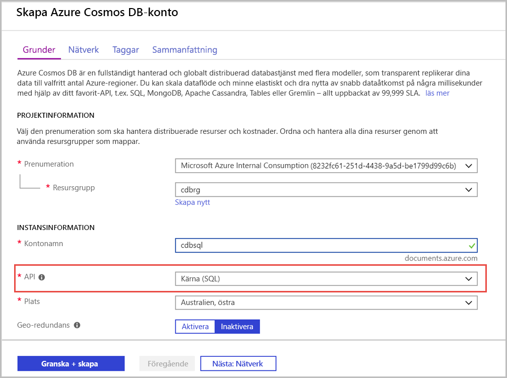

1. Logga in på [Azure Portal](https://portal.azure.com/).
1. Välj **Skapa en resurs** > **Databaser** > **Azure Cosmos DB**.
   
   

1. På den **skapar Azure Cosmos DB-konto** anger de grundläggande inställningarna för det nya Azure Cosmos-kontot. 
 
    |Inställning|Värde|Beskrivning |
    |---|---|---|
    |Prenumeration|Prenumerationsnamn|Välj den prenumeration som du vill använda för det här Azure Cosmos-kontot. |
    |Resursgrupp|Namn på resursgrupp|Välj en resursgrupp eller välj **Skapa nytt**, ange ett unikt namn för den nya resursgruppen. |
    | Kontonamn|Ange ett unikt namn|Ange ett namn som identifierar ditt Azure Cosmos-konto. Eftersom*documents.azure.com* läggs till det ID du anger för att skapa din URI ska du använda ett unikt ID.  ID:t får endast innehålla gemener, siffror och bindestreck (-). Det måste vara mellan 3-31 tecken.|
    | API|Core (SQL)|API:n avgör vilken typ av konto som skapas. Azure Cosmos DB innehåller fem API:er: Core (SQL) och MongoDB för dokumentdata, Gremlin för diagramdata, Azure Table och Cassandra. För närvarande måste du skapa ett separat konto för varje API.   Välj **Core (SQL)** att skapa en dokumentdatabas och en fråga med hjälp av SQL-syntax.   [Läs mer om SQL-API:et](../articles/cosmos-db/documentdb-introduction.md).|
    | Location|Välj den region som är närmast dina användare|Välj en geografisk plats som värd för ditt Azure Cosmos DB-konto. Använd den plats som är närmast dina användare att ge dem snabbast åtkomst till data.|
   
   

1. Välj **Granska + skapa**. Du kan hoppa över den **nätverk** och **taggar** avsnitt. 

1. Granska inställningarna för kontot och välj sedan **skapa**. Det tar några minuter att skapa kontot. Vänta tills portalsidan att visa **distributionen är klar**. 

    

1. Välj **gå till resurs** att gå till sidan för Azure Cosmos DB-konto. 

    
