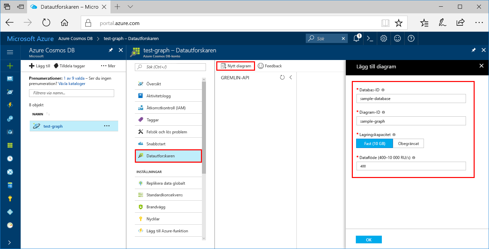

Nu kan du använda datautforskarverktyget i Azure Portal för att skapa en grafdatabas. 

1. Välj **datautforskaren**  >  **nytt diagram**.

    Området **Lägg till diagram** visas längst till höger, du kan behöva bläddra åt höger för att se det.

    

2. På sidan **Lägg till diagram** anger du inställningarna för den nya grafen.

    Inställning|Föreslaget värde|Beskrivning
    ---|---|---
    Databas-id|sample-database|Ange *sample-database* som namn på den nya databasen. Databasnamn måste innehålla mellan 1 och 255 tecken och får inte innehålla `/ \ # ?` eller avslutande blanksteg.
    Dataflöde|400 RU:er|Ändra genomflödet till 400 begäransenheter per sekund (RU/s). Du kan skala upp dataflödet senare om du vill minska svarstiden.
    Graf-id|sample-graph|Ange *sample-graph* som namnet på den nya samlingen. Samma teckenkrav gäller för diagramnamn som databas-ID:n.
    Partition Key (Partitionsnyckel)| /pk |Alla Cosmos DB-konton behöver en partitionsnyckel för att skalas vågrätt. Lär dig hur du väljer en lämplig partitionsnyckel i [artikeln diagram data partitionering](../articles/cosmos-db/graph-partitioning.md).

3. När formuläret har fyllts i väljer du **OK**.