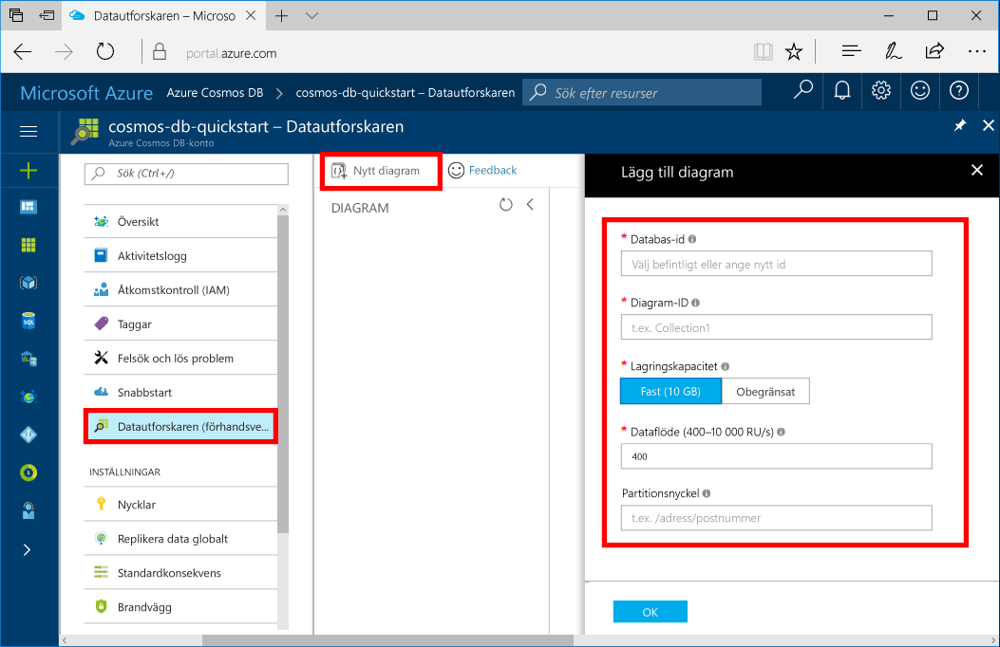

Nu kan du använda datautforskarverktyget i Azure Portal för att skapa en grafdatabas. 

1. Välj i Azure-portalen på menyn till vänster, **Data Explorer (förhandsgranskning)**.

2. Under **Data Explorer (förhandsgranskning)**väljer **nytt diagram**. Fyll i sidan med hjälp av följande information:

    

    Inställning|Föreslaget värde|Beskrivning
    ---|---|---
    Databas-id|sample-database|Ange *exempeldatabasen* som namn på den nya databasen. Databasnamn måste vara mellan 1 och 255 tecken och får inte innehålla `/ \ # ?` eller avslutande blanksteg.
    Graf-id|sample-graph|Ange *exempel diagram* som namn på den nya samlingen. Diagrammet namn har samma krav på tecken som databas-ID: N.
    Lagringskapacitet| 10 GB|Låt standardvärdet vara kvar. Det här är databasens lagringskapacitet.
    Dataflöde|400 RU:er|Låt standardvärdet vara kvar. Du kan skala upp dataflödet senare om du vill minska svarstiden.
    Partitionsnyckeln|/FirstName|En partitionsnyckel som distribuerar data jämnt till varje partition. Att välja rätt Partitionsnyckeln är viktigt att skapa ett performant diagram. Mer information finns i [utformning för partitionering](../articles/cosmos-db/partition-data.md#designing-for-partitioning).

3. När formuläret fylls, väljer du **OK**.
