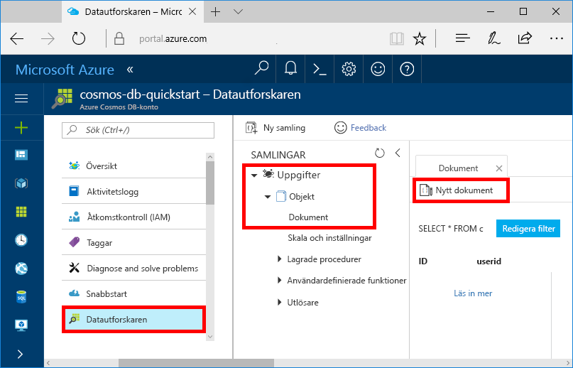
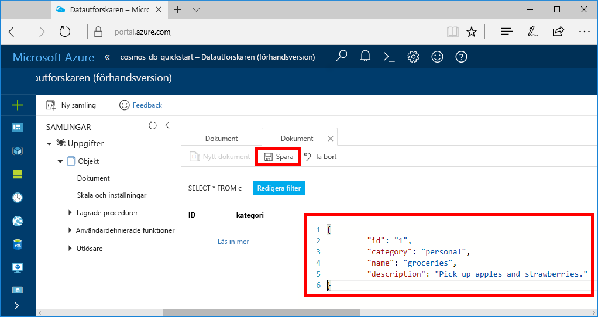

Du kan nu lägga till data till din nya samling med datautforskaren.

1. Den nya databasen visas på panelen Samlingar i datautforskaren. Expandera databasen **Tasks** (Aktiviteter), expandera samlingen **Items** (Objekt), klicka på **Dokument** och klicka sedan på **Nya dokument**. 

   
  
2. Lägg nu till ett dokument i samlingen med följande struktur.

     ```json
     {
         "id": "1",
         "category": "personal",
         "name": "groceries",
         "description": "Pick up apples and strawberries.",
         "isComplete": false
     }
     ```

3. När du har lagt till json på fliken **Dokument** klickar du på **Spara**.

    

4.  Skapa och spara ännu ett dokument där du lägger till ett unikt värde för egenskapen `id` och ändrar de andra egenskaperna som passar. Dina nya dokument kan ha vilken struktur du vill eftersom Azure Cosmos DB inte kräver något schema för dina data.