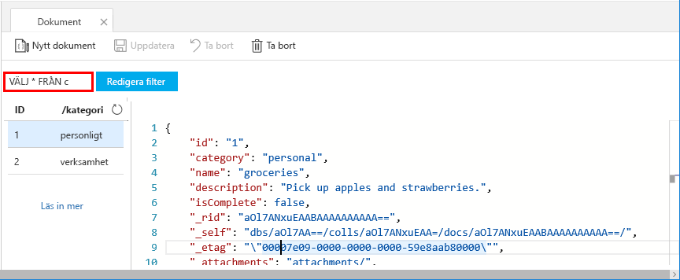
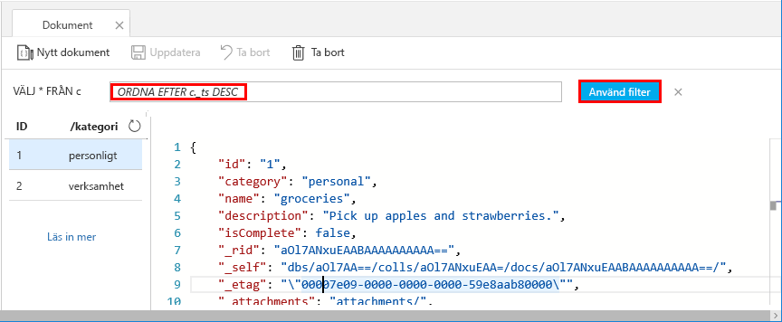

Du kan nu använda frågor i Datautforskaren för att hämta och filtrera dina data.

1. Du kan se att frågan är inställd på `SELECT * FROM c` som standard. Den här standardfrågan hämtar och visar alla dokument i samlingen. 

    

2. Stanna kvar på fliken **Dokument** och ändra frågan genom att klicka på knappen **Redigera filter**, lägga till `ORDER BY c._ts DESC` i frågepredikatrutan och sedan klicka på **Tillämpa filter**.

    

Den här ändrade frågan visar en lista över dokumenten i fallande ordning baserat på deras tidsstämpel, så att ditt andra dokument nu står först. Om du känner till SQL-syntax kan du ange någon av de [SQL-frågor](../articles/cosmos-db/sql-api-sql-query.md) som stöds i den här rutan. 

Då är vårt arbete i Datautforskaren klart. Innan vi går vidare till att arbeta med kod kan du notera att du även kan använda Datautforskaren för att skapa lagrade procedurer, UDF:er och utlösare för att utföra affärslogik på serversidan såväl som att skala genomflödet. Datautforskaren visar all den inbyggda programmässiga dataåtkomsten som finns tillgänglig i API:erna, men ger enkel åtkomst till dina data i Azure-portalen.