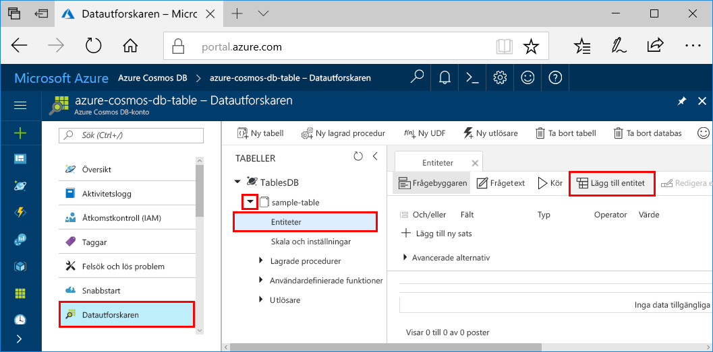
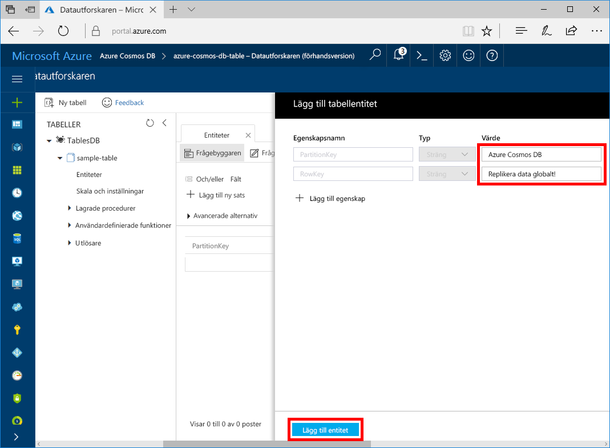

Du kan nu lägga till data till den nya tabellen med datautforskaren.

1. Öppna Datautforskaren, expandera **sample-table**, klicka på **Entiteter** och klicka sedan på **Lägg till entitet**.

   
2. Lägg till data i värderutorna för egenskaperna PartitionKey (Partitionsnyckel) och RowKey (Radnyckel) och klicka på **Lägg till entitet**.

   
  
    Du kan nu lägga till fler entiteter i din tabell, redigera entiteter eller ställa frågor mot data i Datautforskaren. I Datautforskaren kan du även skala ditt dataflöde och lägga till lagrade procedurer, användardefinierade funktioner och utlösare i tabellen.