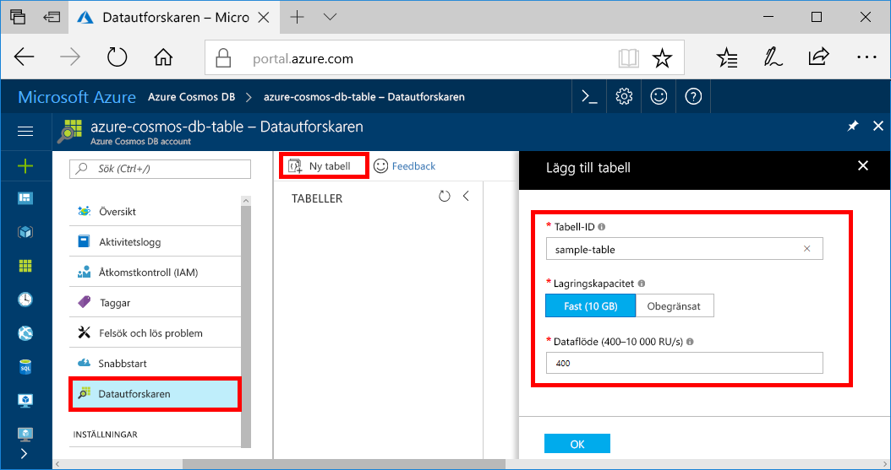

Nu kan du använda Datautforskaren i Azure Portal för att skapa en databas och en tabell. 

1. Klicka på **Datautforskaren** > **Ny tabell**. 
    
    Området **Lägg till tabell** visas längst till höger, du kan behöva bläddra åt höger för att se det.

    

2. På sidan **Lägg till tabell** anger du inställningarna för den nya tabellen.

    Inställning|Föreslaget värde|Beskrivning
    ---|---|---
    Tabell-id|sample-table|ID för din nya tabell. Samma teckenkrav gäller för tabellnamn som databas-id. Databasnamn måste innehålla mellan 1 och 255 tecken och får inte innehålla `/ \ # ?` eller avslutande blanksteg.
    Lagringskapacitet| Fast (10 GB)|Använd standardvärdet för **Fast (10 GB)**. Det här värdet är databasens lagringskapacitet.
    Dataflöde|400 RU:er|Ändra genomflödet till 400 begäransenheter per sekund (RU/s). Du kan skala upp dataflödet senare om du vill minska svarstiden.

    Klicka på **OK**.

    Datautforskaren visar den nya databasen och tabellen.

    